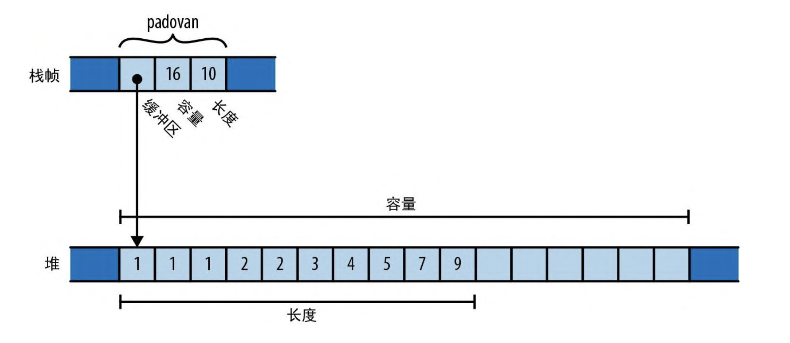
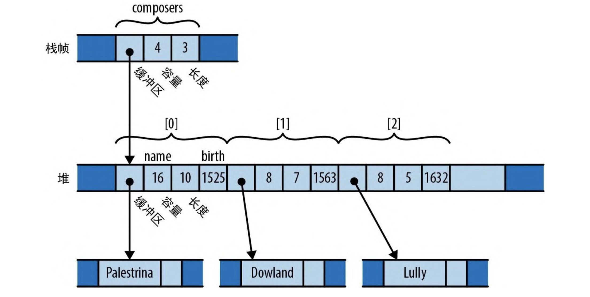
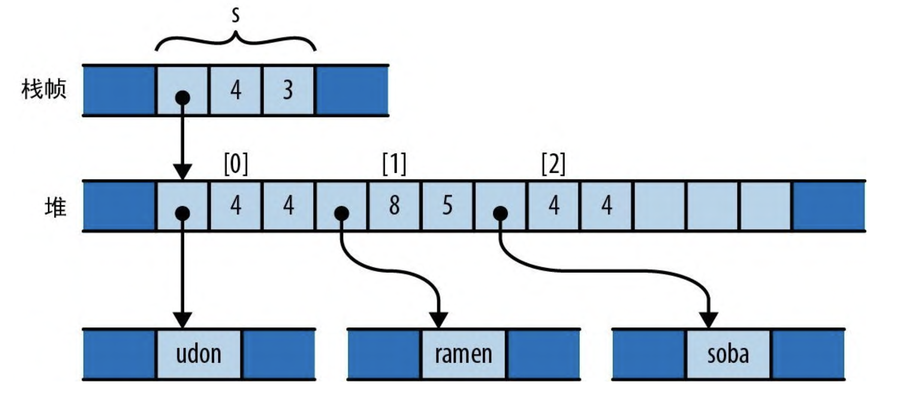
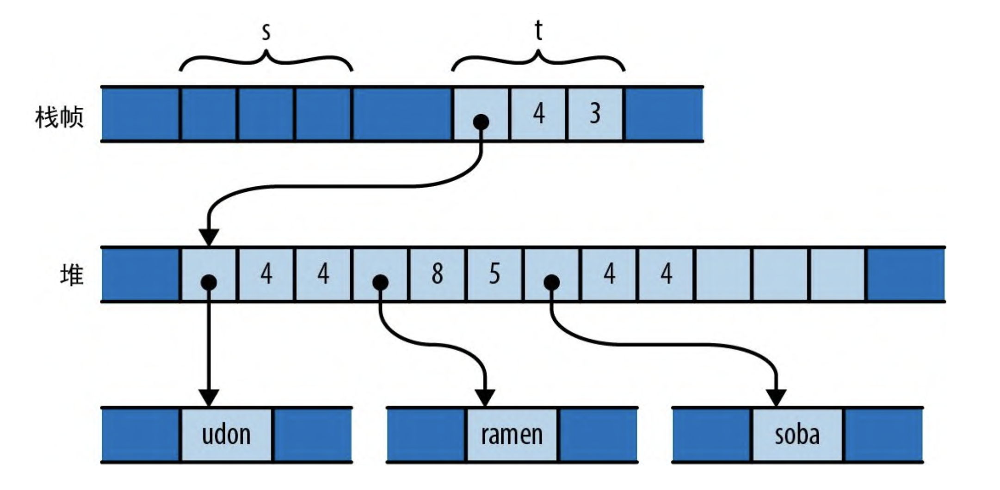
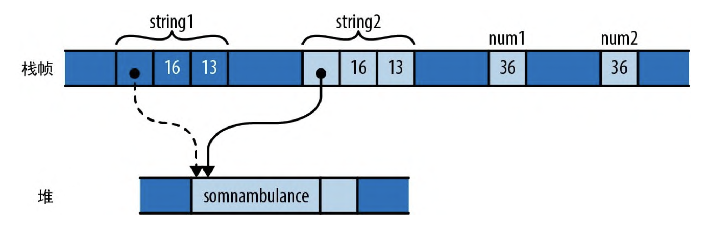
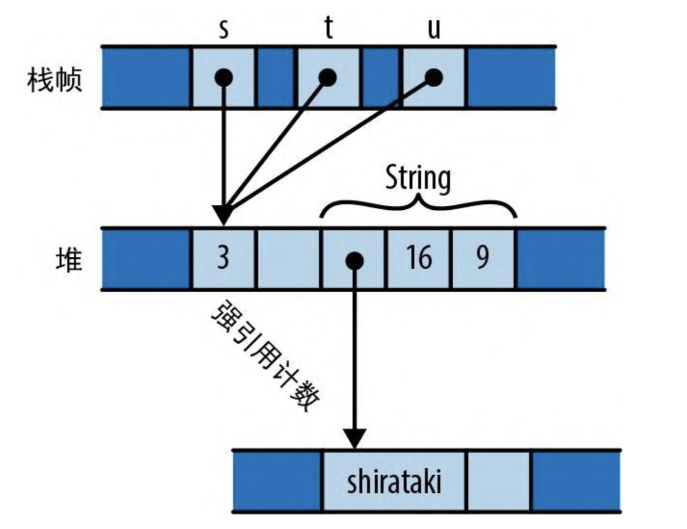

# 所有权

这里我们说的所有权就是当某个对象销毁时，其指向堆中的数据（如果有）也必须销毁。并且后续也不再使用堆中的数据。Rust 中，每个值都有决定其生命周期的唯一拥有这。当拥有者被释放时，它拥有的值也同时被释放。在语法层面限制了这一点。

```rust
fn print_padovan(){
  let mut padovan = vec![1, 1, 1,];// 在此分配数据
  for i in 3..10 {
    let next = padovan[i - 3] + padovan[i - 2];
    padovan.push(next);
  }

  // 当函数最后一条语句执行完毕后，padovan分配的数据会被销毁，其执行堆中的向量也会被销毁。
  println!("P(1..10) = {:?}", padovan);
}
```

内存示意图如下，当`print_padovan`函数执行完毕后，栈帧和堆中的所有数据都会被销毁。



我们来看一个更负责的例子：

```rust
struct Person {
    name: String,
    birth: i32,
}

let mut composers = Vec::with_capacity(3);
composers.push(Person {
    name: "Palestrina".to_string(),
    birth: 1525,
});
composers.push(Person {
    name: "Dowland".to_string(),
    birth: 1563,
});
composers.push(Person {
    name: "Lully".to_string(),
    birth: 1632,
});

for composer in &composers {
    println!("{}, born {}", composer.name, composer.birth);
}
```

上面这段程序对应的内存空间模型如下，当 `composers`离开栈帧时，其关联的所有数据都会被销毁。


Rust 的所有权有以下特点：

- 可以将值从一个拥有者转移给另一个拥有者。这允许你构建、重新排列和拆除树形结构。
- 像整数、浮点数和字符这样的非常简单的类型，不受所有权规则的约束。这些称为`Copy`类型
- 标准库提供了引用计数指针类型`Rc`和`Arc`，它们允许值在某些限制下有多个拥有者。
- 可以对值进行“借用”，以获得值的引用。这种引用是非拥有型指针，有着受限的生命周期。

# 1. 移动

在 Rust 中，对大多数类型来说，像为变量赋值、将其传给函数或从函数返回这样的操作都不会复制值，而是会移动值。源会把值的所有权转移给目标并变回未初始化状态，改由目标变量来控制值的生命周期。

我们来看一个例子:

```rust
let s = vec!["udon".to_string(), "ramen".to_string(), "soba".to_string()];
let t = s;
let u = s;
// use of moved value: `s`
// value used here after moverustcClick for full compiler diagnostic
// main.rs(5, 13): value moved here
// main.rs(3, 9): move occurs because `s` has type `Vec<String>`, which does not implement the `Copy` trait
// main.rs(5, 14): consider cloning the value if the performance cost is acceptable: `.clone()`
```

在第一个语句执行完后，其内存示意图应该是如下状态：

在第二个赋值操作后，会将值从源(s)转移给目标(t)，而源会回到未初始化状态。在语句执行完后，内存示意图如下：

接下来我们执行`let u = s`，会发生什么呢？这会将尚未初始化的值 `s`赋给`u`, Rust 明智地禁止使用未初始化的值，因此编译器会拒绝此代码并报错。

## 1.1 更多的移动类操作

我们来看一个例子：

```rust
let mut s = "Govinda".to_string();
s = "Siddhartha".to_string();
```

在上述代码中，当把 Siddhartha 字符串赋值给 s 时，它先前值 “Govinda” 会首先被丢弃。

再来看一个例子：

```rust
let mut s = "Govinda".to_string();
let t = s;
s = "Siddhartha".to_string(); // 这里什么也没有丢弃，因为s的所有权已经给了变量t
```

这次，t 从 s 接手了原始字符串的所有权，所以当给 s 赋值时，它是未初始化状态。这种情况下不会丢弃任何字符串。

在 Rust 中，除了赋值操作，其他常见也会转交所有权，比如将参数传给函数会将所有权转移给函数的参数、从函数返回一个值会将所有权转移给调用者、构建元组会将值转移给元组

总得来说，有亮点我们需要牢记：

- 移动的永远是值本身，而不是这些值拥有的堆存储。对于向量和字符串，值本身就是指单独的“三字标头”（指向堆数据的指针、容量以及目前的大小），幕后的大型元素数组和文本缓冲区仍然位于它们在堆中的位置。
- Rust 编译器在生成代码时擅长“看穿”这一切动作。在实践中，机器码通常会将值直接存储在它应该在的位置。

## 1.2 移动与控制流

1.1 中的例子都是非常简单的控制流，那么在更为复杂的代码中移动呢？一般的原则是，如果一个变量的值有可能已经移走，并且从那以后尚未明确赋予其新值，那么它就可以被看作是未初始化状态。如果一个变量在执行了 if 表达式的条件后仍然有值，那么就可以在这两个分支中使用它。

```rust
let x = vec![10, 20, 30];
if c {
  ... // 在这里移动了x
} else {
  ... // 或者在这里移动了 x
}
someFn(x); // 这里会报错，只要 if 任何一条分支移动过它， x 在这里就是为初始化状态
```

处于类似的原因，禁止在循环中进行变量的移动

```rust
let x = "move".to_string();

let args: Vec<String> = env::args().skip(1).collect();
for i in 2..10 {
    let s = x; // 这里有移动的操作，编译器将会报错, 因为第一次循环之后， x 将会变为未初始化状态
}

```

## 1.3 移动与索引内容

移动（也就是我们说的赋值操作）会令其来源变成未初始化状态，因为目标将获得该值的所有权。但并非值的每种拥有者都能变成未初始化状态。

```rust
// 构建一个由字符串"101"、"102"......"105"组成的向量
let mut v = Vec::new();
for i in 101..106 {
    v.push(i.to_string());
}
// 从向量中随机抽取元素
let third = v[2]; // 错误:不能移动到Vec索引结构之外
let fifth = v[4]; // 错误:不能移动到Vec索引结构之外
```

为了解决这个问题，Rust 需要以某种方式记住向量的第三个元素和第五个元素是未初始化状态，并要跟踪该信息直到向量被丢弃。通常的解决方案是，让每个向量都携带额外的信息来指示哪些元素是活动的，哪些元素是未初始化的。这显然不是系统编程语言应该做的。向量应该只是向量，不应该携带额外的信息或状态。事实上，Rust 会拒绝前面的代码并报告如下错误：

```rust
// cannot move out of index of `Vec<String>`
// move occurs because value has type `String`, which does not
// implement the `Copy` traitrustcClick for full compiler diagnostic
```

如果我们的确想要移除一个向量该怎么办呢？有以下三种方法

```rust
// 构建一个由字符串"101"、"102"......"105"组成的向量
let mut v = Vec::new();
for i in 101..106 {
    v.push(i.to_string());
}

// 方法一：从向量的末尾弹出一个值
let fifth = v.pop().expect("vector empty");
assert_eq!(fifth, "105");

// 方法二：将向量中指定索引处的值与最后一个值互换，并把前者移动出来。
let second = v.swap_remove(1);
assert_eq!(second, "103");

// 方法三：把要取出的值和另一个值互换：
let third = std::mem::replace(&mut v[2], "substitute".to_string());
assert_eq!(third, "103");

// 最终向量 v 的值
assert_eq!(v, vec!["101", "104", "substitute"]);
```

像 `Vec`这样的集合类型通常也会提供在循环中消耗所有元素的方法：即`for in`的每次循环都会移动元素。在循环完后，`Vec`再次变为未初始化状态。

```rust
let v = vec!["100".to_string(), "200".to_string(), "300".to_string()];

for mut s in v {
  s.push('!');
  println!("{}", s);
}
```

当我们将向量直接传给循环(`for ... in v`)时，会将向量从 `v`中移动出去，让 `v`变成未初始化状态。`for`循环的内部机制会获取向量的所有权并将其分解为元素。在每次迭代中，循环都会将另一个元素转移给变量`s`。由于 `s`现在拥有字符串，因此可以在打印之前在循环体中修改它。在循环的过程中，向量本身对代码不再可见，因此也就无法观察到它正处在某种部分清空的状态。

如果需要从拥有者中移出一个编译器无法跟踪的值，那么可以考虑将拥有者的类型更改为能动态跟踪自己是否有值的类型。例如，

```rust
struct Person {
    name: Option<String>,
    birth: i32,
}

let mut composers = Vec::new();
composers.push(Person {
    name: Some("Palestrina".to_string()),
    birth: 1525,
});

// 我们不能直接像这样操作, 这样会报错。无法移动到索引结构之外
let first_name = composers[0].name;

// 但因为 name 字段从 String 变为了 Option<String>，
// 意味着 None 也是该字段要保存的合法值。
let first_name = std::mem::replace(&mut composers[0].name, None);
assert_eq!(first_name, Some("Palestrina".to_string()));
assert_eq!(composers[0].name, None);
```

上述代码中，`replace`调用会移出 `composers[0].name`的值，将`None`留在原处，并将原始值的所有权转移给其调用者。这种使用`Option`的方式非常普遍，所以该类型专门为此提供了一个`take`方法，以便更加方便的写出上述操作

```rust
// 下面的语句等价于：
// let first_name = std::mem::replace(&mut composers[0].name, None);
let first_name = composers[0].name.take();
```

## 1.4 Copy 类型，关于移动的例外情况

目前为止，我们讨论的移动示例都涉及向量、字符串和其他可能占用大量内存且复制成本极高的类型。移动能让这些类型的所有权清晰且开销成本极低。但对于像 整型、字符、浮点数以及布尔类型，使用移动反而会让事情变得复杂。

我们来看下简单类型和复杂类型在赋值操作上有什么异同：

```rust
let string1 = "somnambulance".to_string();
let string2 = str1;

let num1:i32 = 32;
let num2 = num1;
```

上面的代码运行后，内存示意图如下


与前面的向量一样，赋值会将 string1 转移给 string2，这样就不 会出现两个字符串负责释放同一个缓冲区的情况。但是，num1 和 num2 的情况有所不同。i32 只是内存中的几字节，它不拥有任何堆和资源，也不会实际依赖除本身的字节之外的任何内存。当我们将它的每一位转移给 num2 时，其实已经为 num1 制作了一个完全独立的副本。

在 Rust 中，`Copy`类型的数据进行赋值或者传入给函数操作时，是不会发生移动的，它会直接生成一个副本。赋值的源不会发生任何变化，依然是初始化状态并且可能。两者的所有权不会转移。互不影响。

那么在 Rust 中，哪些是`Copy`类型呢？主要有以下几类：

- 整型
- 浮点型
- 布尔型
- 字符
- 以及上面几种类型组成的元组类型

根据经验，任何在丢弃值时需要特殊处理的类型都不是`Copy`类型，比如字符串、向量等。用户自定义`struct`和`enum`默认情况下都不是`Copy`类型。

```rust
struct Label {
    number: u32,
}

fn main() {
    let l = Label { number: 3 };
    print(l);

    /* 这里会报错
    borrow of moved value: `l`
    value borrowed here after moverustcClick for full compiler diagnostic
    macros.rs(143, 28): Error originated from macro call here
    main.rs(8, 5): Error originated from macro call here
    main.rs(7, 11): value moved here
    main.rs(6, 9): move occurs because `l` has type `Label`, which does not implement the `Copy` trait
    main.rs(11, 13): consider changing this parameter type in function `print` to borrow instead if owning the value isn't necessary
     */
    println!("My label number is: {}", l.number);
}

fn print(l: Label) {
    println!("STAMP: {}", l.number)
}
```

但是，如果结构体中的所有字段本身都是`Copy`类型的话，我们可以通过 `#[derive(Copy, Clone)]`放置在此定义之上来创建`Copy`类型。

```rust
#[derive(Copy, Clone)]
struct Label {
    number: u32,
}

fn main() {
    let l = Label { number: 3 };
    print(l);
    // 由于定义了#[derive(Copy, Clone)] 宏，此结构体为 Copy 类型，这里便不会报错了
    println!("My label number is: {}", l.number);
}

fn print(l: Label) {
    println!("STAMP: {}", l.number)
}
```

如果结构体中存在字段不是`Copy`类型，那么定义`#[derive(Copy, Clone)]`宏就会报错:

```rust
// the trait `Copy` cannot be implemented for this typerustcClick for full compiler diagnostic
// main.rs(4, 5): this field does not implement `Copy`
#[derive(Copy, Clone)]
struct Label {
    number: String,
}
```

> 这里思考一下：为什么 Rust 不把符合条件的结构体类型自动变为 `Copy`类型，而需要添加一个 `#[derive(Copy, Clone)]`宏呢？
>
> 实际上是开发体验上的问题，创建一个 Copy 类型代表着实现者的郑重承诺:如果以后确有必要将其改为非 Copy 类型，则使用它的大部分代码可能需要进行调整 (Copy 类型和非 Copy 类型在赋值和函数传参上有很多差别)。

## 1.5 Rc 与 Arc： 共享所有权

Rust 提供了引用计数指针类型 `Rc`和`Arc`（原子引用计数）。这两个类型非常相似，它们之间的唯一区别是 Arc 可以安全地在线程之间直接共享，而普通 Rc 会使用更快的非线程安全代码来更新其引用计数。

我们可以使用 `Rc`在 Rust 像 Python 一样使用引用计数来管理值的生命周期。

```rust
let s = Rc::new("Shirataki".to_string());

let t = s.clone();
let u = s.clone();
```

对于任意类型 T，其 `Rc<T>` 是带有引用计数的在堆分配的 `T`型指针。克隆一个`Rc<T  >`的(使用`clone()`方法) 值并不会复制`T`，它只会创建另一个指向它的指针并递增引用计数。其内存示意图如下：


通常的所有权规则仅适用于 `Rc` 指针本身，当丢弃最后一个现有的 `Rc`时，Rust 也会丢弃 String。还有一点值得注意的是，`Rc`指针拥有的值是不可变的。所以不能在进行修改操作。
```rust
s.push('1'); // cannot mutate immutable variable `s`
```

> Rust 的内存和线程安全保证的基石是：
> 
> 确保不会有任何值既共享又可变。