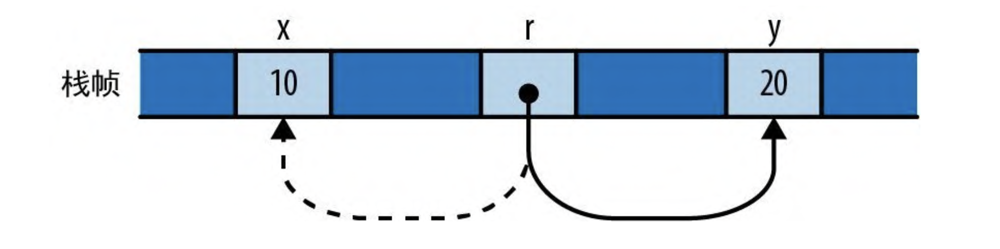
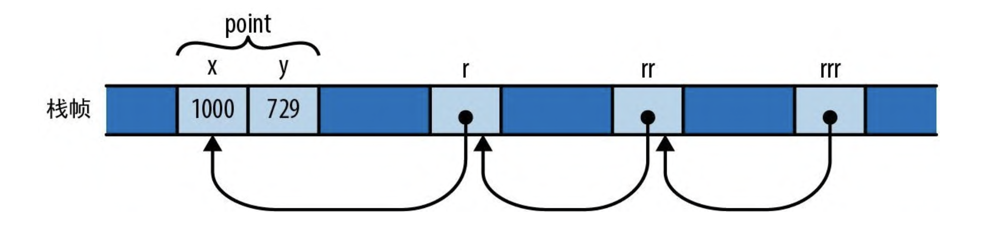

# 引用

Rust 一共有两种指针类型

- 拥有型指针。当拥有者被丢弃时，它的引用目标也随之丢弃。
- 非拥有型指针。这种指针对引用目标的生命周期毫无影响。

借用的概念：创建对某个值的引用称为借用。

- 借用的生命周期绝不能超出其引用目标的生命周期。

## 对值的引用

引用能让你在不影响其所有权的情况下访问值。引用分为两种：

- 共享引用允许你读取但不能修改其引用目标。但你可以根据需要同时拥有任意数量的对特征值的共享引用。值得注意的是：共享引用是`Copy`类型。
- 可变引用允许你读取和修改值，但是，一旦一个值拥有了可变引用，就无法再对该值创建其他任何种类的引用了。且这个值暂时失去对数据的控制，它也不能对堆中的数据进行读和写操作。可变引用不是`Copy`类型。

可以将共享引用和可变引用之间的区别视为在编译期强制执行“多重读取”或“单一写入”规则的一种手段。事实上，这条规则不仅适用于引用，也适用于所引用值的拥有者。只要存在对一个值的共享引用，即使是它的拥有者也不能修改它，该值会被锁定。当 show 正在使用 table 时，没有人可以修改它。类似地，如果有某个值的可变引用，那么它就会独占对该值的访问权，在可变引用消失之前，即使拥有者也根本无法使用该值。事实证明，让共享和修改保持完全分离对于内存安全至关重要.

以下是共享引用的一个例子：

```rust
use std::collections::HashMap;
type Table = HashMap<String, Vec<String>>;
fn main() {
    let mut table = Table::new();
    table.insert(
        "Gesualdo".to_string(),
        vec![
            "many madrigals".to_string(),
            "Tenebrae Responsoria".to_string(),
        ],
    );
    table.insert(
        "Caravaggio".to_string(),
        vec![
            "The Musicians".to_string(),
            "The Calling of St. Matthew".to_string(),
        ],
    );
    table.insert(
        "Cellini".to_string(),
        vec![
            "Perseus with the head of
Medusa"
                .to_string(),
            "a salt cellar".to_string(),
        ],
    );
    show(&table)
}
fn show(table: &Table) {
    for (artist, works) in table {
        println!("works by {}:", artist);
        for work in works {
            println!("  {}", work);
        }
    }
}
```

如果我们要修改 `table`变量的数据，只需像函数传递 `&mut Table`这种可变引用。加入我们直接传入 `table`数据的话，那么一旦对其进行`for`操作后，`table`会在一次次的循环中丢弃所有的数据。这并不是我们所想要的。

### 使用引用

在 Rust 中，引用是通过 `&`运算符显式创建的。同时要使用`*`运算符显式的解引用。因为在 Rust 程序中，引用是非常常用的操作，所以在遇到`.`运算符时，我们不必要使用`*`来对其左操作数隐式解引用。编译器它自己帮我们做了。

```rust
let num = 10;
let a = &num;
assert_eq!(*a, num);


// 遇到 . 运算符时，编译器会进行隐解引用
let mut str = "qweqwe".to_string();
let a = &mut str;
a.push('1'); // 等价于 (*a).push('1');
println!("{}", a);
```

同时， `.`也会在合适的场景进行隐式进行可变引用。在我们之前的例子中，在使用数组切片上的方法时，实质上也是隐式使用可变引用的。

```rust
  let mut arr = vec![3, 2, 1];
  arr.sort(); // 等价于 (&mut arr).sort();

  // 打印每个元素的值，注意这里对 arr 需要使用共享引用，否则 for 循环之后将丢弃 arr 的值。
  for el in &arr {
      println!("{}", el);
  }
```

### 对引用变量赋值

在 C++ 中，一旦使用引用，那么它将不会改变，保持一直对该值的使用。而在 Rust 中，把引用赋值给某个引用变量，会让该变量指向新的地方。

```rust
let x = 10;
let y = 10;
let mut r = &x;

if something {
    // 这里变量 r 更改了指向
    r = &y;
}
assert!(*r == 10 || *r == 20);
```

上面这个例子的内存示意图：


### 对引用进行引用

Rust 允许对引用进行引用：

```rust
let point = Point { x: 1000, y: 729 };
let r = &point;
let rr = &r;
let rrr = &rr;

assert_eq!(rrr.x, rrr.y);
```

其内存示意图为：



Rust 编译器是足够智能的，多重引用遇到`.`运算符一样可以解引用，无论它层级有多深。

### 比较引用

和`.`运算符一样，比较运算符也能解除任意数量的引用

```rust
let x = 10;
let y = 10;

let rx = &x;
let ry = &y;

let rrx = &rx;
let rry = &ry;

// 这里rx和ry会解除引用
assert!(rx == ry);
// 这里rrx和rry会解除引用
assert!(rrx == rry);

// 如果你需要对比地址空间是否一致，可以使用下面的方法
assert!(!std::ptr::eq(rx, ry));

// 值得注意的是，比较运算符必须具有完全相同的类型
assert!(rx == rry); // 这里将报错，因为 rx 和 rry 的类型不一致。
```

### 引用永不为空

Rust 的引用永远都不会为空。如果非要表示某个值可能为空，在 Rust 中常见的做法是使用类型 `Option<&T>`，在机器吗级别，Rust 会将 `None`表示为空指针，将`Some(r)`表示为非零地址（`r` 的类型是 `&T`）。

Rust 允许借用任意种类的表达式结果值的引用：

```rust
// Rust 这里可以看穿一层引用
println!("{}", &1 + &1); // 将打印 2
```

### 对切片和特型对象的引用

Rust 还有一个概念，就是胖指针。胖指针是指某个值地址的双字值。比如对切片的引用就是一个胖指针，携带着此切片的起始地址及其长度。

Rust 的另一种胖指针是特型对象，即对实现了指定特型的值的引用。特型对象会携带一个值的地址和指向适用于该值的特型实现的指针，以便调用特型的方法。

除了会携带这些额外的数据，切片和特型对象引用的行为与其他引用是一样的。它们并不拥有自己的引用目标、它们的生命周期也不允许超出它们的引用目标，它们可能是可变的或共享的。

## 引用安全

### 借用局部变量

你不能借用对局部变量的引用并将其移出变量的作用域，下面的这个例子中，当执行到 `}`后，变量`x`变丢弃了，此时就不能在使用`*r`对其进行解引用了。

```rust
let r;
{
    let x = 1;
    r = &x;
}
// - `x` dropped here while still borrowed
assert_eq!(*r, 1);
```

> 对于变量和借用它的引用来说，引用的生命周期（作用域）不能超出变量的生命周期（作用域）。这个规则对于借用大型数据结构中的某些部分也使用，比如借用向量中的某个元素

### 将引用作为函数参数

在 Rust 中，全局变量的等价物称为静态变量，它是程序启动时就会被创建并一直存续到程序终止时的值。

> 与任何其他声明一样，Rust 的模块系统会控制静态变量在何处可见，因此这只表示它们的生命周期是“全局的”，并不表示它们全局可见。这个概念要分清楚。

关于静态变量有几个注意点：

- 每个静态变量都必须初始化。
- 可变静态变量本质上不是线程安全的。毕竟，任何线程都可以随时访问静态变量，即使在单线程的程序中，它们也可能成为一些另类可重入性问题的牺牲品。由于这些原因，你只能在 unsafe 块中访问可变静态变量。

我们来看一个案例：

```rust
static mut STASH: &i32;
fn f(p: &i32) { STASH = p; }
```

上面的代码块实际上 Rust 编译会报错的。其错误有以下几点：

- `STASH`是全局可变静态变量，需要在 `unsafe`代码块中访问。
- `fn f(p: &i32) { STASH = p; }`这个函数的完整函数签名实际上是这样的`fn f<'a>(p: &'a i32) -> ()` 这里的 `'a` 是 f 的生命周期参数 `<'a>`的意思是“对于任意生命周期`'a`”。在这里表示该函数能接受对具有任意生命周期 `'a`的 i32 型引用。这里需要 p 是 'static 生命周期。

由于 STASH 会存续在程序的整个执行过程中，因此它所持有的引用类型必须具有等长的生命周期， Rust 将此称为 `'static生命周期`。但是指向 p 的引用的生命周期是 'a, 它可以是任何能涵盖对 f 调用的生命周期，所以，Rust 编译器会报错。

更改后的代码如下:

```rust
static mut  STASH :&i32 = &10;

fn f(p: &'static i32) {
  unsafe {
    STASH = p;
  }
}
```

如果看到一个带有 `g(p: &i32)`签名的函数（或者带有生命周期写成`g<'a>(p: &'a i32)`），那么就可以肯定它没有将其参数 p 隐藏在任何超出此调用点的地方。

### 把引用传给函数

```rust
fn g<'a>(p: &'a i32) {...}

let x = 10;
g(&x);
```

只要看看 g 的签名， Rust 就知道它不会将 p 保存在生命周期可能超出本次调用的任何地方：包含本次调用的任何生命周期都必须符合 'a 的要求。所以 Rust 为 &x 选择了选择了尽可能短的生命周期，即调用 g 时的生命周期。这满足所有约束：它的生命周期不会超出 x，并且会涵盖对 g 的完整调用。所以这段代码通过了审核。

### 返回引用

函数通常会接收某个数据结构的引用，然后返回对该结构的某个部分的引用。我们来看一个例子

> 小知识：当函数以单个引用作为参数并返回单个引用时，Rust 会假定两者具有相同的生命周期

```rust
fn main() {
  let s;
  {
    let parabola = [9, 4, 1, -9, 1, 4, 8];
    s = smallest(&parabola); // borrowed value does not live long enough
  }
  println("{}", s);
}
fn smallest(v: &[i32]) -> &i32 {
    let mut s = &v[0];
    for i in &v[1..] {
        if i < s {
            s = i;
        }
    }
    s
}
```

上述代码的解决方案就是把 s 移动到 parabola 同一作用域来

```rust
{
  let s;
  let parabola = [9, 4, 1, -9, 1, 4, 8];
  s = smallest(&parabola); // now it works
  println("{}", s);
}
```

### 包含引用的结构体

每当一个引用类型出现在另一个类型的定义之中，必须显式地写出它的生命周期

```rust
struct S {
  age: &i32; // 这里会报错，
}

// 必须写成这样
struct S<'a> {
  age: &'a i32;
}
```

### 不同的生命周期参数

我们来解析一个这样的例子：

```rust
struct S<'a> {
    x: &'a i32,
    y: &'a i32,
};

let r;
let x = 20;
{
    let y = 10;
    let s = S { x: &x, y: &y };
    r = s.x;
}
println!("{}", r);
```

上述代码实际上会报错。从结构体 S 的定义来看，字段 x 和字段 y 应该具有相同的生命周期。变量 s 和 y 的生命周期是是大括号范围内，x 和 r 是更大一层的生命周期。当 s.x 赋值给 r 时，这没有问题，因为这两者的生命周期相同，但是 y 的生命周期仅限于大括号内。所以找不到一个生命周期 'a， 同时满足 x， 和 y。编译器就会报错。

所以我们如何修改了，定义两个生命周期就行了。这样 x 和 y 可以满足不同的生命周期。编译器便可以正常工作了

```rust
struct S<'a, 'b> {
    x: &'a i32,
    y: &'b i32,
};

let result;
let x = 20;
{
    let y = 10;
    let s = S { x: &x, y: &y };
    result = s.x;
}
println!("{}", result);
```
