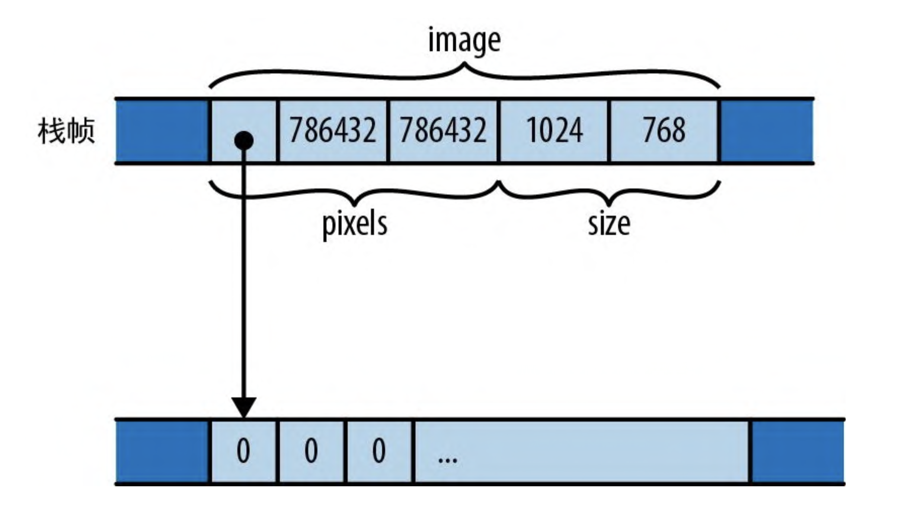

# 结构体

结构体会将多个不同类型的值组合成一个单一的值，以便你能把它们作为一个单元来处理。给定一个结构体，你可以读取和修改它的各个组件。结构体也可以具有关联的方法，以对其组件进行操作。

Rust 有 3 种结构体类型：具名字段型结构体、元组型结构体和单元型结构体。

## 具名字段型结构体

```rust
struct GrayscaleMap {
  pixels: Vec<u8>,
  size: (usize, usize)
}

let width = 1024;
let height = 576;

let image = GrayscaleMap {
  pixels: vec![0; width * height],
  size: (width, height)
}
```

结构体默认情况下是私有的，仅在声明它们的模块及其子模块中可见。可以通过在结构体的定义前加上 pub 来使结构体在其模块外部可见。结构体中的每个字段默认情况下也是私有的。

```rust
// 共有字段
pub struct GrayscaleMap {
  pub pixels: Vec<u8>,
  pub size: (usize, usize)
}
```

创建具名字段结构体的值时，可以使用另一个相同类型的结构体为省略的那些字段提供值。在结构体表达式中，如果具有字段后面跟着 `.. EXPR`，则任何未提及的字段都会从 EXPR 中获取它们的值。

## 元组型结构体

第二种结构体类型称为元组型结构体，因为它类似于元组：

```rust
struct Bounds(usize, usize);

let image_bounds = Bounds(1024, 768);
```

元组型结构体保存的值称为元素，就像元组的值一样。和元组一样，可以访问它们

```rust
assert_eq!(image_bounds.0 * image_bounds.1, 786432);
```

表达式 `Bounds(1024, 768)`看起来像一个函数调用，实际上它确实是，即定义这种类型时也隐式定义了一个函数：

```rust
fn Bounds(elem0: usize, elem1: usize) -> Bounds {
  // ..
}
```

## 单元型结构体

这一种结构体有点晦涩难懂，因为它声明了一个根本没有元素的结构体类型：

```rust
struct Onesuch;
```

这种类型的值不占用内存，很像单元类型 `()`, Rust 即不会在内存中实际存储单元型结构体的值，也不会生成代码来对它们进行操作，因为仅通过值的类型它就能知道关于值的所有信息。但从逻辑上讲，空结构体是一种可以像其他任何类型一样有值的类型。

## 结构体的内存布局

来看一个例子

```rust
struct GrayscaleMap {
  pixels: Vec<u8>,
  size: (usize, usize)
}
```

GrayscaleMap 值在内存中的布局如果 9 - 1 所示：


## 用 impl 定义方法

我们可以在自己定义的结构体上定义一些方法。Rust 方法不会像 C++ 或 Java 中的方法那样出现在结构体定义中，而是会出现在单独的 `impl` 块中。

`impl`块只是 fn 定义的集合，每个定义都会成为块顶部命名的结构体类型上的一个方法。例如，这里我们定义了一个公共的 Queue 结构体，然后为他定义了 push 和 pop 这两个公共方法：

```rust
pub struct Queue {
    older: Vec<char>,
    younger: Vec<char>,
}

impl Queue {
    pub fn push(&mut self, c: char) {
        self.younger.push(c);
    }
    pub fn pop(&mut self) -> Option<char> {
        if self.older.is_empty() {
            if self.younger.is_empty() {
                return None;
            }
            use std::mem::swap;
            swap(&mut self.older, &mut self.younger);
            self.older.reverse();
        }
        self.older.pop()
    }
}
```

在 impl 块中定义的函数称为关联函数，因为它们是与特定类型相关联的。与关联函数相对的是自由函数，它是为定义在 impl 中的语法项。

Rust 会将调用关联函数的结构体值作为第一个参数传给方法，该参数必须具有特殊名称 self。由于 self 的类型显然就是在 impl 块顶部命名的类型或对该类型的引用，因此 Rust 允许你省略类型，并以 self、&self 或 &mut self 作为 self: Queue、self: &Queue 或 self: &mut Queue 的简写形式。如果你愿意，也可以使用完整形式，但如前所述，几乎所有 Rust 代码都会使用简写形式。

由于 push 和 pop 需要修改 Queue，因此它们都接受 &mut self 参数。然而，当调用一个方法时，你不需要自己借用可变引用，常规的方法调用语法就已经隐式处理了这一点。只需编写 q.push(...) 就可以借入对 q 的可变引用，就好像你写的是 (&mut q).push(...) 一样，因为这是 push 方法的 self 参数所要求的。

### 以 Box、Rc 或 Arc 形式传入 self

方法的 self 参数也可以是 `Box<Self>` 类型、`Rc<Self>` 类型或 `Arc<Self>` 类型。这种方法只能在给定的指针类型值上调用。调用该方法会将指针的所有权传给它。

你通常不需要这么做。如果一个方法期望通过引用接受 self，那它 在任何指针类型上调用时都可以正常工作

```rust
let mut bq = Box::new(Queue::new());

bp.push('h');
```

对于方法调用和字段访问，Rust 会自动从 Box、Rc、Arc 等指针类型中借入引用，因此 &self 和 &mut self 几乎总是(偶尔也会用一下 self)方法签名里的正确选择

### 类型关联函数

给定类型的 impl 块还可以定义根本不以 self 为参数的函数。这些函数仍然是关联函数，因为它们在 impl 块中，但他们不是方法，因为他们不接受 self 参数。为了将他们与方法区分开来，我们称为 类型关联函数。

他们通常用于提供构造函数，

```rust
impl Queue {
  pub fn new() -> Queue {
    Queue { older: Vec::new(), younger: Vec::new() }
  }
}
```

## 关联常量

Rust 在其类型系统中的另一个特性也采用了类似于 C# 和 Java 的思想，有些值是与类型而不是该类型的特定实例关联起来的。在 Rust 中，这些叫作关联常量。

```rust
pub struct Vector2 {
  x: f32,
  y: f32
}

impl Vector2 {
  const ZERO: Vector2 = Vector2 { x: 0.0, y: 0.0 };
  const UNIT: Vector2 = Vector2 { x: 1.0, y: 0.0 }
}
```

## 泛型结构体

Rust 结构体可以是 的，这意味着它们的定义是一个模板，你可以在其中插入任何自己喜欢的类型。例如，下面是 Queue 的定义，它可以保存任意类型的值:

```rust
pub struct Queue<T> {
  older: Vec<T>,
  younger: Vec<T>
}
```

在泛型结构体定义中，尖括号(<>)中的类型名称叫作 。泛 型结构体的 impl 块如下所示

```rust
impl<T> Queue<T> {
  pub fn new() -> Queue<T> {
    Queue { older: Vec::new(), younger: Vec::new() }
  }
  pub fn push(&mut self, t:T) {
    self.younger.push(t);
  }

  pub fn is_empty(&self) -> bool {
    self.older.is_empty() && self.younger.is_empty()
  }

}
```

## 带生命周期参数的泛型结构体

正如我们在 5.3.5 节中讨论的那样，如果结构体类型包含引用，则必须为这些引用的生命周期命名。例如，下面这个结构体可能包含对某个切片的最大元素和最小元素的引用。之前已经讨论过

```rust
struct Extrema<'elt> {
  greatest: &'elt i32,
  least: &'elt i32
}
```

## 带常量参数的泛型结构体

泛型结构体也可以接受常量值作为参数。例如，你可以定义一个表示任意次数多项式的类型

```rust
struct Polynomial<const N: usize> {
  coefficients: [f64; N]
}
```

> 常量泛型参数可以是任意整数类型、char 或 bool。不允许使用浮点数、枚举和其他类型

如果结构体还接受其他种类的泛型参数，则生命周期参数必须排在第一位，然后是类型，接下来是任何 const 值。例如，一个包含引用 数组的类型可以这样声明

```rust
struct LumpOfReferences<'a, T, const N: usize> {
  the_lump: [&'a T; N]
}
```

## 让结构体类型派生自某些公共特性

结构体很容易编写

```rust
struct Point {
  x: f64,
  y: f64
}
```

如果你要开始使用这种 Point 类型，很快就会发现它有点儿难用。像这样写的话，Point 不可复制或克隆，不能用 println! ("{:?}", point); 打印，而且不支持 == 运算符和 != 运算符。

这些特性中的每一个在 Rust 中都有名称——Copy、Clone、Debug 和 PartialEq，它们被称为 。第 11 章会展示如何为自己的结构体手动实现特型。但是对于这些标准特型和其他一些特型，无须手动实现，除非你想要某种自定义行为。Rust 可以自动为你实现它们，而且结果准确无误。只需将 #[derive] 属性添加到结构体上即可

```rust
#[derive(Copy, Clone, Debug, PartialEq)]
struct Point {
  x: f64,
  y: f64
}
```
> 只要实现某个特型就会自动让它成为公共特性，因此可复制性、可克隆性等都会成为该结构体的公共 API 的一部分，应该慎重选择。

