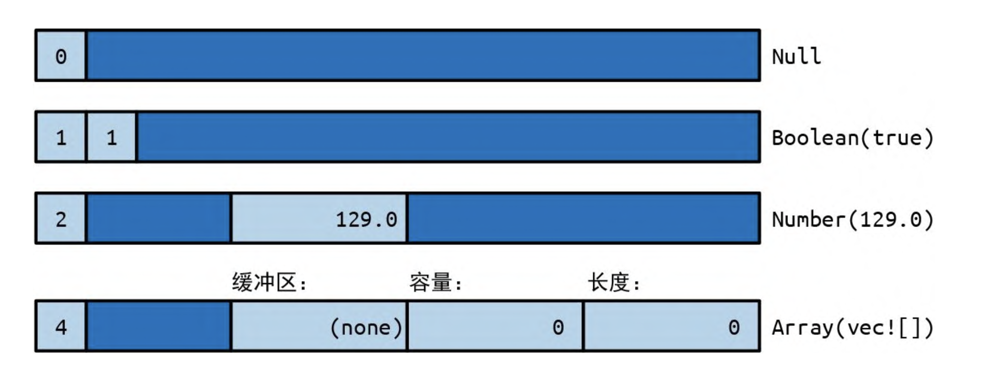
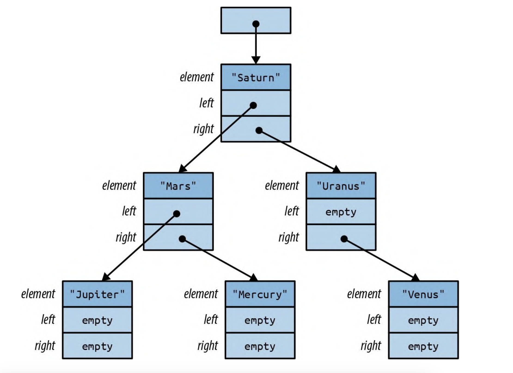
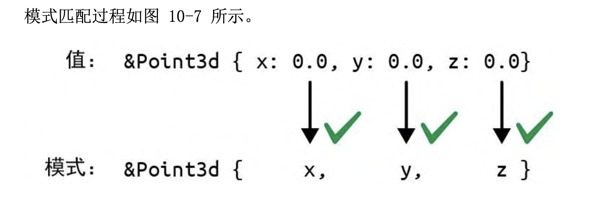

# 枚举

Rust 中简单的 C 风格枚举很直观

```rust
enum Ordering {
  Less,
  Equal,
  Greater
}
```

这声明了一个具有 3 个可能值的 Ordering 类型，称为 或 :Ordering::Less、Ordering::Equal 和 Ordering::Greater。

可以使用 `*` 导出当前所有

```rust
enum Pet {
  Orca,
  Giraffe,
  ...
}

use self::Pet::*;
```

在内存中，C 风格枚举的各个值会存储为整数。有时告诉 Rust 要使用哪几个整数是很有用的, 否则 Rust 会从 0 开始帮你分配数值。

```rust
enum HttpStatus {
  Ok = 200,
  NotModified = 304,
  NotFound = 404
  //..
}
```

可以将 C 风格枚举转换为整数, 从整数到枚举的反向转换则行不通。

```rust
assert_eq!(HttpStatus::Ok as i32, 200);
```

你可以编写自己 的“检查完再转换”逻辑:

```rust
fn http_status_from_u32(n: u32) -> Option<HttpStatus> {
  match n {
    200 => Some(HttpStatus::Ok),
    304 => Some(HttpStatus::NotModified),
    404 => Some(HttpStatus::NotFound),
    _ => None
  }
}
```

枚举可以有方法，就像结构体一样:

```rust
enum TimeUnit {
    Seconds, Minutes, Hours, Days, Months, Years,
}
impl TimeUnit {
  fn plural(self) -> &'static str {
    match self {
      TimeUnit::Seconds => "seconds",
      TimeUnit::Minutes => "minutes",
      TimeUnit::Hours => "hours",
      TimeUnit::Days => "days",
      TimeUnit::Months => "months",
      TimeUnit::Years => "years",
    }
  }
}
```

## 带数据的枚举

```rust
#[derive(Copy, Clone, Debug, PartialEq)]
enum RoughTime {
  InThePast(TimeUnit, u32),
  JustNow,
  InTheFuture(TimeUnit, u32),
}
```

此枚举中的两个变体 InThePast 和 InTheFuture 能接受参数。这种变体叫作。与元组型结构体一样，这些构造器也是可创建新 RoughTime 值的函数:

```rust
let four_score_and_seven_years_ago =
    RoughTime::InThePast(TimeUnit::Years, 4 * 20 + 7);
let three_hours_from_now =
    RoughTime::InTheFuture(TimeUnit::Hours, 3);
```

枚举还可以有 ，就像普通结构体一样包含一些具名字段

```rust
enum Shape {
  Shpere { center: Point3d, radius: f32 },
  Cuboid { corner1: Point3d, corner2: Point3d }
}

let unit_sphere = Shape::Sphere {
  center: ORIGIN,
  radius: 1.0,
}
```

Rust 有 3 种枚举变体, 没有数据的变体对应于单元型结构体。元组型变体的外观和功能很像元组型结构体。结构体型变体具有花括号和具名字段。

```rust
enum RelationshipStatus {
  Single,
  InARelationship,
  ItsComplicated(Option<String>),
  ItsExtremelyComplicated {
    car: DifferentialEqualtion,
    cdr: EarlyModernistPoem
  }
}
```

## 内存中的枚举

在内存中，带有数据的枚举会以一个小型整数加上足以容纳最大变体中所有字段的内存块的格式进行存储。标签字段供 Rust 内部使用。它会区分由哪个构造器创建了值，进而决定这个值应该有哪些字段。

```rust
enum RoughTime {
  InThePast(TimeUnit, u32),
  JustNow,
  InTheFuture(TimeUnit, u32),
}
```

上诉 RoughTime 会占用 8 字节（最大的一个变体是 8 字节）


## 用枚举表示富数据结构

枚举对于快速实现树形数据结构也很有用。假设一个 Rust 程序需要处理任意 JSON 数据。在内存中，任何 JSON 文档都可以表示为这种 Rust 类型的值

```rust
use std::collections::HashMap;

enum Json {
  Null,
  Boolean(bool),
  Number(f64),
  String(String),
  Array(Vec<Json>),
  Object(Box<HashMap<String, Json>>)
}
```

上述类型的内存示意图如下：


## 泛型枚举

枚举可以是泛型的。Rust 标准库中的两个例子是该语言中最常用的数据类型:

```rust
enum Option<T> {
  None,
  Some(T),
}
enum Result<T, E> {
  Ok(T),
  Err(E),
}
```

> 当类型 T 是引用、Box 或其他智能指针类 型时，Rust 可以省掉 `Option<T>` 的标签字段

我们来看一个树型结构体的例子

```rust

enum BinaryTree<T> {
  Empty,
  NonEmpty(Box<TreeNode<T>>),
}

struct TreeNode<T> {
  element: T,
  left: BinaryTree<T>,
  right: BinaryTree<T>
}
```

每个 BinaryTree 值要么是 Empty，要么是 NonEmpty。 如果是 Empty，那它根本不含任何数据。如果是 NonEmpty，那它就会有一个 Box，即一个指向堆上分配的 TreeNode 的指针。

每个 TreeNode 值包含一个实际元素以及另外两个 BinaryTree 值。这意味着树可以包含子树，因此 NonEmpty 树可以有任意数量的 后代。

BinaryTree<&str> 类型值的示意图如下图所示, 与 `Option<Box<T>>` 一样，Rust 在这里也省略了标签字段，因此 BinaryTree 值占用一个机器字。


# 模式

枚举虽然可以存储数据，但 Rust 不允许你直接访问他们，只能用一种安全的方式来访问枚举中的数据，即使用模式。

```rust
let r = shape.radius; // 错误：在 shape 类型上没有 radius 字段
```

回忆一下本章前面定义过的 RoughTime 类型：

```rust
enum TimeUnit {
    Seconds, Minutes, Hours, Days, Months, Years,
}
enum RoughTime {
    InThePast(TimeUnit, u32),
    JustNow,
    InTheFuture(TimeUnit, u32),
}
```

假设你有一个 RoughTime 值并希望把它显示在网页上。你需要访问值内的 TimeUnit 字段和 u32 字段。Rust 不允许你通过编写 rough_time.0 和 rough_time.1 来直接访问他们，毕竟 rough_time 的值可能为 RoughTime::JustNow，怎样才能获得数据呢？

我们需要一个 match 表达式：

```rust {.line-numbers}
fn rough_time_to_english(rt: RoughTime) -> String {
  match rt {
    RoughTime::InThePast(units, count) => format!("{} {} age", count, units.plural()),
    RoughTime::JustNow => format!("just now"),
    RoughTime::InTheFuture(units, count) => format!("{} {} from now", count, units.plural()),
  }
}
```

匹配 RoughTime 值的模式 很像用于创建 RoughTime 值的表达式。这是刻意的设计。表达式会生成值，模式会消耗值。两者刻意使用了很多相同的语法。

下面是常用的模式类型
|模式类型|例子|注意事项|
|-|-|-|
|字面量|100、“name”|匹配一个确切的值;也允许匹配常量名称|
|范围|0..=100 <br>'a' ..= 'k' <br> 256|匹配范围内的任何值，包括可能给定的结束值|
|通配符|\_|匹配任何值并忽略它|
|变量|name<br>mut count|类似于 \_，但会把值移动或复制到新 的局部变量中|
|引用变量|ref field<br>ref mut field|借用对匹配值的引用，而不是移动或复制它|
|与子模式绑定|val @ 0..=99<br>ref circle @ Shpae::Cicle{..}|使用@左边的变量名,匹配其右边的模式|
|枚举型模式|Some(value)<br>None<br>Pet::Orca||
|元组型模式|(key,value)<br>(r,g,b)||
|数组型模式|[a,b,c,d,e,f,g]<br>[heading, carom, correction]||
|切片型模式|[first, second]<br>[first, _, third]<br>[first, .., nth]||
|结构体型模式|{ Colr (r,g,b) }<br>Point { x, y}<br>Card{suit: Clubs, rank: n}<br>Acount { id, name, ..}||
|引用|&value <br> & (k, v) |仅匹配引用值|
|匹配多个模式|'a' \| 'A' <br> & Some("left" \| "right") ||
|守卫表达式|x if x \* x <= r2|只用在 match 表达式(不能用在 let 语句等处)|

## 模式中的字面量、变量和通配符

```rust
match meadow.count_rabbits() {
  0 => {}
  1 => println!("A rabbit is nosing around in the clover."),
  n => println!("There are {} rabbits hopping about in the meadow", n),
}
```

解释一下上面的匹配规则:如果草地上没有兔子，就匹配模式 0;如果只有一只兔子，就匹配模式 1;如果有两只或更多的兔子，就匹配第三个模式，即模式 n。模 式 n 只是一个变量名，它可以匹配任何值，匹配的值会移动或复制到一个新的局部变量中。所以在这种情况下，meadow.count_rabbits() 的值会存储在一个新的局部变量 n 中，然后打印出来。

其他字面量也可以用作模式，包括布尔值、字符，甚至字符串

```rust
let calendar = match settings.get_string("calendar") {
    "gregorian" => Calendar::Gregorian,
    "chinese" => Calendar::Chinese,
    "ethiopian" => Calendar::Ethiopian,
    other => return parse_error("calendar", other),
};
```

other 就像上个例子中的 n 一样充当了包罗万象的 模式。这些模式与 switch 语句中的 default 分支起着相同的作 用，用于匹配与任何其他模式都无法匹配的值。

如果你需要一个包罗万象的模式，但又不关心匹配到的值，那么可以 用单个下划线 \_ 作为模式，这就是通配符模式:

```rust
let caption = match photo.tagged_pet() {
  Pet::Tyrannosaur => "RRRAAAAAHHHHHH",
  Pet::Samoyed => "*dog thoughts*",
  _ => "I'm cute, love me", // 一般性捕获，对任意Pet都生效
};
```

## 元组型模式与结构体型模式

元组型模式匹配元组。每当你想要在单次 match 中获取多条数据时，元组型模式都非常有用

```rust
fn describe_point(x: i32, y: i32) -> &'static str {
    use std::cmp::Ordering::*;
    match (x.cmp(&0), y.cmp(&0)) {
        (Equal, Equal) => "at the origin",
        (_, Equal) => "on the x axis",
        (Equal, _) => "on the y axis",
        (Greater, Greater) => "in the first quadrant",
        (Less, Greater) => "in the second quadrant",
        _ => "somewhere else",
    }
}

```

结构体型模式使用花括号，就像结构体表达式一样。结构体型模式包
含每个字段的子模式

```rust
match balloon.location {
  Point { x: 0, y: height } => println!("straight up {} meters", height),
  Point { x: x, y: y } => println!("at ({}m, {}m)", x, y)
}
```

结构体中也可以使用 `_` 表示我们不关心的变量

```rust
match get_account(id) {
  //...
  Some(Account{
    name,
    language,
    id: _,
    status: _,
    address: _,
    pet: _,
    security_question: _,
    //.. others
  })
}
```

为了避免过的的样板代码,可以使用 `..` 告诉 Rust 不关心其他任何字段

```rust
Some(Account {
  name,
  language,
  ..
}) => language.show_custom_greeting(name)
```

## 数组型模式与切片模式

数组型模式匹配数组。数组型模式通常用于过滤一些特殊情况的值，并且在处理那些不同位置的值具有不同含义的数组时也非常有用。

例如，在将 HSL(色相、饱和度和亮度)颜色值转换为 RGB(红色、绿色和蓝色)颜色值时，具有零亮度或全亮度的颜色只会是黑色或白色。可以使用 match 表达式来简单地处理这些情况。

```rust
fn hsl_to_rgb(hsl: [u8; 3]) => [u8; 3] {
  match hsl {
    [_, _, 0] => [0, 0, 0],
    [_, _, 255] => [255, 255, 255],
    // ...
  }
}
```

切片型模式也与此相似，但与数组不同，切片具有可变长度，因此切片型模式不仅匹配值，还匹配长度。.. 在切片型模式中能匹配任意数量的元素。

```rust
fn greet_people(name: &[&str]) {
  match names {
    [] => { println!("Hello, nobody.") },
    [a] => { println!("Hello, {}.", a) },
    [a, b] => { println!("Hello, {} and {}.", a, b) },
    [a, .., b] => { println!("Hello, {} to {}.", a, b) },
  }
}
```

Rust 也可以像 js 一样,使用解构赋值

```rust
let arr = [11, 2, 3];
let [first, second, third] = arr;
println!("{} = {} = {}", first, second, third);
```

## 引用型模式

Rust 模式提供了两种特性来支持引用. ref 模式会借用已匹配值的一部分. & 模式会匹配引用.

> 匹配不可复制的值会移动该值.

```rust
match account {
    Account { name, language, .. } => {
        ui.greet(&name, &language);
        ui.show_settings(&account); // 错误:借用已移动的值`account`
    }
}
```

在上面这个例子中, 字段 account.name 和 account.language 会移动到局部变量 name 和 language 中. account 的其余部分均已丢弃. 这就是为什么我们之后不能再借用它的引用.

如果 name 和 language 都是可以复制的值, 则 Rust 会复制字段而非移动它们, 这时上述代码就是有效的. 但假设这些是 String 类型, 那我们可以做些什么呢? 我们需要一种借用而非移动匹配值的模式. ref 关键字就是做这样的

```rust
match account {
  Account {
    ref name,
    ref language,
    ..
  } => {
    ui.greet(name, language);
    ui.show_settings(&account); 正确
  }
}
```

现在局部变量 name 和 language 是对 account 中相应字段的引用. 由于 account 只是被借入而没有被消耗, 因此继续调用它的方法是没有问题的.

还可以使用 ref mut 来借入可变引用:

```rust
match line_result {
  Err(ref err) => log_error(err),
  Ok(ref mut line) => {
    trim_comments(line);
    handle(line);
  }
}
```

模式 `Ok(ref mut line)`能匹配任何成功的结果, 并借入其成功值的可变引用.

与 ref 模式相对的引用型模式是 `&` 模式. 以 `&` 开头的模式会匹配引用

> ref 从值取引用, 而 & 是从引用中取值. 这是两个引用型模式的区别

```rust
match sphere.center() {
  &Point3d { x, y, x } => { }
}
```

假设 sphere.center() 会返回对 sphere 中的私有字段的引用, 模式匹配过程如图所示


匹配引用时会遵循我们所期望的一切规则。生命周期规则仍然有效。你不能通过共享引用获得可变访问权限，而且不能将值从引用中移动出去，即使对可变引用也是如此。当我们配 &Point3d { x, y, z } 时，变量 x、y 和 z 会接受坐标的副本，而原始 Point3d 的值保持不变。这种写法之所以有效，是因为这些字段都是可复制的。 如果试图在具有不可复制字段的结构体上这么做，就会出错

```rust
match friend.borrow.car() {
  Some(&Car { engine, .. }) => {
    // do somethin
  }, // 错误:不能把借用的值移动出去
  None => {}
}
```

所以我们需要 ref 模式

```rust
match friend.borrow.car() {
  Some(&Car { ref engine, .. }) => {
    // do somethin
  }, // 正确, engine 是一个引用
  None => {}
}
```
