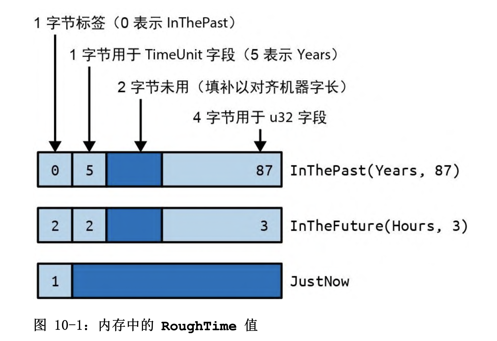

# 枚举

Rust 中简单的 C 风格枚举很直观

```rust
enum Ordering {
  Less,
  Equal,
  Greater
}
```

这声明了一个具有 3 个可能值的 Ordering 类型，称为 或 :Ordering::Less、Ordering::Equal 和 Ordering::Greater。

可以使用 `*` 导出当前所有

```rust
enum Pet {
  Orca,
  Giraffe,
  ...
}

use self::Pet::*;
```

在内存中，C 风格枚举的各个值会存储为整数。有时告诉 Rust 要使用哪几个整数是很有用的, 否则 Rust 会从 0 开始帮你分配数值。

```rust
enum HttpStatus {
  Ok = 200,
  NotModified = 304,
  NotFound = 404
  //..
}
```

可以将 C 风格枚举转换为整数, 从整数到枚举的反向转换则行不通。

```rust
assert_eq!(HttpStatus::Ok as i32, 200);
```

你可以编写自己 的“检查完再转换”逻辑:

```rust
fn http_status_from_u32(n: u32) -> Option<HttpStatus> {
  match n {
    200 => Some(HttpStatus::Ok),
    304 => Some(HttpStatus::NotModified),
    404 => Some(HttpStatus::NotFound),
    _ => None
  }
}
```

枚举可以有方法，就像结构体一样:

```rust
enum TimeUnit {
    Seconds, Minutes, Hours, Days, Months, Years,
}
impl TimeUnit {
  fn plural(self) -> &'static str {
    match self {
      TimeUnit::Seconds => "seconds",
      TimeUnit::Minutes => "minutes",
      TimeUnit::Hours => "hours",
      TimeUnit::Days => "days",
      TimeUnit::Months => "months",
      TimeUnit::Years => "years",
    }
  }
}
```

## 带数据的枚举

```rust
#[derive(Copy, Clone, Debug, PartialEq)]
enum RoughTime {
  InThePast(TimeUnit, u32),
  JustNow,
  InTheFuture(TimeUnit, u32),
}
```

此枚举中的两个变体 InThePast 和 InTheFuture 能接受参数。这种变体叫作。与元组型结构体一样，这些构造器也是可创建新 RoughTime 值的函数:

```rust
let four_score_and_seven_years_ago =
    RoughTime::InThePast(TimeUnit::Years, 4 * 20 + 7);
let three_hours_from_now =
    RoughTime::InTheFuture(TimeUnit::Hours, 3);
```

枚举还可以有 ，就像普通结构体一样包含一些具名字段

```rust
enum Shape {
  Shpere { center: Point3d, radius: f32 },
  Cuboid { corner1: Point3d, corner2: Point3d }
}

let unit_sphere = Shape::Sphere {
  center: ORIGIN,
  radius: 1.0,
}
```

Rust 有 3 种枚举变体, 没有数据的变体对应于单元型结构体。元组型变体的外观和功能很像元组型结构体。结构体型变体具有花括号和具名字段。

```rust
enum RelationshipStatus {
  Single,
  InARelationship,
  ItsComplicated(Option<String>),
  ItsExtremelyComplicated {
    car: DifferentialEqualtion,
    cdr: EarlyModernistPoem
  }
}
```

## 内存中的枚举

在内存中，带有数据的枚举会以一个小型整数加上足以容纳最大变体中所有字段的内存块的格式进行存储。标签字段供 Rust 内部使用。它会区分由哪个构造器创建了值，进而决定这个值应该有哪些字段。

```rust
enum RoughTime {
  InThePast(TimeUnit, u32),
  JustNow,
  InTheFuture(TimeUnit, u32),
}
```

上诉 RoughTime 会占用 8 字节（最大的一个变体是 8 字节）

