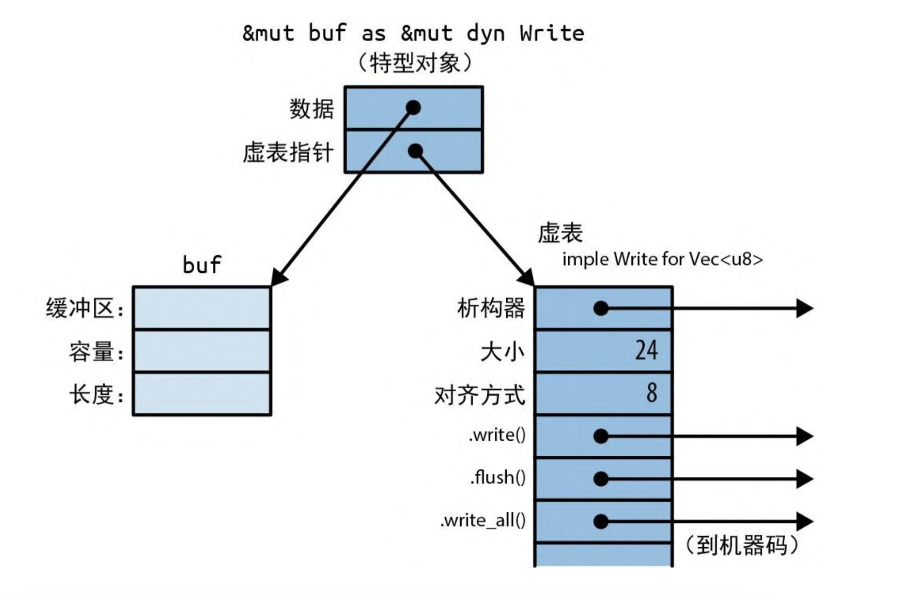
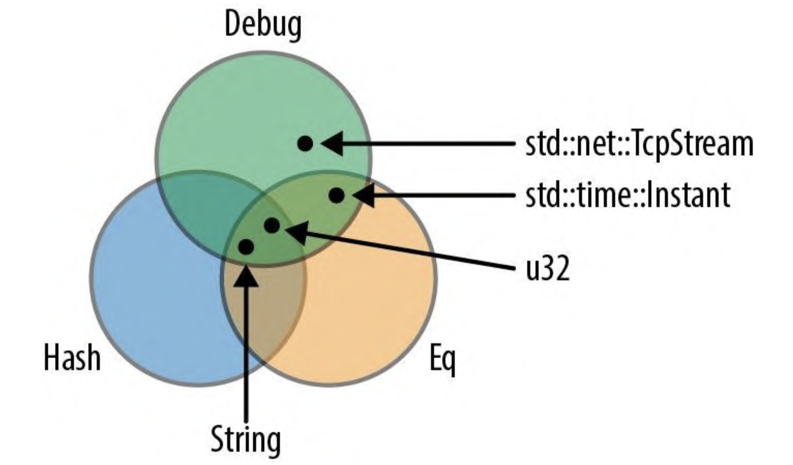

# 使用特性

特型是一种语言特性,我们可以说某类型支持或不支持某个特型. 大多数情况下, 特型代表着一种能力, 即一个类型能做什么.

比如:

- 实现了 std::io::Write 的值能写出一些字节。
- 实现了 std::iter::Iterator 的值能生成一系列值。
- 实现了 std::clone::Clone 的值能在内存中克隆自身。
- 实现了 std::fmt::Debug 的值能用带有 {:?} 格式说明符的 println!() 打印出来。

上述这 4 个特型都是 Rust 标准库的一部分，许多标准类型实现了它们。

- std::fs::File 实现了 Write 特型, 它能将一些字节写入本地文件. std::net::TcpStream 能写入网络连接. `Vec<u8>` 也实现了 Write, 对字节向量的每次 .write() 调用都会将一些数据追加到向量末尾.
- `Range<i32>`(表达式 0..10 的类型) 实现了 Iterator 特型,一些与切片、哈希表等关联的迭代器类型同样实现了 Iterator 特型.
- 大多数标准库类型实现了 Clone. 没实现 Clone 的主要是一些像 TcpStream 这样的类型, 因为它们代表的不仅仅是内存中的数据.
- 同样, 大多数标准库类型支持 Debug

关于特型方法有一条值得注意的规则, 特型本身必须在作用域内. 否则, 它的所有方法都是不可见的.

```rust
let mut buf: Vec<u8> = vec![];
buf.write_all(b"hello")?; // 错误: 没有名为 write_all 的方法
```

在这种情况下, 编译器会打印出一条友好的错误消息, 建议添加 use std::io::Write; 就可以解决问题:

```rust
use std::io::Write;

let mut buf:: Vec<u8> = vec![];
buf.write_all(b"hello")?;   // 正确
```

之所以 Rust 会有这条规则, 是因为你可以使用特型为任意类型添加新方法 —— 甚至是像 u32 和 str 这样的标准库类型. 而第三方 crate 也可以这样做. 但是这可能导致命名冲突. 但是由于 Rust 会要求你导入自己想用的特型, 因此 crate 可以放心地利用这种超能力. 只有导入两个特型, 才会发生冲突, 将具有相同名称的方法添加到同一个类型中. 这在实践中非常罕见.

> Clone 和 Iterator 的各个方法在没有任何特殊导入的情况下就能工作, 因为默认情况下它们始终在作用域中, 它们是标准库预导入的一部分, Rust 会把这些名称自动导入每个模块中. 事实上, 预导入主要就是一些精心挑选的特型.

## 特型对象

在 Rust 中使用特型编写多态代码有两种方法: 特型对象和泛型.

对特型类型的引用叫做**特型对象**. 与任何其他引用一样, 特型对象指向某个值, 它具有生命周期, 并且可以是可变或共享的.

特型对象的与众不同之处在于, Rust 通常无法在编译期间知道引用目标的类型. 因此, 特型对象要包含一些关于引用目标类型的额外信息. 这仅供 Rust 自己在幕后使用: 当你调用 writer.writer(data) 时, Rust 需要使用类型信息来根据 `*writer` 的具体类型动态调用正确的 write 方法. 不能直接查询这些类型信息, Rust 也不支持从特型对象 &mut dyn Write 向下转型会像 `Vec<u8>` 这样的具体类型

### 特型对象的内存布局

在内存中, 特型对象是一个胖指针, 由指向值的指针和指向表示该值类型的虚表的指针组成. 因此, 每个特型对象会占用两个机器字. 如图所示:



Rust 在需要时会自动将普通引用转为特型对象.

```rust
let mut local_file = File::create("hello.txt")?;
say_hello(&mut local_file)?;
```

`&mut local_file`的类型是 `&mut File`, `say_hello`的参数类型是 `&mut dyn Write`. 由于 File 也是一种写入器, 因此 Rust 允许这样的操作, 它会自动将普通引用转换为特型对象.

同样, Rust 会愉快地将 `Box<File>`转换为 `Box<dyn Write>`, 这是一个拥有在堆中分配的写入器的值

```rust
let w: Box<dyn Write> = Box::new(local_file);
```

## 泛型函数与类型参数

短语 `<W: Write>` 把函数变成了泛型形式。此短语叫作类型参数. 这意味着在这个函数的整个函数体中，W 都代表着某种实现了 Write 特型的类型。

```rust
fn say_hello<W: Write>(out: &mut W) -> std::io::Result<()> {
    out.write_all(b"hello world\n")?;
    out.flush()
}
```

W 代表哪种类型取决于泛型函数的使用方式

```rust
say_hello(&mut local_file)?; // 调用 say_hello::<File>
say_hello(&mut bytes)?; // 调用 say_hello::<Vec<u8>>
```

当我们将 `&mut local_file` 传给范型函数 `say_hello()` 时,其实调用的是 `say_hello::<File>()`. Rust 会为此函数生成一份机器码, 以调用 File::write_all() 方法和 File::flush() 方法. 当传入 `&mut bytes`时, 其实是在调用 `say_hello::<Vec<u8>>`. Rust 会为这个版本的函数生成单独的机器码, 以调用相应的 `Vec<u8>`方法. 在这两种情况下, Rust 都会从参数的类型推断出类型 W, 这个过程叫作 单态化, 编译器会自动处理这一切.

我们调用方法时, 也可以显式写出当前的类型

```rust
say_heelo::<File>(&mut local_file)?;
```

有时我们需要同一个类型参数的多种能力. 如果想打印出向量中前十个最常用的值,那么就要让这些值是可打印的

```rust
use std::fmt::Debug;

fn top_ten<T: Debug>(values: &Vec<T>) {
  // ..
}
```

但这还不够友好, 如果我们要确定哪些值是最常用的该怎么办呢? 通常的做法是用这些值作为哈希表中的键. 这意味着这些值还要支持 Hash 操作和 Eq 操作. T 的类型限界必须包括这些特型, 就像 Debug 一样. 这种情况下就要使用 + 号语法:

```rust
use std::hash::Hash;
use std::fmt::Debug;

fn top_ten<T: Debug+Hash+Eq>(values: &Vec<T>) {
  // ..
}
```

有些类型实现了 Debug，有些类型实现了 Hash，有些类型支持 Eq，还有一些类型(如 u32 和 String)实现了所有这 3 个，如图


> 类型参数也可能完全没有限界，但是如果没有为它指定任何限界，则 无法对它做什么。你可以移动它，也可以将它放入一个 Box 或向量 中。但也只能做这些了。

限界可能会变得很长，让人眼花缭乱。Rust 使用关键 字 where 提供了另一种语法:

```rust
use std::fmt::Debug;
use std::hash::Hash;
fn top_ten<T>(values: &Vec<T>) where T: Debug+Hash+Eq {
 // ..
}
```

类型参数 T 仍然放在前面声明, 但限界移到了单独的行中. 这种 where 子句也允许用于泛型结构体、枚举、类型别名和方法, 即任何允许使用限界的地方.

泛型函数可以同时具有生命周期参数和类型参数, 但是生命周期要排在前面:

```rust
fn nearest<'t, 'c, P>(target: &'t P, candidates: &'c [P]) -> &'c P
where P: MeasureDistance {
  //..
}
```

> 生命周期永远不会对机器码产生任何影响. 如果对 nearest() 进行的两次调用使用了相同的类型 P 和不同的生命周期, 那么就会调用同一个编译结果函数. 只有不同的类型才会导致 Rust 编译出泛型函数的多个副本.

除了类型和生命周期, 泛型函数也可以接受常量参数,

```rust
fn dot_product<const N: usize>(a: [f64; N], b: [f64; N]) -> f64 {
  let mut sum = 0.0;
  for i in 0..N {
    sum += a[i] * b[i];
  }
  sum
}
```

在这里, 短语 `<const N: usize>`指出函数 dot_product 需要一个泛型参数 N, 该参数必须是一个 usize. 给定了 N, 这个函数就会接受两个 [f64, N]类型的参数, 并将其对应元素的乘积相加. N 与普通 usize 参数的区别是, 你可以在 dot_product 的签名或函数体的类型中使用它

与类型参数一样, 你既可以显式提供常量参数, 也可以让 Rust 推断他们.

```rust
dot_product::<3>([0.2, 0.4, 0.6], [0, 0.0, 1.0]);

dot_product([3.0, 4.0], [-5.0, 1.1]);
```

- 单独的方法也可以是泛型的, 即使它并没有定义在泛型类型上

```rust
impl PancakeStack {
  fn push<T: Topping>(&mut self, goop: T) -> PancakeResult<()> {
    goop.pour(&self);
    self.absorb_topping(goop);
  }
}
```

- 类型别名也是可以泛型的

```rust
type PancakeResult<T> = Result<T, pancakeError>;
```

> 特性(限界、where 子句、生命周期参数等)可用于所有泛型语法项, 而不仅仅是函数.
