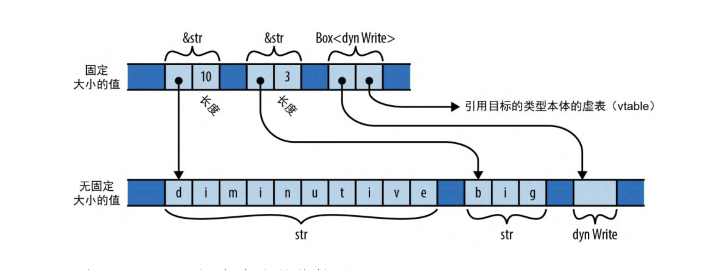

# 实用工具特型

Rust 实用工具特型可分为三大类

- 语言扩展特型
- 标记特型
- 公共词汇特型

实用工具特型汇总表:
|特型|描述|
|-|-|
|Drop|析构器, 每当丢弃一个值时, Rust 都要自动运行的清理代码|
|Sized|具有在编译期已知的固定大小类型的标记特型, 与之相对的是动态大小类型(如切片)|
|Clone|用来支持克隆值的类型|
|Copy|可以简单地通过对包含值的内存进行逐字节复制以进行克隆的类型的标记特型|
|Deref 和 Derefmut|智能指针类型的特型|
|Default|具有合理 默认值 的类型|
|AsRef 和 AsMut |用于从另一种类型中借入一种引用类型的转换特型|
| Borrow 和 BorrowMut |转换类型, 类似 AsRef 和 AsMut, 但能额外保证一致的哈希、排序和相等性|
| From 和 Into |用于将一种类型的值转换为另一种类型的转换特型|
| TryFrom 和 TryInto |用于将一种类型的值转换为另一种类型的转换特型, 用于可能失败的转换|
| ToOwned | 用于将引用转换为拥有型值的转换特型|

## Drop

当一个值的拥有者消失时，Rust 会 (drop)该值。丢弃一个值就必须释放该值拥有的任何其他值、堆存储和系统资源。丢弃可能发生在多种情况下:当变量超出作用域时;在表达式语句的末尾;当截断一个向量时，会从其末尾移除元素;等等。

在大多数情况下，Rust 会自动处理丢弃值的工作。

```rust
struct Appellation {
  name: String,
  nicknames: Vec<String>
}
```

Appellation 拥有用作字符串内容和向量元素缓冲区的堆存储。每当 Appellation 被丢弃时，Rust 都会负责清理所有这些内容，无须你进行任何进一步的编码。但只要你想，也可以通过实现 std::ops::Drop 特型来自定义 Rust 该如何丢弃此类型的值:

```rust
trait Drop {
  fn drop(&mut self);
}
```

> 你不能显式地调用该方法, 只能当此值被丢弃时, 它会自动调用.

## Sized

固定大小类型是指其每个值在内存中都有相同大小的类型。Rust 中的几乎所有类型都是固定大小的，比如每个 u64 占用 8 字节，每个 `(f32, f32, f32)` 元组占用 12 字节。甚至枚举也是有大小的，也就是说，无论实际存在的是哪个变体，枚举总会占据足够的空间来容纳其最大的变体。尽管 `Vec<T>` 拥有一个大小可变的堆分配缓冲区， 但 Vec 值本身是指向“缓冲区、容量和长度”的指针，因此 `Vec<T>` 也是一个固定大小类型。

所有固定大小类型都实现了 `std::marker::Sized` 特型，该特型没有方法或关联类型。Rust 自动为所有适用的类型实现了 `std::marker::Sized` 特型，你不能自己实现它。Sized 的唯一用途是作为类型变量的限界: 像 `T: Sized` 这样的限界要求 `T` 必须是在编译期已知的类型。由于 Rust 语言本身会使用这种类型的特型为具有某些特征的类型打上标记，因此我们将其称为标记特型。

然而，Rust 也有一些 ，它们的值大小不尽相同。例如，字符串切片类型 `str`(注意没有 &)就是无固定大小的。字符串字面量 "diminutive" 和 "big" 是对占用了 10 字节和 3 字节的 str 切片的引用，像 `[T]`(同样没有 &) 这样的数组切片类型也是无固定大小的，即像 `&[u8]` 这样的共享引用可以指向任意大小的 `[u8]` 切片。因为 `str` 类型和 `[T]` 类型都表示不定大小的值集，所以它们是无固定大小类型。



Rust 中另一种常见的无固定大小类型是 dyn 类型，它是特型对象的 引用目标。

特型对象是指向实现了给定特型的某个值的指针。例如，类型 `&dyn std::io::Write` 和 `Box<dyn std::io::Write>` 是指向实现了 `Write` 特型的某个值的指针。引用目标可能是文件、网络套接字，或某种实现了 `Write `的自定义类型。由于实现了 `Write` 的类型集是开放式的，因此 `dyn Write` 作为一个类型也是无固定大小的，也就是说它的值可以有各种大小。

> Rust 不能将无固定大小的值存储在变量中或将它们作为参数传递, 只能通过像 `&str` 或 `Box<dyn Write>` 这样的本身是固定大小的指针来处理它们

由于无固定大小类型处处受限，因此大多数泛型类型变量应当被限制为固定大小的 `Sized` 类型。事实上，鉴于这种情况的普遍性， `Sized` 已经成为 Rust 中的隐式默认值:如果你写 `struct S<T> { ... }`，那么 Rust 会将其理解为 `struct S<T: Sized> { ... }`。如果你不想以这种方式约束 `T`，就必须将其明确地排除，写成 `struct S<T: ?Sized> { ... }`。`?Sized` 语法专用于这种情况，意思是“不要求固定大小的”。如果你写 `struct S<T: ? Sized> { b: Box<T> }`，那么 Rust 将允许写成 `S<str>` 和 `S<dyn Write>`，这样这两个 Box 就变成了胖指针，而不像 `S<i32>` 和 `S<String>` 的 Box 那样只是普通指针。

尽管存在一些限制，但无固定大小类型能让 Rust 的类型系统工作得更顺畅。阅读标准库文档时，你偶尔会遇到类型变量上的 `?Sized` 限界，这几乎总是表明“给定的类型只能通过指针访问”，并能让其关联的代码与切片对象和特型对象以及普通值一起使用。当类型变量具有 `?Sized` 限界时，人们认为它的 ，既可能是固定大小，也可能不是。

## Clone

std::clone::Clone 特型适用于可复制自身的类型

```rust
trait Clone: Sized {
  fn clone(&self) -> Self;
  fn clone_from(&mut self, source: &Self) {
    *self = source.clone()
  }
}
```

clone 方法应该为 self 构造一个独立的副本并返回它。由于此方法的返回类型是 Self，并且函数本来也不可能返回无固定大小的值，因此 Clone 特型也是扩展自 Sized 特型的，进而导致其实现 代码中的 Self 类型被限界成了 Sized。

> 克隆一个值通常还需要为它拥有的任何值分配副本，因此 clone 无论在时间消耗还是内存占用方面都是相当昂贵的

clone_from 方法会把 self 修改成 source 的副本。clone_from 的默认定义只是克隆 source，然后将其转移给 \*self

## Copy

对于大多数类型，赋值时会移动值，而不是复制它们。不拥有任何资源的简单类型可以是 Copy 类型，对这些简单类型赋值会创建源的副本，而不会移动值并使源回到未初始化状态。

由于 Copy 是一种对语言有着特殊意义的标记特型，因此只有当类型需要一个浅层的逐字节复制时，Rust 才允许它实现 Copy。拥有任何其他资源(比如堆缓冲区或操作系统句柄)的类型都无法实现 Copy。

## Deref 和 DerefMut

通过实现 `std::ops::Deref` 特型和 `std::ops::DerefMut` 特型，可以指定像 \* 和 . 这样的解引用运算符在你的类型上的行为。

这两个特型定义如下

```rust
trait Deref {
  type Target: ?Sized;
  fn deref(&ref) -> &Self::Target;
}

trait DerefMut: Deref {
  fn deref_mut(&mut self) -> &mut Self::Target;
}
```

> DerefMut 扩展了 Deref:如果可以解引用并修改某些资源，那 么当然也可以借入对它的共享引用

Deref 特型和 DerefMut 特型还扮演着另一个角色。由于 deref 会接受 &Self 引用并返回 `&Self::Target` 引用，因此 Rust 会利用这一点自动将前一种类型的引用转换为后一种类型的引用。换句话说，如果只要插入一个 deref 调用就能解决类型不匹配问题，那 Rust 就会插入它。实现 DerefMut 也可以为可变引用启用相应的转换。这些叫作隐式解引用

```rust
use std::ops::{Deref, DerefMut};

struct Selector<T> {
  /// 在这个`Selector`中可用的元素
  elements: Vec<T>,
  /// `elements`中“当前”(current)元素的索引
  /// `Selector`的行为类似于指向当前元素的指针
  current: usize
}


impl<T> Deref for Selector<T> {
    type Target = T;
    fn deref(&self) -> &T {
        &self.elements[self.current]
    }
}
impl<T> DerefMut for Selector<T> {
    fn deref_mut(&mut self) -> &mut T {
        &mut self.elements[self.current]
    }
}

/// 给定上述实现，可以像下面这样使用 Selector:
let mut s = Selector { elements: vec!['x', 'y', 'z'], current: 2 };
// 因为`Selector`实现了`Deref`，所以可以使用`*`运算符来引用它的当前元素
assert_eq!(*s, 'z');
// 通过隐式解引用直接在`Selector`上使用`char`的方法断言'z'是字母
assert!(s.is_alphabetic());
// 通过对此`Selector`的引用目标赋值，把'z'改成了'w' *s = 'w';
assert_eq!(s.elements, ['x', 'y', 'w']);
```

## Default

某些类型具有合理的默认值:向量或字符串默认为空、数值默 认为 `0`、`Option` 默认为 `None`，等等。这样的类型都可以实现 `std::default::Default` 特型

default 方法只会返回一个 Self 类型的新值, 如 String 的默认值

```rust
impl Default for String {
  fn default() -> String {
    String::new()
  }
}
```

Default 的另一个常见用途是为表示大量参数集合的结构体生成默认值，其中大部分参数通常不用更改, DrawParameters 结构体包括 24 个字段, 由于 DrawParameters 已经实现了 Default，因此只需提及想要更改的那些字段即可创建一个可以传给 draw 的结构体

```rust
let params = glium::DrawParameters {
    line_width: Some(0.02),
    point_size: Some(0.02),
    .. Default::default()
};
target.draw(..., &params).unwrap();
```

这会调用 Default::default() 来创建一个 DrawParameters 值，该值会使用其所有字段的默认值进行初始化，然后使用结构体的 .. 语法创建出一个更改了 line_width 字段和 point_size 字段的新值，最后就可以把它传给 target.draw 了。

> Rust 不会为结构体类型隐式实现 Default，但是如果结构体的所有字段都实现了 Default，则可以使用 `#[derive(Default)]` 为此结构体自动实现 Default。

