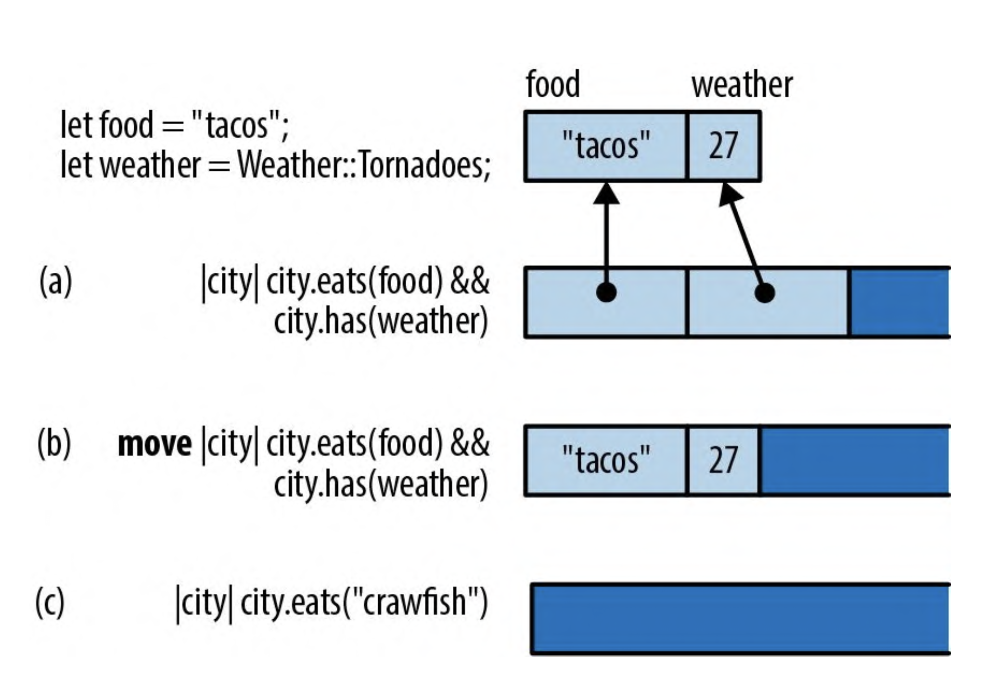
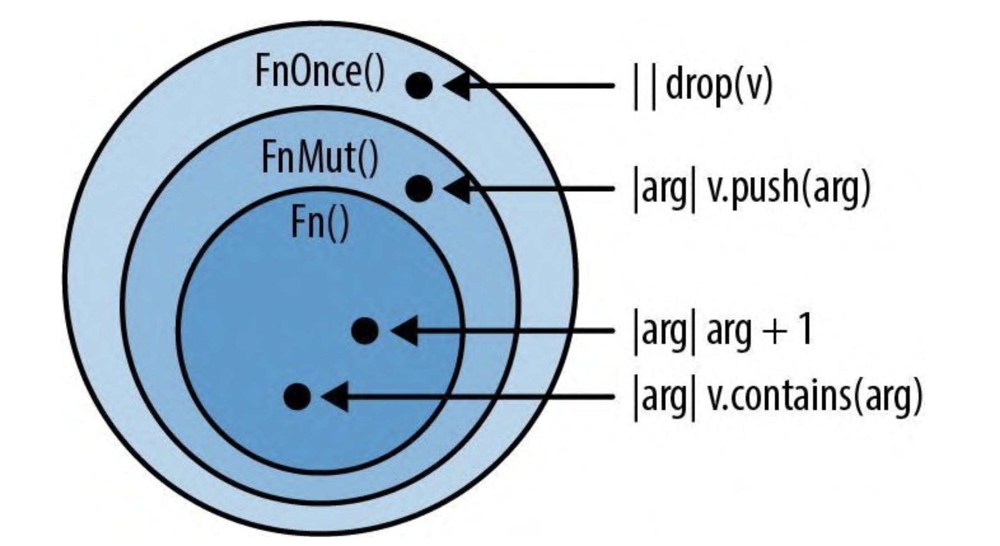

# 闭包

闭包就是匿名函数, 和 js 里面的概念类似.

## 捕获变量

闭包可以使用属于其所在函数的数据

```rust
struct City {
    name: String,
    population: i64,
    country: String,
}
fn sort_by_statistic(cities: &mut Vec<City>, stat: Statistic) {
    cities.sort_by_key(|city| -city.get_statistic(stat));
}
```

这里的闭包使用了 stat，该函数由其所在函数 sort_by_statistic 所拥有。于是我们说这个闭包“捕获”了 stat。这是闭包的经典特性之一，Rust 当然也支持。但在 Rust 中，此特性略有不同。

### 借用值的闭包

```rust
fn sort_by_statistic(cities: &mut Vec<City>, stat: Statistic) {
    cities.sort_by_key(|city| -city.get_statistic(stat));
}
```

在这种情况下，当 Rust 创建闭包时，会自动借入对 stat 的引用。这很合理，因为闭包引用了 stat，所以闭包必须包含对 stat 的引用.

剩下的就简单了。闭包同样遵循借用和生命周期的规则。特别是，由于闭包中包含对 stat 的引用，因此 Rust 不会让它的生命周期超出 stat。因为闭包只会在排序期间使用，所以这个例子是适用的。

### 窃取值的闭包

来看一下比较棘手的例子

```rust
use std::thread;

fn start_sorting_thread(mut cities: Vec<City>, stat: Statistic) -> thread::JoinHandle<Vec<City>> {
  let key_fn = |city: &City| -> i64 { -city.get_statistic(stat) };
  //   || 是闭包的空参数列表
  thread::spawn(|| {
    cities.sort_by_key(key_fn);
    cities
  })
}
```

同样，闭包 key_fn 包含对 stat 的引用。但这一次，Rust 不能保证此引用的安全使用。因此 Rust 会拒绝编译这个程序. 这里还有一个问题，因为 cities 也被不安全地共享了。简单来说，thread::spawn 创建的新线程无法保证在 cities 和 stat 被销毁之前在函数末尾完成其工作。

这两个问题的解决方案是一样的:要求 Rust 将 cities 和 stat 到使用它们的闭包中，而不是借入对它们的引用。

```rust
use std::thread;

fn start_sorting_thread(mut cities: Vec<City>, stat: Statistic) -> thread::JoinHandle<Vec<City>> {
  let key_fn = move |city: &City| -> i64 { -city.get_statistic(stat) };
  //   || 是闭包的空参数列表
  thread::spawn(move || {
    cities.sort_by_key(key_fn);
    cities
  })
}
```

这里唯一的改动是在两个闭包之前都添加了 move 关键字。move 关键字会告诉 Rust，闭包并不是要借入它用到的变量，而是要“窃取”它们。第一个闭包 key_fn 取得了 stat 的所有权。第二个闭包则取得了 cities 和 key_fn 的所有权。

## 函数与闭包的类型

在前面的示例中, 函数和闭包都在被当作值使用。自然，这就意味着它们有自己的类型。例如

```rust
fn city_population_descending(city: &City) -> i64 {
  -city.population
}
```

该函数会接受一个参数(&City)并返回 i64。所以它的类型是 `fn (&City) -> i64`

你可以像对其他值一样对函数执行各种操作。你可以将函数存储在变量中，也可以使用所有常用的 Rust 语法来计算函数值

```rust
let my_key_fn: fn(&City) -> i64 =
  if user.prefs.by_population {
    city_population_descending
  } else {
    city_monster_attack_risk_descending
  }

cities.sort_by_key(my_key_fn);
```

结构体也可以有函数类型的字段。像 Vec 这样的泛型类型可以存储大量的函数，只要它们共享同一个 fn 类型即可。而且函数值占用的空间很小，因为 fn 值就是函数机器码的内存地址，就像 C++ 中的函数指针一样。

闭包与函数不是同一种类型

```rust
/// 给定一份城市列表和一个测试函数，返回有多少个城市通过了测试
fn count_selected_cities(cities: &Vec<City>, test_fn: fn(&City) -> bool) -> usize
{
    let mut count = 0;
    for city in cities {
        if test_fn(city) {
            count += 1;
        }
    }
    count
}
let limit = preferences.acceptable_monster_risk();
let n = count_selected_cities(
    &my_cities,
    |city| city.monster_attack_risk > limit); // 错误:类型不匹配
```

为了支持闭包，必须更改这个函数的类型签名。要改成下面这样

```rust
fn count_selected_cities<F>(cities: &Vec<City>, test_fn: F) ->
usize
    where F: Fn(&City) -> bool
{
    let mut count = 0;
    for city in cities {
        if test_fn(city) {
            count += 1;
} }
count }
```

```rust
fn(&City) -> bool  // fn类型(只接受函数)
Fn(&City) -> bool  // Fn特型(既接受函数也接受闭包)
```

这种特殊的语法内置于语言中。-> 和返回类型是可选的，如果省略，则返回类型为 ()。

> 事实上，你编写的每个闭包都有自己的类型，因为闭包可以包含数据: 从封闭作用域中借用或“窃取”的值。这既可以是任意数量的变量，也可以是任意类型的组合。所以每个闭包都有一个由编译器创建的特殊类型，大到足以容纳这些数据。任何两个闭包的类型都不相同。但是每个闭包都会实现 Fn 特型，我们上面的示例中的闭包就实现了 Fn(&City) -> i64

> 因为每个闭包都有自己的类型，所以使用闭包的代码通常都应该是泛型的

## 闭包性能

在大多数语言中，闭包会在堆中分配内存、进行动态派发以及进行垃圾回收。因此，创建、调用和收集每一个闭包都会花费一点点额外的 CPU 时间。更糟的是，闭包往往难以 ，而内联是编译器用来消除函数调用开销并实施大量其他优化的关键技术。总而言之，闭包在这些语言中确实慢到值得手动将它们从节奏紧凑的内层循环中去掉。

Rust 闭包则没有这些性能缺陷。它们没有垃圾回收。与 Rust 中的其他所有类型一样，除非你将闭包放在 Box、Vec 或其他容器中，否则它们不会被分配到堆上。由于每个闭包都有不同的类型，因此 Rust 编译器只要知道你正在调用的闭包的类型，就可以内联该闭包的代码。这使得在节奏紧凑的循环中使用闭包成为可能.

下面展示了 Rust 闭包在内存中的布局方式。在图的顶部，我们展示了闭包要引用的两个局部变量:字符串 food 和简单的枚举 weather，枚举的数值恰好是 27。



## 闭包安全

### 杀死闭包

在 Rust 中，我们会说 值。最直观的方法是调用 drop()

```rust
let my_str = "hello".to_string();
let f = || drop(my_str);
```

当调用 f 时，my_str 会被丢弃。那么，如果调用它两次会发生什么呢?

```rust
fn();
fn();
```

我们来深入思考一下。当第一次调用 f 时，它丢弃了 my_str，这意味着存储该字符串的内存已经被释放，交还给了系统。当第二次调用 f 时，发生了同样的事情。这是 C++ 编程中会触发未定义行为的经典错误: 双重释放.

在 Rust 中丢弃同一个 String 两次当然也会出事, 编译器会报错

### FnOnce

我们再试一次欺骗 Rust，让它把同一个 String 丢弃两次。这次将使用下面这个泛型函数:

```rust
fn call_twice<F>(closure: F) where F: Fn {
  closure();
  closure();
}
```

可以将这个泛型函数传给任何实现了特型 Fn() 的闭包，即不带参数且会返回 () 的闭包。(与函数一样，返回类型如果是 () 则可以省略，Fn() 是 Fn() -> () 的简写形式。)

现在，如果将不安全的闭包传给这个泛型函数会发生什么呢? 同样会报错

```rust
let my_str = "hello".to_string();
let f = || drop(my_str);
call_twice(f); // closure is `FnOnce` because it moves the variable `my_str`
```

第一次调用 FnOnce 闭包时，闭包本身也会被消耗掉。这是因为 Fn 和 FnOnce 这两个特型是这样定义的

```rust
// 无参数的`Fn`特型和`FnOnce`特型的伪代码
trait Fn() -> R {
  fn call(&self) -> R;
}
trait FnOnce() -> R {
  fn call_once(self) -> R;
}
```

对于 Fn 闭包，closure() 会扩展为 closure.call()。此方法会通过引用获取 self，因此闭包不会被移动。但是如果闭包只能安全地调用一次，那么 closure() 就会扩展为 closure.call_once()。该方法会按值获取 self，因此这个闭包就会被消耗掉。

### FnMut

Rust 认为不可变值可以安全地跨线程共享，但是包含可变数据的不可变闭包不能安全共享, 从多个线程调用这样的闭包可能会导致各种竞态条件，因为多个线程会试图同时读取和写入同一份数据。

Rust 还有另一类名为 FnMut 的闭包，也就是可写入的闭包。FnMut 闭包会通过可变引用来调用，其定义如下所示:

```rust
trait Fn() -> R {
  fn call(&self) -> R;
}

trait FnMut() -> R {
  fn call_mut(&mut self) -> R;
}

trait FnOnce() -> R {
  fn call_once(self) -> R;
}
```

任何需要对值进行可变访问但不会丢弃任何值的闭包都是 FnMut 闭包.

```rust
let mut i = 0;
let incr = || {
i += 1; // incr借入了对i的一个可变引用
    println!("Ding! i is now: {}", i);
};
call_twice(incr);
```

按照 call_twice 的调用方式，它会要求传入一个 Fn。由于 incr 是 FnMut 而非 Fn

Rust 闭包的三种类别

- Fn 是可以不受限制地调用任意多次的闭包和函数系列. 此最高类别还包括所有 fn 函数
- FnMut 是本身会被声明为 mut, 并且可以多次调用的闭包系列
- FnOnce 是如果其调用者拥有此闭包, 它就只能调用一次的闭包系列

每个 Fn 都能满足 FnMut 的要求，每个 FnMut 都能满足 FnOnce 的要求。如图所示，它们不是 3 个彼此独立的类别。



应该说，Fn() 是 FnMut() 的子特型，而 FnMut() 是 FnOnce() 的子特型。这使得 Fn 成了最严格且最强大的类别。FnMut 和 FnOnce 是更宽泛的类别，其中包括某些具有使用限制的闭包。

很显然为了接受尽可能宽泛的闭包， call_twice 函数应该接受所有 FnMut 闭包

```rust
fn call_twice<F>(mut closure: F) where F: FnMut {
  closure();
  closure();
}
```

### 对闭包的 Copy 和 Clone

闭包是表示包含它们捕获的变量的值(对于 move 闭包)或对值的引用(对于非 move 闭包)的结构体。闭包的 Copy 规则和 Clone 规则与常规结构体的规则是一样的。一个不修改变量的非 move 闭包只持有共享引用，这些引用既能 Clone 也能 Copy，所以闭包也能 Clone 和 Copy

```rust
let y = 10;
let add_y = |x| x + y;
let copy_of_add_y = add_y; // 此闭包能`Copy`，所以可以调用它两次

assert_eq!(add_y(copy_of_add_y(22)), 42);
```

一个 修改值的非 move 闭包在其内部表示中也可以有可变引用。可变引用既不能 Clone，也不能 Copy，使用它们的闭包同样如此

```rust
let mut x = 0;
let mut add_to_x = |n| { x += n; x };
let copy_of_add_to_x = add_to_x; // 这会进行移动而非复制 assert_eq!(add_to_x(copy_of_add_to_x(1)), 2);
// 错误:使用了已移动出去的值
```

对于 move 闭包，规则更简单。如果 move 闭包捕获的所有内容都能 Copy，那它就能 Copy。如果 move 闭包捕获的所有内容都能 Clone，那它就能 Clone

```rust
let mut greeting = String::from("Hello, ");
let greet = move |name| {
    greeting.push_str(name);
    println!("{}", greeting);
};
greet.clone()("Alfred");
greet.clone()("Bruce");
```

当在 greet 中使用 greeting 时，greeting 被移动到了内部表示 greet 的结构体中，因为它是一个 move 闭包。所以，当我们克隆 greet 时，它里面的所有东西同时被克隆了。greeting 有两个副本，它们会在调用 greet 的克隆时分别被修改。这种行为本身并不是很有用，但是在你需要将同一个闭包传给多个函数的场景中，它会非常有帮助。

## 回调

很多库会在其 API 中使用回调函数，即由用户提供某些函数，供库稍后调用。我们曾使用 actix-web 框架编写过一个简单的 Web 服务器。那个程序的一个重要部分是路由器，它看起来是这样的:

```rust
App::new()
  .route("/", web::get().to(get_index))
  .route("/", web::post().to(post_gcd))
```

这个路由器的目的是将从互联网传入的请求路由到处理特定类型请求的那部分 Rust 代码中。在本示例中，get_index 和 post_gcd 是我们在程序其他地方使用 fn 关键字声明的函数名称。其实也可以在这里传入闭包

```rust
App::new()
  .route("/", web::get().to(|| {
    HttpResponse::Ok()
      .content_type("text/html")
      .body("<title>GCD Calculator</title>")
  }))
  .route("/gcd", web::get().to(|| {
    HttpResponse::Ok
      .content_type("text/html")
      .body(format!("The GCD of {} and {} is {}", form.n, form.m, gcd(form.n, form.m)))
  }))
```

那么，如何在自己的程序中做到这一点呢?可以试着从头开始编写自己的简易路由器，而不使用来自 actix-web 的任何代码。可以首先声明一些类型来表示 HTTP 请求和响应:

```rust
struct Request {
    method: String,
    url: String,
    headers: HashMap<String, String>,
    body: Vec<u8>
}
struct Response {
    code: u32,
    headers: HashMap<String, String>,
    body: Vec<u8>
}
```

现在路由器所做的只是存储一个将 URL 映射到回调的表，以便按需调用正确的回调。为简单起见，只允许用户创建与单个 URL 精确匹配的路由。

```rust
struct BasicRouter<C> where C: Fn(&Request) -> Response {
    routes: HashMap<String, C>
}
impl<C> BasicRouter<C> where C: Fn(&Request) -> Response { /// 创建一个空路由器
fn new() -> BasicRouter<C> {
        BasicRouter { routes: HashMap::new() }
    }
/// 给路由器添加一个路由
fn add_route(&mut self, url: &str, callback: C) {
        self.routes.insert(url.to_string(), callback);
    }
}
```

遗憾的是，我们犯了一个错误。如果只给路由器添加一个路由，那么它是可以正常工作的,
不过很遗憾，如果再添加一个路由

```rust
let mut router = BasicRouter::new();
router.add_route("/", |_| get_form_response());

// expected closure, found a different closure
router.add_route("/gcd", |req| get_gcd_response(req));

```

我们所犯的错误在于如何定义 BasicRouter 类型

```rust
struct BasicRouter<C> where C: Fn(&Request) -> Response {
    routes: HashMap<String, C>
}
```

这里声明的每个 BasicRouter 都带有一个回调类型 C，并且 HashMap 中的所有回调都是此类型的。但在 Rust 中, 任何两个闭包都是不同的类型, 所以导致第二次添加时, 类型不匹配

这里的解决方案可以这样, 因为要支持多种类型，需要使用 Box 和特型对象, 每个 Box 可以包含不同类型的闭包，因此单个 HashMap 可以包含各种回调

```rust
type BoxedCallback = Box<dyn Fn(&Request) -> Response>;
struct BasicRouter {
    routes: HashMap<String, BoxedCallback>
}

impl BasicRouter {
  // 创建一个空路由器
  fn new() -> BasicRouter {
          BasicRouter { routes: HashMap::new() }
      }
  // 给路由器添加一个路由
  fn add_route<C>(&mut self, url: &str, callback: C)
          where C: Fn(&Request) -> Response + 'static
      {
          self.routes.insert(url.to_string(), Box::new(callback));
      }
}
```

请注意 add_route 的类型签名中 C 的两个限界:特定的 Fn 特型和 'static 生命周期。Rust 要求我们添加这个 'static 限界。如果没有它，那么对 Box::new(callback) 的调用就会出错，因为如果闭包包含对即将超出作用域的变量的已借用引用，那么存储闭包就是不安全的。

## 高效地使用闭包

正如我们所见，Rust 的闭包不同于大多数其他语言中的闭包。最大的区别是，在具有垃圾回收的语言中，你可以在闭包中使用局部变量，而无须考虑生命周期或所有权的问题。但如果没有垃圾回收，那么情况就不同了。一些在 Java、C# 和 JavaScript 中常见的设计模式如果不进行改变将无法在 Rust 中正常工作。

我们以模型-视图-控制器设计模式(简称 MVC)为例。对于用户界面的每个元素，MVC 框架都会创建 3 个对象:表示该 UI 元素状态的模型、负责其外观的视图和处理用户交互的控制器。多年来，MVC 模式已经出现了无数变体，但总体思路仍是 3 个对象以某种方式分担了 UI 的职责。

这就是问题所在。通常，每个对象都会直接或通过回调对其他对象中的一个或两个进行引用，每当 3 个对象中的一个对象发生变化时，它会通知其他两个对象，因此所有内容都会及时更新。哪个对象“拥有”其他对象之类的问题永远不会出现。


如果不进行更改，就无法在 Rust 中实现此模式。所有权必须明晰，循环引用也必须消除。模型和控制器不能相互直接引用。

Rust 的“激进赌注”是基于“必然存在好的替代设计”这个假设的。有时你可以通过让每个闭包接受它需要的引用作为参数，来解决闭包所有权和生命周期的问题。有时你可以为系统中的每个事物分配一个编号，并传递这些编号而不是传递引用。或者你可以实现 MVC 的众多变体之一，其中的对象并非都相互引用。或者你可以将工具包建模为具有单向数据流的非 MVC 系统


