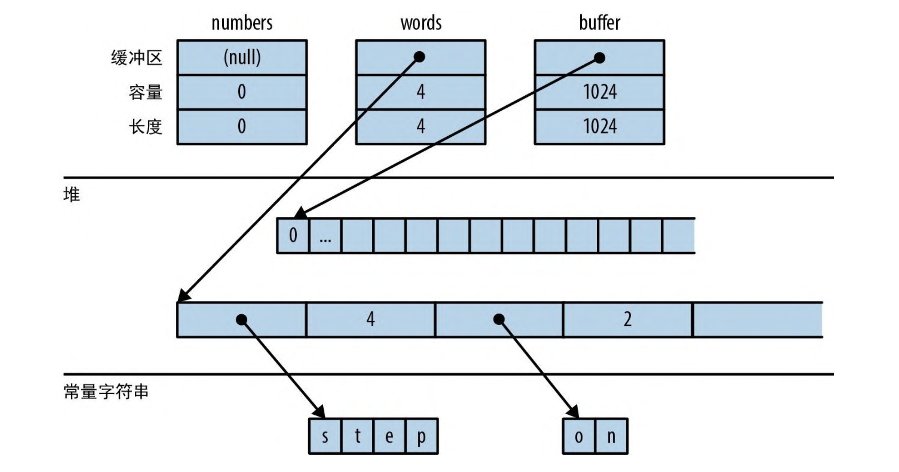
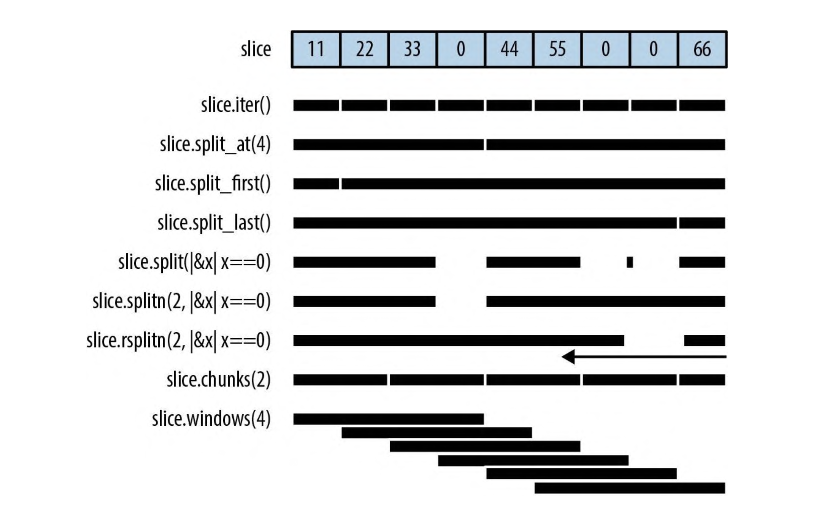

# 集合

Rust 标准库包含多个 ，这些集合是泛型类型，用于在内存中存储各种数据。

移动和借用无处不在。Rust 使用移动来避免对值做深拷贝。这就是 `Vec<T>::push(item)` 方法会按值而非按引用来获取参数的原因。这样值就会移动到向量中。 将 String 压入 `Vec<String>` 中会很快，因为 Rust 不必复制字符串的字符数据，并且字符串的所有权始终是明晰的。

其次，Rust 没有失效型错误，也就是当程序仍持有指向集合内部数据的指针时，集合被重新调整大小或发生其他变化而导致的那种悬空指针错误。

最后，Rust 没有 null，因此在其他语言使用 null 的地方 Rust 会使用 Option。

## 概述

下面展示了 Rust 的 8 个标准集合，它们都是泛型类型。
|集合|描述|详细|
|-|-|-|
|Vec<T>|可增长数组|可增长的、分配在堆上的 T 类型值数组|
|VecDeque<T>|可增长数组(可增长的环形缓冲区)|与 Vec<T> 类似，但更适合用作先入先出队列|
|LinkedList<T>|双向链表|
|BinaryHeap<T> where T: Ord|二叉堆|优先级队列。BinaryHeap 中的值是精心组织过的，因始终可以高效地查找和移除其最大值|
|HashMap<K, V> where K: Eq + Hash|键值哈希表|由键-值对构成的表。通过键查找值很快。其条目会以任意顺序存储。|
|BTreeMap<K, V> where K: Ord|有序键值表|与 `HashMap<K, V>` 类似，但它会根据键来对条目进行排序。 `BTreeMap<String, i32>` 会以 String 的比较顺序来存储其条目。除非需要让条目保持排序状态，否则用 HashMap 更快一些|
|HashSet<T> where T: Eq + Hash|无序的、 基于哈希的集合|由 T 类型的值组成的 Set。它既能很快地添加值和移除值，也能很快地查询给定值是否在此 Set 中|
|BTreeSet<T> where T: Ord|有序集|与 HashSet<T> 类似，但它会让元素按值排序。同样，除非需要让数据保持排序状态，否则用 HashSet 更快一些。|

`Vec<T>`、`HashMap<K, V>` 和 `HashSet<T>` 是最常用的集合类型，其余的都各自有其基本应用场景。

## `Vec<T>`

创建向量的最简单方法是使用 vec! 宏:

```rust
let mut numbers: Vec<i32> = vec![];

let words = vec!["step", "on", "no", "pets"];
let mut buffer = vec![0u8; 1024]; // 1024个内容为0的字节
```

向量具有 3 个字段:长度、容量和指向用于存储元素的堆分配内存的指针。下图展示了前面的向量在内存中的布局方式。空向量 numbers 最初的容量为 0。直到添加第一个元素之前，不会为其分配堆内存。



与所有集合一样，Vec 也实现了 `std::iter::FromIterator`，所以可以使用迭代器的 `.collect()` 方法从任意迭代器创建向量

```rust
let my_vec = my_set.into_iter().collect::<Vec<String>>();
```

### 访问元素

通过索引来获取数组、切片或向量的元素非常简单

```rust
let first_line = &lines[0];

let fifth_number = numbers[4];
let second_line = lines[1].clone();

let my_ref = &buffer[4..12];

let my_copy = buffer[4..12].to_vec();
```

如果索引超出了范围，则所有这些形式都会引发 panic。

Rust 对数值类型很挑剔，对向量也不例外。向量的长度和索引都是 usize 类型。试图用 u32、u64 或 isize 作为向量索引会导致出错。可以根据需要使用 n as usize 来转换

下面这些方法可以轻松访问向量或切片的特定元素(请注意，所有的切片方法也都适用于数组和向量)。

- slice.first() 返回第一个元素的引用

```rust
slice.first(); //
```

返回类型为 Option<&T>，所以如果 slice 为空则返回值为 None，如果不为空则返回 `Some(&slice[0])`

```rust
if let Some(item) = v.first() {
    println!("We got one! {}", item);
}
```

- slice.last() 返回最后一个元素的引用
- slice.get(index) 获取位置为 index 的元素的索引, 如果其存在，就返回 `slice[index]` 引用的 Some 值。如果 slice 的元素少于 `index+1` 个，则返回 None
- slice.first_mut() 返回第一个元素的可变索引
- slice.last_mut() 返回最后一个元素的可变索引
- slice.get_mut(index) 获取位置为 index 的可变索引

```rust
let mut slice = [0, 1, 2, 3];
{
    let last = slice.last_mut().unwrap();
    assert_eq!(*last, 3);
    *last = 100;
}
assert_eq!(slice, [0, 1, 2, 100]);
```

按值返回 T 就意味着移动它，所以一些需要就地访问元素的方法通常会按引用返回这些元素。

- to_vec() 方法是一个例外，它会复制这些元素。

克隆整个切片，返回一个新向量, 此方法只能用在元素可以克隆的情况下，也就是需满足 where T: Clone 限界

```rust
let v = [1, 2, 3, 4, 5, 6, 7, 8, 9];
assert_eq!(v.to_vec(),
           vec![1, 2, 3, 4, 5, 6, 7, 8, 9]);
assert_eq!(v[0..6].to_vec(),
           vec![1, 2, 3, 4, 5, 6]);
```

### 迭代

向量、数组和切片是可迭代的，要么按值迭代 ，要么按引用迭代

> 其实除非元素是 Copy 类型，否则切片并不能按值迭代

- 遍历 `Vec<T>` 或数组 `[T; n]` 会生成 T 类型的条目。 这些元素会逐个从向量或数组中移动出来并被消耗掉
- 遍历 `&[T; N]`、`&[T]` 或 `&Vec<T>` 类型的值（对数组、切片或向量的引用）会生成` &T` 类型的条目，即对单个元素的引用，这些元素不会移动出来。
- 遍历 `&mut [T; N]`、`&mut [T]` 或 `&mut Vec<T>` 类型的值会生成 `&mut T`类型的条目

数组、切片和向量也有 `.iter()` 方法和 `.iter_mut()` 方法，以用于创建一个会生成对其元素的引用的迭代器

### 扩大向量和收缩向量

数组、切片或向量的长度是它们所包含的元素数量

- slice.len() 返回切片或数组的长度, 返回 slice 的长度，类型为 usize
- slice.is_empty() 返回切片或数组是否为空，如果 slice 未包含任何元素（slice.len() == 0）则为真

以下方法是关于扩大向量和收缩向量的，但数组和切片中没有这些方法， 因为数组和切片一旦创建就无法调整大小。

向量的所有元素都存储在连续的、分配在堆上的内存块中。向量的容量就是该内存块可以容纳的最大元素数量。Vec 通常会替你管理容量，当需要更多空间时它会自动分配更大的缓冲区并将元素移入其中。下面是一些显式管理容量的方法。

- Vec::with_capacity(capacity) 创建一个新的空向量，但预先分配了足够的空间来容纳 capacity 个元素。
- vec.capacity() 返回向量的容量，类型为 usize。 vec.capacity() >= vec.len() 始终成立
- vec.reserve(additional) 向量预留 additional 个元素的空间。如果 additional 超过了向量的当前容量，则分配一个新的容量，使得 vec.capacity() >= vec.len() + additional。
- vec.reserve_exact(additional) 向量精确预留 additional 个元素的空间。使得 vec.capacity() == vec.len() + additional。
- vec.shrink_to_fit() 如果 vec.capacity() 大于 vec.len()，则尝试释放额外的内存。

`Vec<T>` 还有许多用来添加或移除元素的方法，它们可以改变向量的长度。所有这些方法都可以通过可变引用获取其 self 参数。

- vec.push(value) 在向量的末尾添加一个元素。
- vec.pop() 移除并返回向量的最后一个元素, 类型为 `Option<T>`。如果向量为空，则返回 `None`，否则返回 `Some(value)`。

  > 请注意，.push() 会按值而不是按引用接受其参数。同样，.pop()会返回弹出的值，而不是引用。向量的大部分方法也是如此。它们可以将值移动进和移动出向量。

- vec.insert(index, value) 在 index 位置插入一个元素。将 `vec[index..]` 中的所有当前值向右平移一个位置以腾出空间。
- vec.remove(index) 移除并返回 index 位置的元素。将 `vec[index+1..]` 中的所有元素向左平移一个位置，并缩短 vec 的长度。如果 index 越界，则会引发 panic。向量越长，移除元素的开销就越大。如果经常执行 vec.remove(0)，则建议使用 `VecDeque<T>` 代替。
  > 需要移动的元素越多，.insert() 和 .remove() 的速度就会越慢

下面这四个方法可以把向量的长度更改为特定值

- `vec.resize(new_len, value)`, 将 vec 的长度设置为 new_len, 并用 value 的副本填充新元素。如果 new_len 小于 vec 的当前长度，则 vec 的末尾元素将被丢弃。如果 new_len 大于 vec 的当前长度，则 vec 的新元素将用 value 填充。元素类型必须实现 Clone 特型。
- `vec.resize_with(new_len, f)`, 与 `vec.resize(new_len, value)` 类似，但 value 不是一个常量，而是一个闭包，它会在需要时生成新元素。它能用于不可 Clone 的元素类型。

- `vec.truncate(new_len)` 截断 vec，将其长度设置为 new_len，丢弃 vec 的所有索引大于等于 new_len 的元素。如果 `vec.len()` 已经小于或等于 `new_len`，则不会有任何操作。
- `vec.clear()` 清空 vec，将其长度设置为 0，此方法的效果和 `vec.truncate(0)` 相同。

下面这 4 个 方法可以一次添加或移除多个值

- `vec.extend(iterable)` 将 iterable 中的元素添加到 vec 的末尾。iterable 可以是任何实现 `IntoIterator<Item=T>` 的类型，包括 `Vec<T>`。
  > 此方法非常有用，所以我们为其定义了一个标准特型 Extend，所有标准集合都实现了该特型。不过很遗憾，这会导致 rustdoc 在其生成的 HTML 底部将 .extend() 与其他特型方法混排在一起，因此在需要时很难找到它，
- `vec.split_off(index)` 将 vec 从 index 位置开始分离出来，并返回一个新的向量，其内容是 vec 的 index 位置之后的所有元素。
- `vec.append(&mut vec2)` 将 vec2 中的元素添加到 vec 的末尾。vec2 是`Vec<T>`类型的另一个向量，之后， vec2 会被清空。
  > 此方法与 vec.extend(vec2) 类似，不同之处在于调用 extend 之后 vec2 仍然存在，其容量也不受影响。
- `vec.drain(range)` 从 vec 中移除指定范围的元素，并返回一个迭代器，可以用来遍历这些元素。

还有一些略显古怪的方法可以从向量中选择性地移除一些元素。

- `vec.retain(|&x| predicate(x))` 移除 vec 中满足 predicate 函数的元素。predicate 函数的参数是 `&T`，因此可以访问 vec 的元素。predicate 函数返回 `true` 或 `false`，如果返回 `true`，则该元素将被移除。
- `vec.dedup()` 移除 vec 中相邻重复的元素。元素类型必须实现 PartialEq 特型。
  > ```rust
  > let mut byte_vec = b"Misssssssissippi".to_vec();
  > byte_vec.dedup();
  > assert_eq!(&byte_vec, b"Misisipi");
  > // 输出中仍然有两个 's' 字符。这是因为此方法只会移除相邻的重复项
  > ```
- `vec.dedup_by_key(|&x| key(x))` 移除 vec 中根据 key 函数返回相同值的元素。key 函数的参数是 `&T`，因此可以访问 vec 的元素。元素类型必须实现 PartialEq 特型。
- `vec.dedup_by(|&x, &y| predicate(x, y))` 移除 vec 中满足 predicate 函数的相邻元素。predicate 函数的参数是 `&T` 和 `&T`，因此可以访问 vec 的元素。predicate 函数返回 `true` 或 `false`，如果返回 `true`，则该元素将被移除。
- `vec.dedup_by_key(key)` 根据 key 属性去重。元素类型必须实现 PartialEq 特型。

> 上面列举的一些方法，只有 .resize() 会克隆值，其他方法都是将值从一个地方移动到另一个地方

### 联结

以下两个方法可用于数组的数组，即其元素本身也是数组、切片或向量的数组、切片或向量。

- slice.concat() 将 slice 中的元素连接成一个新的向量。

  > ```rust
  > assert_eq!([[1, 2], [3, 4], [5, 6]].concat(),
  > vec![1, 2, 3, 4, 5, 6]);
  > ```

- slice.join(&separator) 与 concat 类似，只是在这些切片之间插入了值 separator 的副本。
  > ```rust
  > assert_eq!([[1, 2], [3, 4], [5, 6]].join(&0), vec![1, 2, 0, 3, 4, 0, 5, 6])
  > ```

### 拆分

同时获得多个对数组、切片或向量中元素的不可变引用是比较容易的

```rust
let v = vec![0, 1, 2, 3];
let a = &v[i];
let b = &v[j];

let mid = v.len() / 2;
let front_half = &v[..mid];
let back_half = &v[mid..];
```

但获取多个可变引用就不那么容易了

```rust
let mut v = vec![0, 1, 2, 3];
let a = &mut v[i];
let b = &mut v[j]; // 错误:不能同时把`v`借入为多个可变引用
*a = 6; // 这里用到了引用`a`和引用`b`
*b = 7; // 所以它们的生命周期必然重叠
```

Rust 有几种方法可以同时借入对数组、切片或向量的两个或多个部分的可变引用。与前面的代码不同，这些方法是安全的，因为根据设计，它们总会把数据拆分成几个的区域。这里的大部分方法在处理非 mut 切片时也很方便，因此每个方法都有 mut 版本和非 mut 版本。



这些方法都没有直接修改数组、切片或向量，它们只是返回了对内部
数据中各部分的新引用。

- slice.iter() 返回迭代器; slice.iter_mut() 返回可变迭代器
- slice.split_at(index) 拆分于 slice.split_at_mut(index) 类似，但返回两个切片，而不是可变引用。
  将一个切片分成两半，返回一个值对。 `slice.split_at(index)` 等价于 `(&slice[..index], &slice[index..])`。如果 index 超出了限界，这两个方法就会发 生 panic。
- slice.split_first() 拆分首个; 返回的类型是 `Option<(&T, &[T])> slice`.split_first_mut() 拆分首个,但返回可变引用。
- slice.split_last() 拆分最后一个; slice.split_last_mut() 拆分最后一个,但返回可变引用。

- slice.split(is_seq) 拆分，将 slice 拆分为一个或多个子切片，使用函数或闭包 is_seq 确定拆分位置，这两个方法会返回一个遍历这些子切片的迭代器， slice.split_mut(is_seq) 可变拆分

  当你消耗此迭代器时，这些方法会为切片中的每个元素调用 is_sep(&element)。如果 is_sep(&element) 为 true，则认为该元素是分隔符。分隔符不会包含在输出的任何子切片中。输出总是至少包含一个子切片，每遇到一个分隔符就额外加一个。如果有多个分隔符彼此相邻，或者有分隔符出现在 slice 的两端，则每对分隔符和两端的分隔符分别会对应输出一个空的子切片。

- slice.split_inclusive(is_sep)(拆分，含分隔符) 和 slice.split_inclusive_mut(is_sep)(可变拆分，含分隔符)

  与 split 和 split_mut 类似，但这两个方法会在前一个子切 片的结尾包含分隔符而不会排除它。

- slice.rsplit(is_sep)(右起拆分)和 slice.rsplit_mut(is_sep)(右起可变拆分)

- slice.splitn(n, is_sep)(拆分为 n 片)和 slice.splitn_mut(n, is_sep)(可变拆为 n 片)

- slice.chunks(n)(分为长度为 n 的块)和 slice.chunks_mut(n)(分为长度为 n 的可变块)

- slice.rchunks(n)(右起分为长度为 n 的块)和 slice.rchunks_mut(n)(右起分为长度为 n 的可变块)

- slice.windows(n)(滑动窗口)

  返回一个其行为类似于 slice 中数据的“滑动窗口”的迭代 器。这个迭代器会生成一些横跨此 slice 中 n 个连续元素的子切 片。它生成的第一个值是 &slice[0..n]，第二个值是 &slice[1..n+1]，以此类推。

### 变换

下面是交换切片内容的一些便利方法。

- `slice.swap(i, j)`交换元素：交换 `slice[i]` 和 `slice[j]` 这两个元素。

- `slice_a.swap_with_slice(slice_b)`互换内容, 交换 slice_a 和 slice_b 的全部内容。slice_a 和 slice_b 的长度必须相同。

- `vec.swap_remove(i)`交换后移除

  移除并返回 vec[i]。与 vec.remove(i) 类似，但此方法不会将向量中剩余的元素平移过来以填补空缺，而是简单地将 vec 的最后一个元素移动到空缺中。如果不关心向量中剩余条目的顺序，那么
  此方法会很有用，因为性能更高。

### 填充

下面是替换可变切片内容的两种便利方法。

- `slice.fill(value)` 填充，用 value 的克隆体填充切片。

- `slice.fill_with(function)` 以 function 回调填充, 使用调用给定函数生成的值来填充切片。这对于实现了 Default 但未实现 Clone 的类型很有用，比如当 T 为不可复制类型时的 `Option<T>` 或 `Vec<T>`。

### 排序与搜索

下面是切片提供的 3 个排序方法, 这三个方法都是稳定排序。

- `slice.sort()` 排序，将元素按升序排列。此方法仅当元素类型实现了 Ord 时才存在。

- `slice.sort_by(cmp)` 按 `cmp` 回调排序, 对 slice 中的元素按函数或闭包 `cmp` 指定的顺序进行排序。 `cmp` 必须实现 `Fn(&T, &T) -> std::cmp::Ordering`。

  手动实现 cmp 是一件痛苦的事，不过可以把它委托给别的 .cmp() 方法来实现

  ```rust
  students.sort_by(|a, b| a.last_name.cmp(&b.last_name))
  ```

  如果想按一个字段排序，但当该字段相同时按另一个字段判定先
  后，则可以先把它们做成元组然后再进行比较。

  ```rust
  students.sort_by(|a, b| {
    let a_key = (&a.last_name, &a.first_name);
    let b_key = (&b.last_name, &b.first_name);
    a_key.cmp(&b_key)
  });
  ```

- `slice.sort_by_key(key)` 按 key 回调排序

  使用由函数或闭包型参数 key 给出的排序键对 slice 的元素按递增顺序排序。key 的类型必须实现 `Fn(&T) -> K`，这里要满足 `K: Ord`。这在 T 包含一个或多个有序字段时会很有用，因此它可以按多种方式排序

  ```rust
  // 按平均学分绩点排序，低分在前
  students.sort_by_key(|s| s.grade_point_average());
  ```

  请注意，在排序过程中不会缓存这些排序键值，因此 key 函数可能会被调用 n 次以上。

  出于技术原因，key(element) 无法返回从元素借来的任何引用。下面这种写法行不通:

  ```rust
  // 错误:无法推断生命周期
  students.sort_by_key(|s| &s.last_name);
  ```

要想以相反的顺序排序，可以将 `sort_by` 与交换了两个参数的 `cmp` 闭包一起使用。传入参数 `|b, a|` 而不是 `|a, b|` 可以有效地生成相反的顺序。或者，也可以在排序之后调用 `.reverse()` 方法。

一旦切片排序完毕，就可以高效地进行搜索了。

- `slice.binary_search(&value)` 二分搜索
- `slice.binary_search_by(&value, cmp)` 按 cmp 回调二分搜索
- `slice.binary_search_by_key(&value, key)` 按 key 闭包二分搜索

以上 3 个方法都会在给定的已排序 slice 中搜索 value。请注意，value 是按引用传递的。

这些方法的返回类型是 `Result<usize, usize>`。如果在指定排序顺序中 `slice[index]` 等于 value，那么这些方法就会返回 Ok(index)。如果找不到这样一个索引，那么这些方法就会返回 Err(insertion_point)，这样当你在 insertion_point 中插入 value 后，向量仍然会保持排好序的状态。

> 当然，只有在切片确实已经按指定顺序排序时二分搜索才有效。否则，结果将是没有意义的，因为如果输入无效，则输出也无效。

可以用另一个方法在未排过序的向量中搜索

- `slice.contains(&value)` 包含元素 value

  如果 slice 中有任何元素等于 value，则返回 true。这会简单地检查切片的每个元素，直到找到匹配项。value 同样是按引用传递的

### 比较切片

如果类型 T 支持 `==` 运算符和 `!=` 运算符(`PartialEq` 特型)，那么数组 `[T; N]`、切片 `[T]` 和向量 `Vec<T>` 也会支持这两个运算符。如果两个切片的长度相同并且对应的元素也相等，那它们就是相等的。数组和向量也是如此。

- `slice.starts_with(other)` 以 other 开头

  ```rust
  assert_eq!([1, 2, 3, 4].starts_with(&[1, 2]), true);
  assert_eq!([1, 2, 3, 4].starts_with(&[2, 3]), false);
  ```

- `slice.ends_with(other)` 以 other 结尾

  ```rust
  assert_eq!([1, 2, 3, 4].ends_with(&[3, 4]), true);
  ```

### 随机元素

随机数并未内置在 Rust 标准库中，但在 rand crate 中可以找到它们。rand crate 提供了以下两个方法，用于从数组、切片或向量中获取随机输出。

具体可见文档： https://crates.io/crates/rand

### Rust 中不存在失效型错误

大多数主流编程语言有集合和迭代器，它们为排除失效型错误做了一点儿变化:不要在迭代集合时修改它。例如，在 Python 中，与向量等价的是列表:

```rust
my_list = [1, 3, 5, 7, 9]
```

假设我们试图从 my_list 中移除所有大于 4 的值

```python
for index, val in enumerate(my_list):
    if val > 4:
del my_list[index] # bug:在迭代过程中修改列表 print(my_list)
```

令人惊讶的是，这个程序打印出了 [1, 3, 7]。但是 7 显然大于 4。为什么失控了?这就是失效型错误: 程序在迭代数据时修改了数据，让迭代器失效了

我们试着在 Rust 中重现这个 bug

```rust
fn main() {
    let mut my_vec = vec![1, 3, 5, 7, 9];
    for (index, &val) in my_vec.iter().enumerate() {
        if val > 4 {
            my_vec.remove(index); // 错误:不能把`my_vec`借用为可变的
        }
    }
    println!("{:?}", my_vec);
}
```

当然，Rust 在编译时就会拒绝这个程序。当我们调用 my_vec.iter() 时，它借用了一个共享(非 mut)的向量引用。引用与迭代器的生命周期一样长，直到 for 循环结束。当存在不可变引用时，不能通过调用 my_vec.remove(index) 来修改向量。
