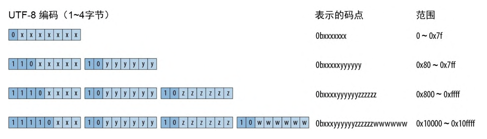
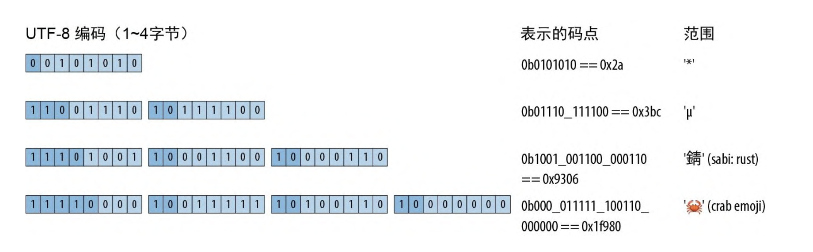

# 字符串与文本

## 一些 Unicode 的背景知识

介绍一些 Unicode 的背景知识有助于更好地理解 Rust。

### ASCII、Latin-1、Unicode

ASCII 是最初的 7 位编码，它包含了 128 个字符，包括英文字母、数字、标点符号和一些控制字符。

Latin-1 扩展了 ASCII，增加了 128 个字符，包括西欧语言的字符。

Unicode 是为了解决不同语言、不同文化的字符编码问题而创建的。它包含了超过 100,000 个字符，涵盖了世界上所有语言和文化。

### UTF-8 编码

Rust 的 String 类型和 str 类型表示使用了 UTF-8 编码形式的文本。UTF-8 会将字符编码为 1~4 字节的序列，如图所示。



格式良好的 UTF-8 序列有两个限制。首先，只有任何给定码点的最短编码才被认为是格式良好的，你不能花费 4 字节来编码原本只需要 3 字节的码点。此规则确保了每个码点只会有唯一一个 UTF-8 编码。其次，格式良好的 UTF-8 不得对从 0xd800 到 0xdfff 或超过 0x10ffff 的数值进行编码:这些数值要么保留用作非字符目的，要么完全超出了 Unicode 的范围。

一些 UTF-8 的编码示例：



虽然在螃蟹表情符号的编码中其前导字节对码点只贡献了一串 0，但是它仍然需要用 4 字节来编码:3 字节的 UTF-8 编码只能表达 16 位码点，而 0x1f980 有 17 位长。

- 由于 UTF-8 会把码点 0 ~ 0x7f 编码为字节 0 ~ 0x7f，因此一段 ASCII 文本必然是有效的 UTF-8 字符串。反过来，如果 UTF-8 字符串中只包含 ASCII 字符，则它也必然是有效的 ASCII 字符串。

  > 对于 Latin-1 则不是这样的，比如，Latin-1 会将 é 编码为字节 0xe9，而 UTF-8 会将其解释为三字节编码中的第一字节

- 通过查看任何字节的高位，就能立刻判断出它是某个字符的 UTF-8 编码的起始字节还是中间字节

### 文本的方向性

拉丁文、西里尔文、泰文等文字是从左向右书写的，而希伯来文、阿拉伯文等文字则是从右向左书写的。Unicode 以写入或读取字符的常规顺序存储字符，因此在这种情况下字符串(如希伯来语文本)中保存的首字节是对写在最右端的字符的编码。

## 字符（char）

Rust 的 char 类型是一个包含 Unicode 码点的 32 位值。char 保证会落在 0~ 0xd7ff 或 0xe000~0x10ffff 范围内，所有用于创建和操作 char 值的方法都会确保此规则永远成立。char 类型实现了 Copy 和 Clone，以及用于比较、哈希和格式化的所有常用特型。

字符串切片可以使用 slice.chars() 生成针对其字符的迭代器:

```rust
assert_eq!("カニ".chars().next(), Some('カ'));
```
