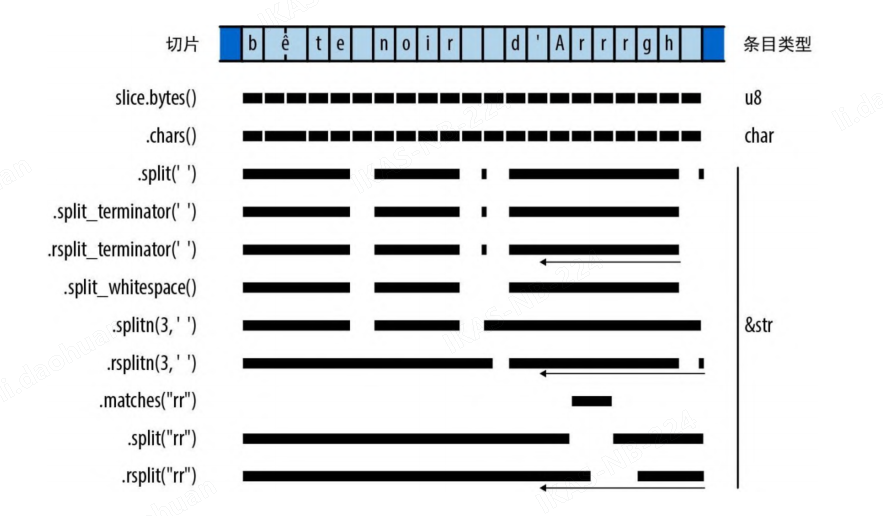

# 字符串与文本

## 一些 Unicode 的背景知识

介绍一些 Unicode 的背景知识有助于更好地理解 Rust。

### ASCII、Latin-1、Unicode

ASCII 是最初的 7 位编码，它包含了 128 个字符，包括英文字母、数字、标点符号和一些控制字符。

Latin-1 扩展了 ASCII，增加了 128 个字符，包括西欧语言的字符。

Unicode 是为了解决不同语言、不同文化的字符编码问题而创建的。它包含了超过 100,000 个字符，涵盖了世界上所有语言和文化。

### UTF-8 编码

Rust 的 String 类型和 str 类型表示使用了 UTF-8 编码形式的文本。UTF-8 会将字符编码为 1~4 字节的序列，如图所示。


格式良好的 UTF-8 序列有两个限制。首先，只有任何给定码点的最短编码才被认为是格式良好的，你不能花费 4 字节来编码原本只需要 3 字节的码点。此规则确保了每个码点只会有唯一一个 UTF-8 编码。其次，格式良好的 UTF-8 不得对从 0xd800 到 0xdfff 或超过 0x10ffff 的数值进行编码:这些数值要么保留用作非字符目的，要么完全超出了 Unicode 的范围。

一些 UTF-8 的编码示例：


虽然在螃蟹表情符号的编码中其前导字节对码点只贡献了一串 0，但是它仍然需要用 4 字节来编码:3 字节的 UTF-8 编码只能表达 16 位码点，而 0x1f980 有 17 位长。

- 由于 UTF-8 会把码点 0 ~ 0x7f 编码为字节 0 ~ 0x7f，因此一段 ASCII 文本必然是有效的 UTF-8 字符串。反过来，如果 UTF-8 字符串中只包含 ASCII 字符，则它也必然是有效的 ASCII 字符串。

  > 对于 Latin-1 则不是这样的，比如，Latin-1 会将 é 编码为字节 0xe9，而 UTF-8 会将其解释为三字节编码中的第一字节

- 通过查看任何字节的高位，就能立刻判断出它是某个字符的 UTF-8 编码的起始字节还是中间字节

### 文本的方向性

拉丁文、西里尔文、泰文等文字是从左向右书写的，而希伯来文、阿拉伯文等文字则是从右向左书写的。Unicode 以写入或读取字符的常规顺序存储字符，因此在这种情况下字符串(如希伯来语文本)中保存的首字节是对写在最右端的字符的编码。

## 字符（char）

Rust 的 char 类型是一个包含 Unicode 码点的 32 位值。char 保证会落在 0~ 0xd7ff 或 0xe000~0x10ffff 范围内，所有用于创建和操作 char 值的方法都会确保此规则永远成立。char 类型实现了 Copy 和 Clone，以及用于比较、哈希和格式化的所有常用特型。

字符串切片可以使用 slice.chars() 生成针对其字符的迭代器:

```rust
assert_eq!("カニ".chars().next(), Some('カ'));
```

### 字符分类

char 类型的一些方法可以将字符分入几个常见类别

- ch.is_numeric() 判断是否为数字
- ch.is_alphabetic() 判断是否为字母
- ch.is_alphanumeric() 判断是否为字母或数字
- ch.is_whitespace() 判断是否为空白字符
- ch.is_control() 判断是否为控制字符

下面是一组仅限于 ASCII 的方法，对任何非 ASCII char 都会返回 false

- ch.is_ascii() 判断是否为 ASCII 字符，码点介于 0~127 之间
- ch.is_ascii_alphabetic() 判断是否为大写或小写 ASCII 字母，在'A'..='Z'或'a'..='z'之间
- ch.is_ascii_alphanumeric() 判断是否为 ASCII 字母或数字
- ch.is_ascii_digit() 判断是否为 ASCII 数字，在'0'..='9'之间
- ch.is_ascii_hexdigit() 判断是否为 ASCII 十六进制数字，在'0'..='9'或'a'..='f'或'A'..='F'之间
- ch.is_ascii_punctuation() 判断是否既不是字母也不是数字的任何 ASCII 图形字符
- ch.is_ascii_uppercase() 判断是否为大写 ASCII 字母，在'A'..='Z'之间
- ch.is_ascii_lowercase() 判断是否为小写 ASCII 字母，在'a'..='z'之间

> 所有 is*ascii*... 方法也可用于 u8 字节类型

### 处理数字

对于数字的处理，可以使用以下方法

- `ch.to_digit(radix)` 转数字

  判断 ch 是不是以 radix 为基数的数字。如果是，就返回 Some(num)，
  其中 num 是 u32；否则，返回 None。此方法只会识别 ASCII 数字，而不包括
  char::is_numeric 涵盖的更广泛的字符类别。radix 参数的范围可以从 2
  到 36。对于大于 10 的基数，会用 ASCII 字母（不分大小写）表示值为 10 到
  35 的数字。

- `std::char::from_digit(num, radix)` 来自数字

  自由函数，只要有可能，就可以把 u32 数字值 num 转换为 char。如果
  num 可以表示为 radix 中的单个数字，那么 from_digit 就会返回
  Some(ch)，其中 ch 是数字。当 radix 大于 10 时，ch 可以是小写字母。
  否则，它会返回 None。

- `ch.is_digit(radix)` 是数字？

  如果 ch 可以表示以 radix 为基数的 ASCII 数字，就返回 true。此方法
  等效于 ch.to_digit(radix) != None。

### 字符大小写转换

- `ch.to_lowercase()` 转换为小写字母，
- `ch.to_uppercase()` 转换为大写字母。

这两个方法会返回迭代器而不是单个字符，因为 Unicode 中的大小写转换并不总是一对一的过程

```rust
let mut upper = 's'.to_uppercase();
assert_eq!(upper.next(), Some('S'));
assert_eq!(upper.next(), None);

// 德文字母"ß"的大写形式是"SS"：
let mut upper1 = 'ß'.to_uppercase();
assert_eq!(upper1.next(), Some('S'));
assert_eq!(upper1.next(), Some('S'));
assert_eq!(upper1.next(), None);
```

> 这些迭代器都实现了 std::fmt::Display 特型，因此可以将它们直接传给 println! 或 write! 宏

### 与整数之间的转换

Rust 的 as 运算符会将 char 转换为任何整数类型，并抹掉高位

> as 是运算符！！！

```rust
assert_eq!('B' as u32, 66);
assert_eq!('饂' as u8, 66); // 截断高位
assert_eq!('二' as i8, -116); // 同上
```

as 运算符会将任何 u8 值转换为 char，并且 char 也实现了 `From<u8>`。但是，更宽的整数类型可以表示无效码点，因此对于那部分整数，必须使用`std::char::from_u32` 进行转换，它会返回 `Option<char>`。

```RUST
assert_eq!(char::from(66), 'B');
assert_eq!(std::char::from_u32(0x9942), Some('饂'));
assert_eq!(std::char::from_u32(0xd800), None); // 为UTF-16保留的码点
```

## String 与 str

Rust 的 String 类型和 str 类型会保证自己只包含格式良好的 UTF-8。标准库通过限制你创建 String 值和 str 值的方式以及可以对它们执行的操作来确保这一点。这样，当引入这些值时一定是格式良好的，而且在使用中也是如此。它们所有的方法都会坚守这个保证：对它们的任何安全操作都不会引入格式错误的 UTF-8。这就简化了处理文本的代码。

Rust 可以将文本处理方法关联到 str 或 String 上，具体关联到哪个取决于该方法是需要可调整大小的缓冲区还是仅满足于就地使用文本。由于 String 可以解引用成 &str，因此在 str 上定义的每个方法都可以直接在 String 上使用。

String 通过封装 `Vec<u8>` 实现，并可以确保向量中的内容永远是格式良好的 UTF-8。Rust 永远不会把 String 改成更复杂的表示形式，因此你可以假设 String 的性能表现始终会和 Vec 保持一致。

### 创建字符串值

创建 String 值的常见方法有以下几种

- `String::new()` 返回一个新的空字符串。这时还没有在堆上分配缓冲区，但将来会按需分配。

- `String::with_capacity(n)` 　返回一个新的空字符串，其中预先分配了一个足以容纳至少 n 字节的缓冲区。如果事先知道要构建的字符串的长度，则此构造函数可以让你从一开始就正确设置缓冲区大小，而不是等构建字符串时再进行调整。如果字符串的长度超过 n 字节，则该字符串仍会根据需要增加其缓冲区。与向量一样，字符串也有 capacity 方法、reserve 方法和 shrink_to_fit 方法，但一般来说默认的分配逻辑就很好。

- `str_slice.to_string()` 分配一个新的 String，其内容是 str_slice 的副本。

- `iter.collect()` 通过串联迭代器的各个条目构造出字符串，迭代器的条目可以是 char 值、&str 值或 String 值。

  ```rust
  let spacey = "man hat tan";
  let spaceless: String = spacey.chars().filter(|c| !c.is_whitespace()).collect();
  assert_eq!(spaceless, "manhattan");
  ```

### 简单探查

下面这些方法可以从字符串切片中获取基本信息。

- `slice.len()` 返回字符串的长度（以字节为单位）。

- `slice.is_empty()` 判断字符串是否为空。

- `slice[range]` 返回借用了 slice 给定部分的切片。有界的范围、部分有界的
  范围和无界的范围都可以。

  ```rust
  let full = "bookkeeping";
  assert_eq!(&full[..4], "book");
  assert_eq!(&full[5..], "eeping");
  assert_eq!(&full[2..4], "ok");
  assert_eq!(full[..].len(), 11);
  assert_eq!(full[5..].contains("boo"), false);
  ```

  请注意，不能索引具有单个位置的字符串切片，比如`slice[i]`。要想在给定的字节偏移处获取单个字符有点儿笨拙：必须在切片上生成一个 `chars` 迭代器，并要求它解析成单个字符的 `UTF-8`

- `slice.split_at(i)` 拆分于, 返回从 slice 借来的两个共享切片的元组：一个是字节偏移量 i 之前的部分，另一个是字节偏移量 i 之后的部分。换句话说，这会返回 `(slice[..i], slice[i..])`。

- `slice.is_char_boundary(i)` 是字符边界？如果字节偏移量 i 恰好落在字符边界之间并且适合作为 slice
  的偏移量，就返回 True。

### 追加文本与插入文本

- `string.push(ch)` 压入，将字符 ch 追加到 string 的末尾。

- `string.push_str(slice)` 压入字符串

- `string.extend(iter)` 以 iter 扩展, 将迭代器 iter 生成的条目追加到字符串中。迭代器可以生成 char 值、str 值或 String 值。这是 String 对 std::iter::Extend 特型的实现。

  ```rust
  let mut also_spaceless = "con".to_string();
  also_spaceless.extend("tri but ion".split_whitespace());
  assert_eq!(also_spaceless, "contribution");
  ```

- `string.insert(i, ch)` 插入于， 在 string 内的字节偏移量 i 处插入单个字符 ch。这需要平移 i 之后的所有字符以便为 ch 腾出空间，因此用这种方式构建字符串的时间复杂度是 O(n)。

- `string.insert_str(i, slice)` 插入字符串于

  String 实现了 std::fmt::Write，这意味着 write! 宏和 writeln! 宏可以将格式化后的文本追加到 String 上：

  ```rust
  use std::fmt::Write;
  let mut letter = String::new();
  writeln!(letter, "Whose {} these are I think I know", "rutabagas")?;
  writeln!(letter, "His house is in the village though;")?;
  assert_eq!(letter, "Whose rutabagas these are I think I know\nHis house is in the village though;\n");
  ```

  由于 write! 和 writeln! 是专为写入输出流而设计的，因此它们会返回一个 Result，如果你忽略 Result，则 Rust 会报错。上述代码使用了 ? 运算符来处理错误，但实际上写入 String 是肯定不会出错的，因此这种情况下也可以调用 .unwrap()。

String 实现了 `Add<&str>` 和 `AddAssign<&str>`，所以你可以编写如下代码

```rust
let left = "partners".to_string();
let mut right = "crime".to_string();
assert_eq!(left + " in " + &right, "partners in crime");
right += " doesn't pay";
assert_eq!(right, "crime doesn't pay");
```

当应用于字符串时，+ 运算符会按值获取其左操作数，所以实际上它可以重用该 String 的缓冲区作为加法的结果。因此，如果左操作数的缓冲区足够容纳结果，那么就不需要分配内存。

遗憾的是，此运算不是对称的，+ 的左操作数不能是 &str，所以不能写成：

```RUST
let parenthetical = "(" + string + ")";
```

只能改成

```rust
let parenthetical = "(".to_string() + &string + ")";
```

通过向末尾追加小片段的方式从头到尾构建字符串是高效的。String 的行为方式与向量是一样的，当它需要更多容量时，总是至少将其缓冲区大小加倍。这就令再次复制的开销与字符串的最终大小成正比。不过，使用`String::with_capacity` 创建具有正确缓冲区大小的字符串可以完全避免调整大小，并且可以减少对堆分配器的调用次数。

### 文本移除和替换

String 有以下几个移除文本的方法。这些方法不会影响字符串的容量，如果需要释放内存，请使用 shrink_to_fit。

- string.clear() 清空字符串。

- string.truncate(n) 截断字符串，使其长度为 n 字节。如果 n 小于等于当前长度，则截断到 n 字节；否则，截断到当前长度。

- string.pop() 移除并返回 string 的最后一个字符。如果 string 为空，则返回 None。

- string.remove(i) 移除并返回 string 内的字节偏移量 i 处的字符。这需要平移 i 之后的所有字符以便腾出空间，因此用这种方式构建字符串的时间复杂度是 O(n)。

- string.drain(range) 移除并返回 string 内的字节范围 range 内的字符。这需要平移 range 之后的所有字符以便腾出空间，因此用这种方式构建字符串的时间复杂度是 O(n)。

- string.replace_range(range, slice) 用 slice 替换 string 内的字节范围 range 内的字符。这需要平移 range 之后的所有字符以便腾出空间，因此用这种方式构建字符串的时间复杂度是 O(n)。

### 搜索与迭代的约定

Rust 用于搜索文本和迭代文本的标准库函数遵循了一些命名约定，以便于记忆。

- `r`

  大多数操作会从头到尾处理文本，但名称以 r 开头的操作会从尾到头处理。例如，rsplit 是 split 的从尾到头版本。

- `n`

  名称以 n 结尾的迭代器会将自己限定为只取给定数量的匹配项。

- `_indices`

  名称以 \_indices 结尾的迭代器会生成通常的迭代值和在此 slice 中的字节偏移量组成的值对。

### 搜索文本的模式

当标准库函数需要搜索、匹配、拆分或修剪文本时，它能接受如下几种类型来表示要查找的内容：

```rust
let haystack = "One fine day, in the middle of the night, I saw a shining star";

assert_eq!(haystack.find(","), Some(12));
assert_eq!(haystack.find("day"), Some(9));
assert_eq!(haystack.find(char::is_whitespace), Some(3));
```

这些类型称为模式，大多数操作支持它们。标准库支持 4 种主要的模式。

- 以 `char` 作为模式意味着要匹配该字符
- 以 `String`、`&str` 或 `&&str` 作为模式，意味着要匹配等于该模式的字串
- 以 `Fn(char) -> bool` 闭包作为模式，意味着要匹配满足该函数的任何字符
- 以 `&[char]` 注意并不是 &str，而是 char 的切片，作为模式，意味着要匹配该列表中出现的任何单个字符。请注意，如果将此列表写成数组字面量，那么可能要调用 as_ref() 来获得正确的类型, 如果不这么做，则 Rust 会误以为这是固定大小数组类型 `&[char; 2]`。遗憾的是，`&[char; 2]` 不是有效的模式类型。

### 搜索与替换

Rust 提供了一些可以在切片中搜索某些模式并可能将其替换成新文本的方法。

- slice.contains(pattern) 包含， 如果 slice 包含 pattern 的匹配项，就返回 true。

- slice.starts_with(pattern) 开头， 如果 slice 开头是 pattern 的匹配项，就返回 true。

- slice.ends_with(pattern) 结尾， 如果 slice 结尾是 pattern 的匹配项，就返回 true。

- slice.find(pattern) 查找， 返回 Some(i) 说明找到了匹配项，其中 i 是匹配项的字节偏移量。如果没有匹配项，则返回 None。

  ```rust
    let quip = "We also know there are known unknowns";
  assert_eq!(quip.find("know"), Some(8));
  assert_eq!(quip.rfind("know"), Some(31));
  assert_eq!(quip.find("ya know"), None);
  assert_eq!(quip.rfind(char::is_uppercase), Some(0));
  ```

- slice.replace(pattern, replacement) 替换, 返回新的 String，它是通过用 replacement 急性替换 pattern 的所有匹配项而形成的

- slice.replacen(pattern, replacement, n) 替换 n 次,与上一个方法类似，但最多替换前 n 个匹配项。

### 遍历文本

标准库提供了几种对切片的文本进行迭代的方法。下图展示了一些示例



这些方法中大多数会返回可逆的迭代器（也就是说，它们实现了 DoubleEndedIterator）：调用它们的 .rev() 适配器方法会为你提供一个迭代器，该迭代器会生成相同的条目，只是顺序相反。

- slice.chars() 字符， 返回一个迭代器，它会生成每个字符的 char 值。
- slice.char_indices() 字符索引， 返回一个迭代器，它会生成每个字符的 char 值和它的字节偏移量组成的值对。

  ```rust
  assert_eq!(
    "élan".char_indices().collect::<Vec<_>>(),
    vec![
        (0, 'é'), // 有一个双字节UTF-8编码
        (2, 'l'),
        (3, 'a'),
        (4, 'n')
    ]
  );
  ```

  > 请注意，这并不等同于 `.chars().enumerate()`，因为本方法提供的是每个字符在切片中的字节偏移量，而不仅仅是字符的序号。

- slice.bytes() 字节迭代器,返回访问 slice 中各字节的迭代器，对外暴露 UTF-8 编码细节。

  ```rust
  assert_eq!(
      "élan".bytes().collect::<Vec<_>>(),
      vec![195, 169, b'l', b'a', b'n']
  );
  ```

- slice.lines() 文本行迭代器, 返回一个迭代器，它会生成每个行的切片。

  返回访问 slice 中各行的迭代器。各行以 "\n" 或 "\r\n"结尾。生成的每个条目都是从 slice 中借入的 &str。这些条目不包括行的终止字符。

- slice.split(pattern) 分割， 返回一个迭代器，它会生成从 slice 中借出的子串，这些子串是通过在 pattern 匹配项处拆分 slice 而形成的。如果 pattern 是 &str，则返回的迭代器不可逆，因为这类模式会根据不同的扫描方向生成不同的匹配序列，但可逆迭代器不允许这种行为。

- slice.rsplit(pattern) 右起拆分, 与上一个方法类似，但此方法会从尾到头扫描 slice，并按该顺序生成匹配项。

- slice.split_terminator(pattern) 分割终止符， 返回一个迭代器，它会生成从 slice 中借出的子串，这些子串是通过在 pattern 匹配项处拆分 slice 而形成的，但不包括 pattern 匹配项本身。如果 pattern 是 &str，则返回的迭代器不可逆，因为这类模式会根据不同的扫描方向生成不同的匹配序列，但可逆迭代器不允许这种行为。

  ```rust
  // 这里把':'字符视为分隔符。注意结尾的""（空串）
  assert_eq!(
    "jimb:1000:Jim Blandy:".split(':').collect::<Vec<_>>(),
    vec!["jimb", "1000", "Jim Blandy", ""]
  );
  // 这里把'\n'字符视为终结符
  assert_eq!(
    "127.0.0.1 localhost\n127.0.0.1 www.reddit.com\n"
        .split_terminator('\n')
        .collect::<Vec<_>>(),
    vec!["127.0.0.1 localhost", "127.0.0.1 www.reddit.com"]
  );
  // 注意，没有结尾的""！
  ```

- `slice.splitn(n, pattern)` / `slice.rsplitn(n, pattern)` 拆分为 n 片

  与 split 和 rsplit 类似，但这两个方法会把字符串分成最多 n 个切片，拆分位置位于 pattern 的第 n-1 个（split）或倒数第 n-1 个（rsplit）匹配项处。

- `slice.split_whitespace()` 按空白字符拆分
- `slice.split_ascii_whitespace()` 按 ASCII 空白字符拆分

  返回访问 slice 中以空白字符分隔的各部分的迭代器。这两个方法会把连续多个空白字符视为单个分隔符。忽略尾部空白字符。

  `split_whitespace` 方法会使用 Unicode 的空白字符定义，由 char 上的 `is_whitespace` 方法实现。`split_ascii_whitespace` 方法则会使用只识别 ASCII 空白字符的 `char::is_ascii_whitespace`。

  ```rust
  let poem = "This is just to say\n\
  I have eaten\n\
  the plums\n\
  again\n";
  assert_eq!(
    poem.split_whitespace().collect::<Vec<_>>(),
    vec!["This", "is", "just", "to", "say", "I", "have", "eaten", "the", "plums", "again"]
  );
  ```

- `slice.matches(pattern)` 匹配， 返回一个迭代器，它会生成从 slice 中借出的子串，这些子串是通过在 pattern 匹配项处匹配 slice 而形成的。如果 pattern 是 &str，则返回的迭代器不可逆，因为这类模式会根据不同的扫描方向生成不同的匹配序列，但可逆迭代器不允许这种行为。

- `slice.match_indices(pattern)` 匹配索引， 返回一个迭代器，它会生成从 slice 中借出的子串，这些子串是通过在 pattern 匹配项处匹配 slice 而形成的，并生成匹配项的字节偏移量。如果 pattern 是 &str，则返回的迭代器不可逆，因为这类模式会根据不同的扫描方向生成不同的匹配序列，但可逆迭代器不允许这种行为。

### 修剪

修剪字符串就是从字符串的开头或结尾移除文本（通常是空白字符）。修剪常用于清理从文件中读取的输入，在此文件中，用户可能为了易读性而添加了文本缩进，或者不小心在一行中留下了尾随空白字符。

- slice.trim() 修剪空白

  返回略去了任何前导空白字符和尾随空白字符的 slice 的子切片。slice.trim_start() 只会略去前导空白字符，slice.trim_end() 只会略去尾随空白字符。

  ```rust
  assert_eq!("\t*.rs ".trim(), "*.rs");
  assert_eq!("\t*.rs ".trim_start(), "*.rs ");
  assert_eq!("\t*.rs ".trim_end(), "\t*.rs");
  ```

- slice.trim_matches(pattern) 修剪模式, 返回 slice 的子切片，该子切片从开头和结尾略去了 pattern 的所有匹配项。trim_start_matches 方法和 trim_end_matches 方法只会对匹配的前导内容或尾随内容执行修剪操作

  ```rust
  assert_eq!("001990".trim_start_matches('0'), "1990");
  ```

- slice.strip_prefix(prefix) 修剪前缀, 返回 slice 的子切片，该子切片从开头移除了 prefix。如果 slice 开头不是 prefix，则返回 None。

  ```rust
  let slice = "banana";
  assert_eq!(slice.strip_suffix("na"),
  Some("bana"))
  ```

### 从字符串中解析出其他类型

Rust 为“从字符串解析出值”和“生成值的文本表示”提供了一些标准特型。如果一个类型实现了 std::str::FromStr 特型，那它就提供了一种从字符串切片中解析出值的标准方法：

```rust
pub trait FromStr: Sized {
  type Err;
  fn from_str(s: &str) -> Result<Self, Self::Err>;
}
```

所有常见的机器类型都实现了 FromStr

```rust
use std::str::FromStr;
assert_eq!(usize::from_str("123"), Ok(123));
assert_eq!(f64::from_str("3.14"), Ok(3.14));
assert_eq!(bool::from_str("true"), Ok(true));
// char 类型也实现了 FromStr，用于解析只有一个字符的字符串
assert_eq!(char::from_str("x"), Ok('x'));
```

`std::net::IpAddr` 类型，即包含 IPv4 或 IPv6 互联网地址的 enum，同样实现了 FromStr

字符串切片有一个 `parse` 方法，该方法可以将切片解析为你想要的任何类型——只要它实现了 FromStr。与 Iterator::collect 一样，有时需要明确写出想要的类型，因此用 parse 不一定比直接调用 from_str 可读性强。

```rust
let address = "fe80::0000:3ea9:f4ff:fe34:7a50".parse::<IpAddr>()?;
```

### 将其他类型转换为字符串

将非文本值转换为字符串的方法主要有以下 3 种

- 那些具有人类可读的自然打印形式的类型可以实现 std::fmt::Display 特型，该特型允许在 format! 宏的格式中使用 {} 格式说明符：

  ```rust
  assert_eq!(format!("{}, wow", "doge"), "doge, wow");
  assert_eq!(format!("{}", true), "true");
  assert_eq!(
      format!("({:.3}, {:.3})", 0.5, f64::sqrt(3.0) / 2.0),
      "(0.500, 0.866)"
  );
  ```

  Rust 的所有机器数值类型都实现了 `Display`，字符、字符串和切片也是如此。智能指针类型 `Box<T>`、`Rc<T>` 和 `Arc<T>` 也实现了 `Display`（只要 T 本身实现了 Display）：它们的显示形式就只是其引用目标的显示形式而已。而像 `Vec` 和`HashMap` 这样的容器则没有实现`Display`，因为这些类型没有人类可读的单一自然形式。

- 如果一个类型实现了 Display，那么标准库就会自动为它实现 std::str::ToString 特型，当你不需要 format! 的灵活性时，使用此特型的唯一方法 to_string 会更方便

- 标准库中的每个公共类型都实现了 `std::fmt::Debug`，这个特型会接受一个值并将其格式化为对程序员有用的字符串。用 Debug 生成字符串的最简单方法是使用 `format!` 宏的 `{:?}`格式说明符

### 借用其他类似文本的类型

可以通过以下两种方式借用切片的内容。

- 切片和 String 都实现了 `AsRef<str>`、`AsRef<[u8]>`、 `AsRef<Path>` 和`AsRef<OsStr>`。许多标准库函数会使用这些特型作为参数类型的限界，因此可以直接将切片和字符串传给它们，即便它们真正想要的是其他类型。

- 切片和字符串还实现了 `std::borrow::Borrow<str>` 特型。 `HashMap` 和 `BTreeMap` 会借助 `Borrow` 令 `String` 很好地用作表中的键。

### 以 UTF-8 格式访问文本

获取表示文本的那些字节有两个主要方法，具体取决于你是想获取字节的所有权还是只想借用它们。

- `slice.as_bytes()` 用作字节切片, 把 slice 的字节借入为 `&[u8]`。由于这不是可变引用，因此 slice 可以假定其字节将保持为格式良好的 UTF-8

- `string.into_bytes()` 转为字节切片, 获取 `string` 的所有权并按值返回字符串字节的 `Vec<u8>`。这 是一个开销极低的转换，因为它只是移动了字符串一直用作缓冲区的 `Vec<u8>`。由于 string 已经不复存在，因此这些字节无须继续保持为格式良好的 UTF-8，而调用者可以随意修改 `Vec<u8>`。

### 从 UTF-8 数据生成文本

如果你有一个包含 UTF-8 数据的字节块，那么有几个方法可以将其转换为 String 或切片，但具体用哪个取决于你希望如何处理错误。

- `String::from_utf8(vec)` 将 `vec` 转换为 `String`。如果 `vec` 不是格式良好的 UTF-8，则会返回 `Err` 并包含有关错误的详细信息。

  如果这些字节不是有效的 UTF-8，则返回 Err(e)，其中 e 是 FromUtf8Error 型的错误值。调用 e.into_bytes() 会返回原始 向量 vec，因此当转换失败时它并不会丢失

  ```rust
  let good_utf8: Vec<u8> = vec![0xe9, 0x8c, 0x86];
  assert_eq!(String::from_utf8(good_utf8).ok(), Some("錆".to_string()));
  let bad_utf8: Vec<u8> = vec![0x9f, 0xf0, 0xa6, 0x80];
  let result = String::from_utf8(bad_utf8);
  assert!(result.is_err());
  // 由于String::from_utf8失败了，因此它不会消耗原始向量，
  // 而是通过错误值把原始向量原原本本地还给了我们
  assert_eq!(
    result.unwrap_err().into_bytes(),
    vec![0x9f, 0xf0, 0xa6, 0x80]
  );
  ```

- `String::from_utf8_lossy(vec)` 尝试从 `&[u8]` 共享字节切片构造一个 `String` 或 `&str`。此转换总会成功，任何格式错误的 UTF-8 都会被 Unicode 代用字符替换。返回值是一个 `Cow<str>`，如果它包含格式良好的 UTF-8，就会 直接从 `byte_slice` 借用 `&str`，否则会拥有一个新分配的 String，其中格式错误的字节会被代用字符替换。因此，当 `byte_slice` 是格式良好的 UTF-8 时，不会发生堆分配或复制。

### 推迟分配

假设你想让程序向用户打招呼。在 Unix 上，可以这样写

```rust
fn get_name() -> String {
    std::env::var("USER") // 在Windows上要改成"USERNAME"
        .unwrap_or("whoever you are".to_string())
}
fn main() -> () {
    println!("Greetings, {}!", get_name());
}
```

问题的关键在于，get_name 的返回值有时应该是拥有型 String， 有时则应该是 &'static str，并且在运行程序之前我们无法知道会是哪一个。这种动态的特点预示着应该考虑使用 std::borrow::Cow，这个写入时克隆类型既可以持有拥有型数据也可以持有借入的数据。

`Cow<'a, T>` 是一个具有 `Owned` 和 `Borrowed` 两个变体的枚举。`Borrowed` 持有一个引用 `&'a T`，而 `Owned` 持有` &T` 的拥有型版本: 对于 `&str` 是 `String`，对于 `& [i32]` 是 `Vec<i32>`，等等。无论是 `Owned` 还是 `Borrowed`， `Cow<'a, T>` 总能生成一个 `&T` 供你使用。事实上，`Cow<'a, T>` 可以解引用为 `&T`，其行为类似于一种智能指针。

```rust
fn get_name() -> std::borrow::Cow<'static, str> {
    std::env::var("USER")
        .map(|v| Cow::Owned(v))
        .unwrap_or(Cow::Borrowed("whoever you are"))
}
fn main() -> () {
    println!("Greetings, {}!", get_name());
}
```

当你可能需要也可能不需要修改借用的某些文本时，Cow 也很有用。不需要修改时，可以继续借用。但是 Cow 名副其实的写入时克隆行为可以根据需要为你提供一个拥有型的、可变的值副本。Cow 的 to_mut 方法会确保 Cow 是 Cow::Owned，必要时会应用该值的 ToOwned 实现，然后返回对该值的可变引用。

### 把字符串当作泛型集合

String 同时实现了 `std::default::Default` 和 `std::iter::Extend`, default 返回空字符串，而 extend 可以把字符、字符串切片、Cow<..., str> 或字符串追加到一个字符串尾部。这与 Rust 的其他集合类型(如 Vec 和 HashMap)为其泛型构造模式(如 collect 和 partition)实现的特型组合是一样的。

## 格式化各种值

以下几个标准库特性中都有这种用于格式化字符串的小型语言。

- `format!` 宏会用它来构建 String。
- `println!` 宏和 `print!` 宏会将格式化后的文本写入标准输出流。
- `writeln!` 宏和 `write!` 宏会将格式化后的文本写入指定的输 出流。
- `panic!` 宏会使用它构建一个信息丰富的异常终止描述。

Rust 格式化工具的设计是开放式的。你可以通过实现 std::fmt 模块的格式化特型来扩展这些宏以支持自己的类型。也可以使用 format_args! 宏和 std::fmt::Arguments 类型来让自己的函数和宏支持格式化语言。

> 格式化宏总会借入对其参数的共享引用，但永远不会拥有或修改它们。

模板的 `{...}` 形式称为格式参数，具体形式为 `{which:how}`。 Which 和 how 都是可选的，很多时候用 `{}` 就行。

- which(哪个)值用于选择模板后面的哪个实参应该取代该形参的位置。可以按索引或名称选择实参。没有 which 值的形参只会简单地从左到右与实参配对。
- how(如何)值表示应如何格式化参数:如何填补、精度如何、数值 基数等。如果存在 how，则需要写上前面的冒号。

### 格式化文本值

当格式化像 &str 或 String(将 char 视为单字符字符串)这样的文本类型时，参数的 how 值有几个部分，都是可选的。

- **_文本长度限制_**。如果参数比这个值长，Rust 就会截断它。如果未指定限制，Rust 就使用全文。
- **_最小字段宽度_**。在完成所有截断之后，如果参数比这个值短，Rust 就会在右边(默认)用空格(默认)填补它以让字段达到这个宽度。如果省略，Rust 则不会填补参数。
- **_对齐方式_**。如果参数需要填补空白以满足最小字段宽度，那么这个值表示应将文本放置在字段中的什么位置。`<`、`^` 和 `>` 分别会将文本放在开头、中间和结尾。
- 在此填补过程中使用的填补字符。如果省略，Rust 就会使用空格。如果指定了填补字符，则必须同时指定对齐方式。

格式: `{参数位置:填补字符对齐方式:最小字段宽度.文本长度限制}`

> 除了 `&str` 和 `String`，你也可以直接向格式化宏传入带有文本型引 用目标的智能指针类型，比如 `Rc<String>` 或 `Cow<'a, str>`。

### 格式化数字值

当格式化参数具有 `usize` 或 `f64` 之类的数值类型时，参数的 how 值可以有如下几个部分，它们全是可选的。

- 填补与对齐，它们和对文本类型的含义一样
- `+` 字符，要求始终显示数值的符号，即使相应参数是正数
- `#` 字符，要求加显式基数前缀，比如 0x 或 0b
- `0` 字符，要求通过在数值中包含前导零（而不是通常的填补方式）来满足最小字段宽度。
- `最小字段宽度`，如果格式化后的数值没有这么宽，那么 Rust 会在左侧（默认）用空格（默认）填补它以构成给定宽度的字段。
- 浮点参数的精度，指示 Rust 应在小数点后包含多少位数字。Rust 会根据需要进行舍入或零扩展以生成要求的小数位。如果省略精度，那么 Rust 会尝试使用尽可能少的数字来准确表示该值。对于整数类型的参数，精度会被忽略

- 进制符号。对于整数类型，二进制是 `b`，八进制是 `o`，十六进制是小写字母 `x` 或大写字母 `X`。如果包含 `#` 字符，则它们会包含显式的 Rust 风格的基数前缀 `0b`、`0o`、`0x` 或 `0X`。对于浮点类型，`e` 或 `E` 的基数需要科学记数法，具有归一化系数，使用 `e` 或 `E` 作为指数。如果不指定任何进制符号，则 Rust 会将数值格式化为十进制。

### 格式化其他类型

除了字符串和数值，还可以格式化标准库中的其他几种类型。

- 错误类型全都可以直接格式化，从而很容易地将它们包含在错误消息中。每种错误类型都应该实现 `std::error::Error` 特型，该特型扩展了默认格式化特型 `std::fmt::Display`。因此，任何实现了 Error 的类型都可以格式化。

- 可以格式化 `std::net::IpAddr`、`std::net::SocketAddr` 等互联网协议地址类型。

- 布尔值 true 和 false 也可以被格式化，虽然它们通常不是直接呈现给最终用户的最佳格式。

### 格式化值以进行调试

为了帮助调试和记录日志，`{:?}` 参数能以对程序员有帮助的方式格式化 Rust 标准库中的任何公共类型。你可以使用它来检查向量、切片、元组、哈希表、线程和其他数百种类型。

> 使用 `{:#?}` 可以美化输出, 使其更易于阅读。

```rust
use std::collections::HashMap;
let mut map = HashMap::new();
map.insert("Portland", 2021);
map.insert("Seattle", 2022);
map.insert("San Francisco", 2023);

println!("{:#?}", map);

/**  Output:
  * {
  *    "San Francisco": 2023,
  *    "Portland": 2021,
  *    "Seattle": 2022,
  * }
  */
```

供调试用的格式化通常会以十进制打印数值，但可以在问号前放置一个 x 或 X 以请求十六进制，并且会遵循前导零和字段宽度语法，如下

```rust
println!("{:02?}", [9, 15, 240]);
println!("{:02x?}", [9, 15, 240]);
/**
 * Output:
 * [09, 15, 240]
 * [09, 0f, f0]
 */
```

你可以用 `#[derive(Debug)]` 语法让自己的类型(结构体、枚举等)支持 `{:?}`：

```rust
#[derive(Copy, Clone, Debug)]
struct Complex { re: f64, im: f64 }
```

### 格式化指针以进行调试

正常情况下，如果将任何种类的指针（引用、Box 或 Rc）传给格式化宏，宏都会简单地追踪指针并格式化它的引用目标，指针本身并不重要。但是在调试时，查看指针有时很有帮助：地址可以用作单个值的粗略“名称”，这在检查含有循环或共享指针的结构体时可能很有帮助。

`{:p}` 表示法会将引用、Box 和其他类似指针的类型格式化为地址

```rust
use std::rc::Rc;
let original = Rc::new("mazurka".to_string());
let cloned = original.clone();
let impostor = Rc::new("mazurka".to_string());

println!("text:    {}, {}, {}", original, cloned, impostor);
println!("pointer: {:p}, {:p}, {:p}", original, cloned, impostor);
/**
 * Output:
 * text:    mazurka, mazurka, mazurka
 * pointer: 0x1dd225e61d0, 0x1dd225e61d0, 0x1dd225e63b0
 */
```

### 按索引或名称引用参数

格式参数可以明确选择它要使用的参数。例如：

```rust
assert_eq!(
    format!("{1}, {0}, {2}", "zeroth", "first", "second"),
    "first, zeroth, second"
);
```

还可以按名称选择参数。这能让有许多参数的复杂模板更加清晰易读。

```rust
assert_eq!(
    format!(
        "{description:.<9} {quantity:2} @ {prince:5.2}",
        prince = 10.5,
        description = "apple",
        quantity = 2
    ),
    "apple....  2 @ 10.50"
);
```

### 动态宽度与动态精度

参数的最小字段宽度、文本长度限制和数值精度不必总是固定值，也可以在运行期进行选择。

我们一直在研究类似于下面这个表达式的情况，它会生成在 20 个字符宽的字段中右对齐的字符串 content：

```rust
format!("{:>20}", content);
```

但是，如果想在运行期选择字段宽度，则可以这样写:

```rust
format!("{:>1$}", content, get_width());
```

将最小字段宽度写成 1$ 就是在告诉 format! 使用第二个参数的值作为宽度。它引用的参数必须是 usize。还可以按名称引用参数

```rust
format!("{:>width$}", content, width=get_width())
```

同样的方法也适用于文本长度限制

```rust
format!("{:>width$.limit$}", content, width=get_width(), limit=get_limit())
```

### 格式化自己的类型

格式化宏会使用 `std::fmt` 模块中定义的一组特型将值转换为文本。通过自行实现这些特型中的一个或多个，就可以让 Rust 的格式化宏来格式化你的类型。

格式参数中的符号指示了其参数类型必须实现的特型
|符号|例子|特型|目的|
|-|-|-|-|
|无|{}|std::fmt::Display|文本、数值、错误等通用特型|
|b|{bits:#b}|std::fmt::Binary|二进制表示|
|o|{:#o}|std::fmt::Octal|八进制表示|
|x|{:4x}|std::fmt::LowerHex|十六进制表示，小写字母|
|X|{:4X}|std::fmt::UpperHex|十六进制表示，大写字母|
|e|{:.2e}|std::fmt::LowerExp|科学记数法表示，小写字母|
|E|{:.2E}|std::fmt::UpperExp|科学记数法表示，大写字母|
|p|{:p}|std::fmt::Pointer|指针表示|
|t|{:?}, {:#?}|std::fmt::Debug|调试表示|

当你将 `#[derive(Debug)]`属性放在类型定义上，以支持 `{:?}` 格式参数时，其实只是在要求 Rust 替你实现 `std::fmt::Debug` 特型。

这些格式化特型都具有相同的结构，只是名称不同而已。这里以 `std::fmt::Display` 为代表来讲解

```rust
trait Display {
    fn fmt(&self, dest: &mut std::fmt::Formatter) -> std::fmt::Result;
}
```

fmt 方法的任务是为 self 生成格式良好的表达形式并将其字符写入 dest。除了用作输出流，dest 参数还携带着从格式参数解析出的详细信息，比如对齐方式和最小字段宽度。

如果 Complex 值能以通常的 `a + bi` 形式打印自己则会更好。下面是执行本操作的 Display 实现

```rust
struct Complex {
    re: f64,
    im: f64,
}

impl fmt::Display for Complex {
    fn fmt(&self, dest: &mut fmt::Formatter<'_>) -> fmt::Result {
        let im_sign = if self.im >= 0.0 { "+" } else { "-" };
        write!(dest, "{} {} {}i", self.re, im_sign, f64::abs(self.im))
    }
}
```

