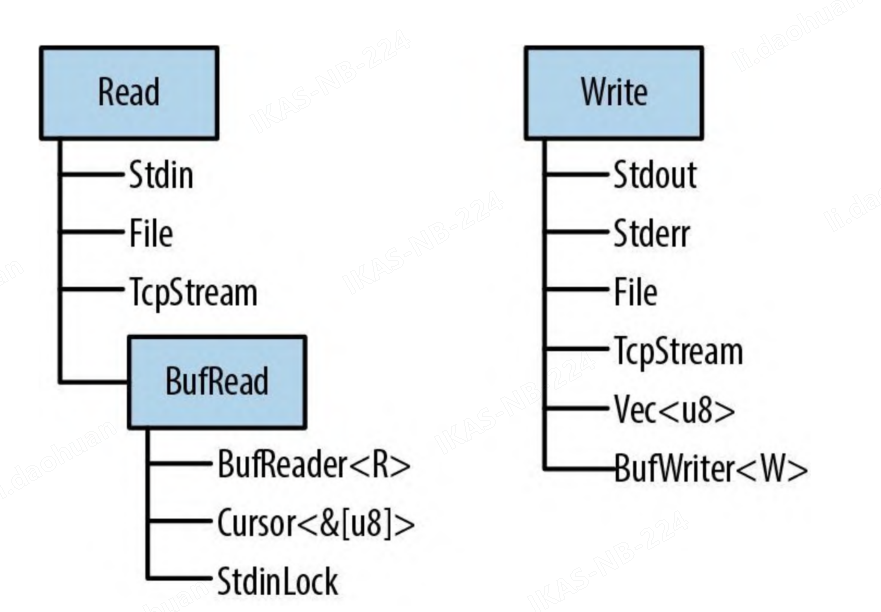
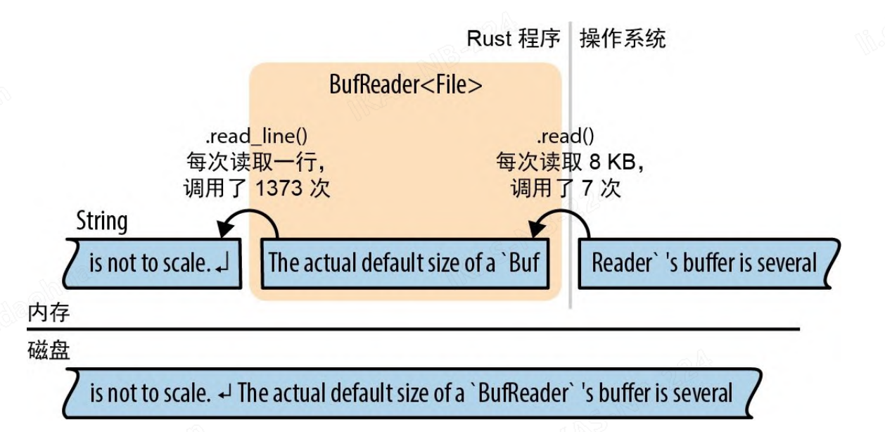

# 输入与输出

Rust 标准库中的输入和输出的特性是围绕 3 个特型组织的，即 Read、BufRead 和 Write。

- Read 实现了 Read 的值具有面向字节的输入方法。它们叫作读取器。
- 实现了 BufRead 的值是缓冲读取器。它们支持 Read 的所有方法，外加读取文本行等方法。
- 实现了 Write 的值能支持面向字节和 UTF-8 文本的输出。它们叫作写入器。

下图展示了这 3 个特型以及几个读取器类型和写入器类型的示例。



## 读取器和写入器

你的程序可以从读取器中读取一些字节。例如：

- 使用 `std::fs::File::open()` 打开一个文件。
- `std::net::TcpStream`，用于通过网络接收数据。
- `std::io::stdin()`, 用于从进程的标准输入流中进行读取
- `std::io::Cursor<&[u8]>`和`std::io::Cursor<Vec<u8>>`，它们是从已存在于内存中的字节数组或向量中进行“读取”的读取器。

写入器则可以向其中写入一些字节。例如：

- 使用 `std::fs::File::create(filename)` 创建一个文件。
- `std::net::TcpStream`，用于通过网络发送数据。
- `std::io::stdout()` 和 `std::io::stderr()`，它们是进程的标准输出流和标准错误流。
- `Vec<u8>` 也是一个写入器，它的 write 方法会把内容追加到向量
- `std::io::Cursor<Vec<u8>` 它与 `Vec<u8>` 很像，但允许读取数据和写入数据，并能在向量中寻找不同的位置
- `std::io::Cursor<&mut [u8]>`，它与`std::io::Cursor<Vec<u8>>` 很像，不过不能增长缓冲区，因为它只是一些现有字节数组的切片。

由于读取器和写入器都有标准特型（`std::io::Read` 和`std::io::Write`），因此编写适用于各种输入通道或输出通道的泛型代码是很常见的。例如，下面是一个将所有字节从任意读取器复制到任意写入器的函数：

```rust
use std::io::{self, ErrorKind, Read, Write};

const DEFAULT_BUF_SIZE: usize = 8 * 1024;
pub fn copy<R: ?Sized, W: ?Sized>(reader: &mut R, writer: &mut W) -> io::Result<u64>
where
    R: Read,
    W: Write,
{
    let mut buf = [0; DEFAULT_BUF_SIZE];
    let mut written = 0;
    loop {
        let len = match reader.read(&mut buf) {
            Ok(0) => return Ok(written),
            Ok(len) => len,
            Err(ref e) if e.kind() == ErrorKind::Interrupted => continue,
            Err(e) => return Err(e),
        };
        writer.write_all(&buf[..len])?;
        written += len as u64;
    }
}
```

这是 Rust 标准库中提供的 `std::io::copy()` 函数的实现。它使用一个缓冲区来减少系统调用的次数，并在遇到 `Interrupted` 错误时重试。

### 读取器

`std::io::Read` 有以下几个读取数据的方法。所有这些方法都需要对读取器本身进行可变引用。

- `reader.read(&mut buffer)` 读取

  从数据源中读取一些字节并将他们存储在给定的 buffer 中。buffer 参数的类型是 `&mut[u8]`, 此方法最多会读取 `buffer.len()` 个字节。

  返回的类型是 `io::Result<u64>`, 它是 `Result<u64, io::Error>`的类型别名。成功时，这个 u64 的值是已读取的字节数，可能等于或小于 buffer.len()，就算数据源突然涌入了更多数据也不会超出。Ok(0) 则意味着没有更多输入可以读取了

  出错时，.read() 会返回一个 Err(err)， 其中 err 是一个 io::Error 值。为了对人类友好，io::Error 是可打印的； 为了便于程序处理，它有一个 .kind() 方法，该方法会返回 io::ErrorKind 类型的错误代码。此枚举的成员都有 PermissionDenied 和 ConnectionReset 之类的名称。大多数表示严重的错误，不容忽视，但有一种错误需要特殊处理。 io::ErrorKind::Interrupted 对应于 Unix 错误码 EINTR，表示读取恰好被某种信号中断了。除非程序的设计目标之一就是对信号中断做一些巧妙的处理，否则就应该再次尝试读取。

  .read() 方法是非常底层的，甚至还继承了底层操作系统的某些怪癖。如果你正在为一种新型数据源实现 Read 特型，那么这会给你很大的发挥空间。但如果你想读取一些数据，则会很痛苦。因此，Rust 提供了几个更高级的便捷方法。这些方法是 Read 中的默认是实现，而且都处理了 ErrorKind::Interrupted, 这样就不必我们自己处理了。

- `reader.read_to_end(&mut buffer)` 读取所有字节

  从这个读取器读取所有剩余的输入，将其追加到 `Vec<u8>`型的 byte_vec 中。返回 `io::Result<usize>`, 即已读取的字节数。此方法对要装入向量中的数据量没有任何限制，因此不要在不受信任的来源上使用它。

- `reader.read_to_string(&mut string)` 读取所有字节并将其追加到 String 中

  如果流不是有效的 UTF-8，则返回 ErrorKind::InvalidData 错误

- `reader.read_exact(&mut buffer)` 精确读满

  读取足够的数据来填充给定的缓冲区。参数类型是 &[u8]。如果读取器在读够 buf.len() 字节之前就耗尽了数据，那么此方法就会返回 ErrorKind::UnexpectedEof 错误。

以上这些是 Read 特型的主要方法。此外，还有 3 个适配器方法可以按值获取 reader，将其转换为迭代器或另一种读取器。

- `reader.bytes()` 适配器，返回一个迭代器，每次迭代返回一个字节。

  返回输入流中各字节的迭代器。条目类型是`io::Result<u8>`，因此每字节都需要进行错误检查。此外，此方法会为每字节调用一次 `reader.read()`，如果没有缓冲，则会非常低效。

- `reader.chain(reader2)` 串联

  返回新的读取器，先生成来自 reader 的所有输入，然后再生成来自 reader2 的所有输入。

- `reader.take(n)` 截断

  返回新的读取器，从与 reader 相同的数据源读取，但仅限于前 n 字节的输入。

> 没有关闭读取器的方法。读取器和写入器通常会实现 Drop 以便自行关闭

### 缓冲读取器

为了提高效率，可以对读取器和写入器进行缓冲，这基本上意味着它们有一块内存（缓冲区），用于保存一些输入数据或输出数据。这可以减少一些系统调用, 如图所示。应用程序会从 BufReader 中读取数据，在本例中是通过调用其 .read_line() 方法实现的。 BufReader 会依次从操作系统获取更大块的输入。



BufReader 缓冲区的实际大小默认为几千字节，因此一次 read 系统调用就可以服务数百次 .read_line()调用。这很重要，因为系统调用很慢。

缓冲读取器同时实现了 Read 特型和 BufRead 特型，后者添加了以下方法。

- `reader.read_line(&mut line)` 读取一行

  读取一行文本并将其追加到 line，line 是一个 String。行尾的换行符 '\n' 包含在 line 中，返回值是 `io::Result<usize>`，表示已读取的字节数，包括行尾结束符号（如果有的话）。　如果读取器在输入的末尾，则会保持 line 不变并返回 `Ok(0)`。

- `reader.lines()` 文本行迭代器

  返回生成各个输入行的迭代器。条目类型是`io::Result<String>`。字符串中不包含换行符。如果输入带有 Windows 风格的行尾结束符号 "\r\n"，则这两个字符都会被去掉。

- `reader.read_until(stop_byte, &mut byte_vec)` 读取到 stop_byte 为止，`reader.split(stop_byte)` 根据 stop_byte 拆分

  与 `.read_line()` 和 `.lines()` 类似（这两个是以换行符为分隔符的），但这两个方法是面向字节的，会生成 `Vec<u8>` 而不是 `String`。你要自选分隔符`stop_byte`。

### 读取行

下面是一个用于实现 Unix grep 实用程序的函数，该函数会在多行文本（通常是通过管道从另一条命令输入的文本）中搜索给定字符串

```rust
use std::io;
use std::io::prelude::*;


fn grep(target: &str) -> io::Result<()> {
    let stdin = io::stdin();
    for line_result in stdin.lock().lines() {
        let line = line_result?;
        if line.contains(target) {
            println!("{}", line);
        }
    }
    Ok(())
}
```

假如我们想完善这个 grep 程序，让它支持在磁盘上搜索文件。可以把这个函数变成泛型函数

```rust
fn grep(target: &str, reader: R) -> io::Result<()>
where R: BufRead
{
    for line_result in reader.lines() {
        let line = line_result?;
        if line.contains(target) {
            println!("{}", line);
        }
    }
    Ok(())
}
```

### 收集行

有些读取器方法（包括 .lines()）会返回生成 Result 值的迭代器。当你第一次想要将文件的所有行都收集到一个大型向量中时，就会遇到如何摆脱 Result 的问题

```rust
// 正确，但不是你想要的
let results: Vec<io::Result<String>> = reader.lines().collect();
// 错误：不能把Result的集合转换成Vec<String>
let lines: Vec<String> = reader.lines().collect();
```

第二次尝试无法编译：遇到这些错误怎么办？最直观的解决方法是编写一个 for 循环并检查每个条目是否有错

```rust
let mut lines = vec![];
for line_result in reader.lines() {
    lines.push(line_result?);
}
```

这固然没错，但这里最好还是用 .collect()，事实上确实可以做到。只要知道该请求哪种类型就可以了：

```rust
let lines = reader.lines().collect::<io::Result<Vec<String>>>()?;
```

标准库中包含了 Result 对 FromIterator 的实现，这个实现让一切成为可能：

```rust
impl<T, E, C> FromIterator<Result<T, E>> for Result<C, E>
  where C: FromIterator<T>
{
  //...
}
```

假设 C 是任意集合类型，比如` Vec` 或 `HashSet`。只要已经知道如何从 T 值的迭代器构建出 C，就可以从生成 `Result<T, E>` 值的迭代器构建出`Result<C, E>`。只需从迭代器中提取各个值并从 Ok 结果构建出集合即可，但一旦看到 Err，就停止并将其传出。

换句话说，`io::Result<Vec<String>>` 是一种集合类型，因此 `.collect()` 方法可以创建并填充该类型的值。

### 写入器

如前所述，输入主要是用方法完成的，而输出略有不同。

我们一直在使用 `println!()` 生成纯文本输出，还有不会在行尾添加换行符的 `print!()` 宏，以及会写入标准错误流的 `eprintln!` 宏和 `eprint!` 宏。所有这些宏的格式化代码都和 `format!` 宏一样

要将输出发送到写入器，请使用 write!() 宏和 writeln!() 宏。它们和 print!() 和 println!() 类似，但有两点区别

- 一是每个 `write` 宏都接受一个额外的写入器作为第一参数。
- 二是它们会返回 `Result`，因此必须处理错误。这就是为什么要在每行末尾使用 `?` 运算符

Write 特型的主要方法如下：

- `writer.write(&buffer)` 写入

  将切片 buf 中的一些字节写入底层流。此方法会返回`io::Result<usize>`。成功时，这给出了已写入的字节数，如果流突然提前关闭，那么这个值可能会小于 `buf.len()`。

  > 和 Reader::read() 一样，这是一个要避免直接使用的底层方法。

- `writer.write_all(&buffer)` 写入所有字节

  将切片 buf 中的所有字节都写入。返回 `Result<()>`

- `writer.flush()` 刷新缓冲区

  将可能被缓冲在内存中的数据刷新到底层流中。返回 `Result<()>`

  > 请注意，虽然 println! 宏和 eprintln! 宏会自动刷新 stdout 流和 stderr 流的缓冲区，但 print! 宏和 eprint! 宏不会。使用它们时，可能要手动调用 flush()。

与读取器一样，写入器也会在被丢弃时自动关闭。

正如 `BufReader::new(reader)` 会为任意读取器添加缓冲区一样，`BufWriter::new(writer)` 也会为任意写入器添加缓冲区

```rust
let file = File::create("tmp.txt")?;
let writer = BufWriter::new(file);
```

要设置缓冲区的大小，请使用 `BufWriter::with_capacity(size, writer)`。

当丢弃 `BufWriter` 时，所有剩余的缓冲数据都将写入底层写入器。但是，如果在此写入过程中发生错误，则错误会被忽略。（由于错误发生在 `BufWriter` 的 `.drop()` 方法内部，因此没有合适的地方来报告。）为了确保应用程序会注意到所有输出错误，请在丢弃带缓冲的写入器之前将它手动 `.flush()` 一下。

### 文件

- `File::open(path)` 打开文件

  打开一个文件并返回一个 `File` 类型。如果文件不存在或无法打开，则返回 `io::Error`。

- `File::create(path)` 创建文件

  创建一个文件并返回一个 `File` 类型。创建一个用于写入的新文件。如果存在具有给定文件名的文件，则会将其截断。

当这两个方法都不符合需求时，可以使用 OpenOptions 来指定所期望的确切行为

```rust
use std::fs::OpenOptions;

let log = OpenOptions::new()
    .append(true) // 如果文件已存在，则追加到末尾
    .open("server.log")
    .unwrap();

let file = OpenOptions::new()
    .write(true)
    .create_new(true) // 如果文件存在，则会失败
    .open("new_file.txt")
    .unwrap();
```

方法 `.append()`、`.write()`、`.create_new()` 等是可以链式调 用的:每个方法都会返回 self。这种链式调用的设计模式很常见， 所以在 Rust 中它有一个专门的名字——构建器(builder)

### 寻址

`File` 还实现了 `Seek` 特型，这意味着你可以在 `File` 中“跳来跳去”，而不是从头到尾一次性读取或写入。`Seek` 的定义如下：

```rust
pub enum SeekFrom {
  Start(u64),
  End(i64),
  Current(i64),
}

pub trait Seek {
  fn seek(&mut self, pos: SeekFrom) -> io::Result<u64>;
}

```

此枚举让 seek 方法表现得很好:可以用 file.seek(SeekFrom::Start(0)) 倒回到开头，还能用 file.seek(SeekFrom::Current(-8)) 回退几字节，等等。

> 在文件中寻址很慢。无论使用的是硬盘还是固态驱动器(SSD)，每一次寻址的开销都接近于读取数兆字节的数据。

### 其他读取器与写入器类型

- `io::stdin()` 标准输入

  返回标准输入流的读取器。类型是 `io::Stdin`。由于它被所有线程共享，因此每次读取都会获取和释放互斥锁。

  Stdin 有一个 `.lock()` 方法，该方法会获取互斥锁并返回 `io::StdinLock`，这是一个带缓冲的读取器，在被丢弃之前会持有互斥锁。因此，对 `StdinLock` 的单个操作就避免了互斥开销。

  ```rust
  let stdin = io::stdin();
  let lines = stdin.lock().lines();
  ```

- `io::stdout()` 标准输出 和 `io::stderr()` 标准错误

  返回标准输出流(`Stdout`)类型和标准错误流(`Stderr`)类型的写入器。它们也有互斥锁和 `.lock()` 方法。

- `Vec<u8>` u8 向量

  实现了 Write。写入 `Vec<u8>` 会使用新数据扩展向量。String 没有实现 Write，要使用 Write 构建字符串，需要首先写入 `Vec<u8>`。然后使用 `String::from_utf8(vec)`将向量转换为字符串。

- `Cursor::new(buf)` 新建游标

  创建一个 Cursor（一个从 buf 读取数据等缓冲读取器），这样你就创建了一个能读取 String 的读取器。参数 buf 可以是实现了 `AsRef<[u8]>` 的类型，比如 `&[u8]` 或 `Vec<u8>` 或 `&str`。

  Cursor 的内部平平无奇，只有两个字段: buf 本身和一个整数，该整数是 buf 中下一次读取开始的偏移量。此位置的初始值为 0。

  Cursor 实现了 `Read`、`BufRead` 和 `Seek`。如果 buf 的类型是 `&mut [u8]` 或 `Vec<u8>`，那么 Cursor 也实现了 `Write`。写入游标会覆盖 buf 中从当前位置开始的字节。如果试图直接写到超出 `&mut [u8]` 末尾的位置，就会导致一次“部分写入”或一个 io::Error。不过，使用游标写入 `Vec<u8>` 的结尾就没有这个问题:它会增长此向量。因此，`Cursor<&mut [u8]>` 和 `Cursor<Vec<u8>>` 实现了所有这 4 个 `std::io::prelude` 特型。

- `std::net::TcpStream` Tcp 流

  表示 TCP 网络连接。由于 TCP 支持双向通信，因此它既是读取器又是写入器。

  类型关联函数 `TcpStream::connect(("hostname", PORT))` 会尝试连接到服务器并返回 `io::Result<TcpStream>`

- `std::process::Command` 命令

  支持启动子进程并通过管道将数据传输到其标准输入

- `std::io` 模块还提供了一些返回普通读取器和写入器的函数

  - `io::empty()` 这是无操作读取器。读取总会成功，但只会返回“输入结束”(EOF)。
  - `io::sink()` 这是无操作写入器。所有的写入方法都会返回 Ok，但只是把数据扔掉了。
  - `io::repeat(byte)` 是一个无限重复的读取器。它会返回一个字节重复 `byte` 的迭代器。

## 文件与目录

### OsStr 和 Path

麻烦的是，操作系统并不会强制要求其文件名是有效的 Unicode。下面是创建文本文件的两个 Linux shell 命令。第一个使用了有效的 UTF-8 文件名，第二个则没有

```shell
echo "hello, world" > ô.txt
echo "O brave new world, that has such filenames in't" > '\xf4'.text
```

这两个命令都没有任何报错就通过了，因为 Linux 内核并不检查 UTF-8 的格式有效性。对内核来说，任意字节串(除了 null 字节和斜杠)都是可接受的文件名。在 Windows 上的情况类似:几乎任意 16 位“宽字符”字符串都是可接受的文件名，即使字符串不是有效的 UTF-16 也可以。操作系统处理的其他字符串也是如此，比如命令行参数和环境变量。

Rust 字符串始终是有效的 Unicode。文件名在实践中总是 Unicode，但 Rust 必须以某种方式处理罕见的例外情况。这就是 Rust 会有 std::ffi::OsStr 和 OsString 的原因。

OsStr 是一种字符串类型，它是 UTF-8 的超集。OsStr 的任务是表示当前系统上的所有文件名、命令行参数和环境变量，无论他们是不是有效的 Unicode。在 Unix 上，OsStr 可以保存任意字节序列。 在 Windows 上，OsStr 使用 UTF-8 的扩展格式存储，可以对任意 16 位值序列(包括不符合标准的半代用区码点)进行编码。

所以我们有两种字符串类型:str 用于实际的 Unicode 字符串，而 OsStr 用于操作系统可能抛出的任意文字。还有用于文件名的 std::path::Path，这纯粹是一个便捷名称。Path 与 OsStr 完 全一样，只是添加了许多关于文件名的便捷方法

### Path 与 PathBuf 的方法

Path 提供了以下的方法

- `Path::new(str)` 新建路径

  将 `&str` 或 `&OsStr` 转换为 `&Path`。这不会复制字符串。新的 `&Path` 会指向与原始 `&str` 或 `&OsStr` 相同的字节。

```rust
use std::path::Path;

let home_dir = Path::new("/home/fwolfe");
```

- `path.parent()` 父目录

  返回父目录的 `Option<&Path>`。如果路径没有父目录，则返回 `None`。这不会复制路径。path 的父路径一定是 path 的子串。

- `path.file_name()` 文件名

  返回 path 的最后一个组件(如果有的话)。返回类型是 `Option<&OsStr>`。典型情况下，path 由目录、斜杠和文件名组成，此方法会返回文件名。

  ```rust
  use std::ffi::OsStr;
  assert_eq!(Path::new("/home/fwolfe/program.txt").file_name(),
      Some(OsStr::new("program.txt")));
  ```

- `path.is_absolute()` 是否为绝对路径
- `path.is_relative()` 是否为相对路径

- `path.join(path)` 联结两个路径，返回一个新的 PathBuf

  ```rust
  let path1 = Path::new("/usr/share/dict");
  assert_eq!(path1.join("words"),
      Path::new("/usr/share/dict/words"));
  ```

  > 如果 path2 本身是绝对路径，则只会返回 path2 的副本，因此该方法可用于将任意路径转换为绝对路径。

- `path.components()` 路径组件迭代器

  返回一个迭代器，它会生成路径的各个组件。组件是路径中的一部分，比如目录名、文件名或扩展名。组件的类型是 `std::path::Component`，它是一个枚举，可以是 `Normal(OsStr)`、`RootDir`、`CurDir` 或 `ParentDir`。

  ```rust
  pub enum Component {
    Prefix(PrefixComponent<'a>), // 驱动器路径或共享路径
    RootDir, // 根目录 (/)
    CurDir, // 当前目录 (.)
    ParentDir, // 父目录 (..)
    Normal(OsStr), // 其他部分 普通文件或目录名
  }
  ```

- `path.ancestors()` 祖先路径迭代器

  返回一个迭代器，它会生成路径的各个祖先。祖先是路径中所有组件的组合，包括根目录。

  ```rust
  let file = Path::new("/home/jimb/calendars/calendar-18x18.pdf");
  assert_eq!(
    file.ancestors().collect::<Vec<_>>(),
    vec![
        Path::new("/home/jimb/calendars/calendar-18x18.pdf"),
        Path::new("/home/jimb/calendars"),
        Path::new("/home/jimb"),
        Path::new("/home"),
        Path::new("/")
    ]
  );
  ```

  这就像在重复调用 parent 直到它返回 None。最后一个条目始终是根路径或前缀路径(Prefix)。

这些方法只针对内存中的字符串进行操作。Path 也有一些能查询文件系统的方法:`.exists()`、`.is_file()`、`.is_dir()`、`.read_dir()`、`.canonicalize()` 等

将 Path 转换为字符串有以下 3 个方法，每个方法都容许 Path 中存在无效 UTF-8。

- `path.to_str()` 转换为 `Option<&str>`

  如果路径中包含无效 UTF-8，则返回 `None`。

- `path.to_string_lossy()` 转换为 `Cow<str>`

  转换为 `Cow<str>`，其中包含原始字节序列，但可能包含无效的 UTF-8。

- `path.display()` 转换为 `Display`

  转换为 `Display`，用于打印路径。

  ```rust
  println!("Download found. You put it in: {}", dir_path.display());
  ```

  此方法返回的值不是字符串，但它实现了 `std::fmt::Display`，因此可以与 `format!()`、`println!() `和类似的宏一起使用。如果路径不是有效的 UTF-8，则输出可能包含 � 字符。

### 读取目录

要列出目录的内容，请使用 `std::fs::read_dir()` 或 Path 中的等效方法 `.read_dir()`

```rust
for entry_result in path.read_dir()? {
    let entry = entry_result?;
    println!("{}", entry.file_name().to_string_lossy());
}
```

注意，在这段代码中有两行用到了 ? 运算符。第 1 行检查了打开目录时的错误。第 2 行检查了读取下一个条目时的错误。

entry 的类型是 `std::fs::DirEntry`, 这个结构体提供了数个方法。

- `entry.file_name()` 文件名

  文件或目录的名称，是 OsString 类型的。

- `entry.path()` 路径

  与 `entry.file_name()` 基本相同，但 `entry.path()` 联结了原始路径，生成了一个新的 `PathBuf`。如果正在列出的目录是`"/home/jimb"`，并且 `entry.file_name()` 是 `".emacs"`，那么` entry.path()` 将返回`PathBuf::from("/home/jimb/.emacs")`

- `entry.file_type()` 文件类型

  返回 `io::Result<FileType>` `FileType` 有 `.is_file()`、`.is_dir()`、`.is_symlink()` 方法。

- `entry.metadata()` 元数据

  返回 `io::Result<Metadata>` 元数据包含文件大小、权限、创建时间、修改时间等信息。

> 特殊目录 . 和 .. 在读取目录时不会列出

下面是一个更接近现实的例子。以下代码会递归地将目录树从磁盘上的一个位置复制到另一个位置

```rust
/// 把`src`中的任何内容复制到目标路径`dst`
fn copy_to(src: &Path, src_type: &fs::FileType, dst: &Path) -> io::Result<()> {
    if src_type.is_file() {
        fs::copy(src, dst)?;
    } else if src_type.is_dir() {
        copy_dir_to(src, dst)?;
    } else {
        return Err(io::Error::new(
            io::ErrorKind::Other,
            format!("don't know how to copy: {}", src.display()),
        ));
    }
    Ok(())
}
/// 把现有目录`src`复制到目标路径`dst`
fn copy_dir_to(src: &Path, dst: &Path) -> io::Result<()> {
    if !dst.is_dir() {
        fs::create_dir(dst)?;
    }
    for entry_result in src.read_dir()? {
        let entry = entry_result?;
        let file_type = entry.file_type()?;
        copy_to(&entry.path(), &file_type, &dst.join(entry.file_name()))?;
    }
    Ok(())
}
```
