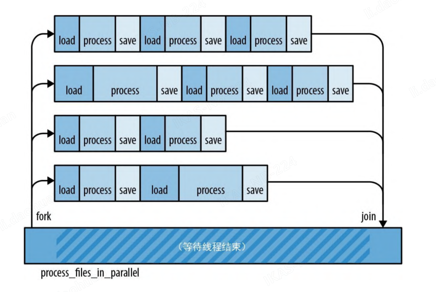
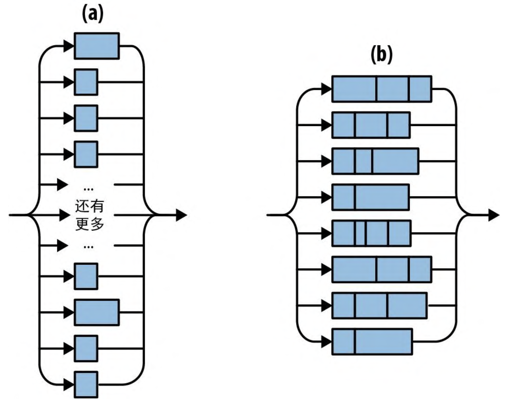
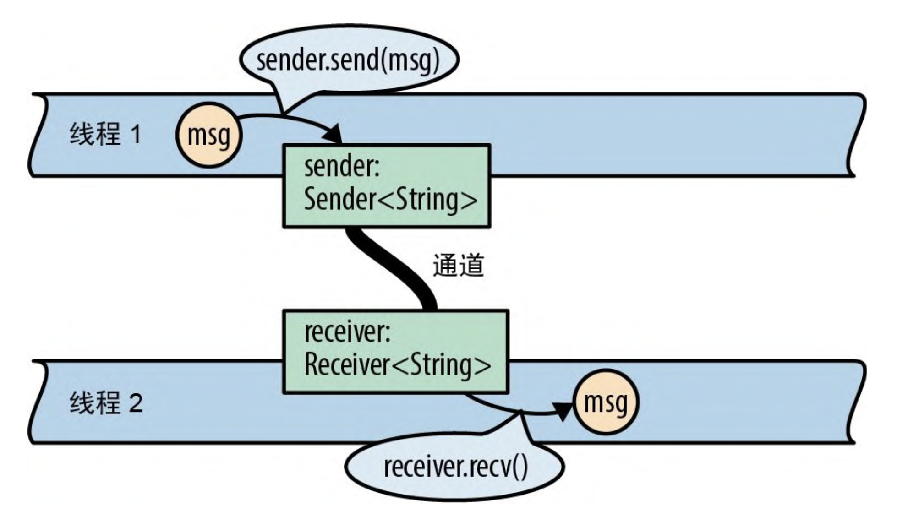
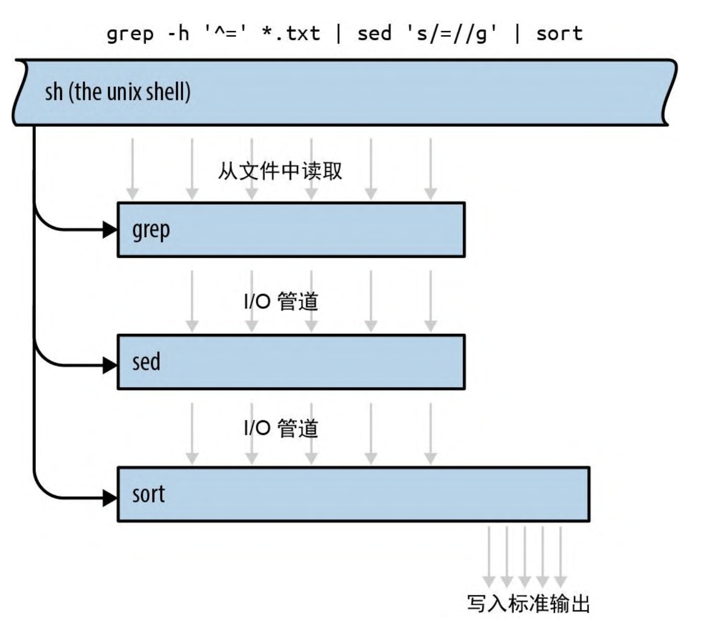
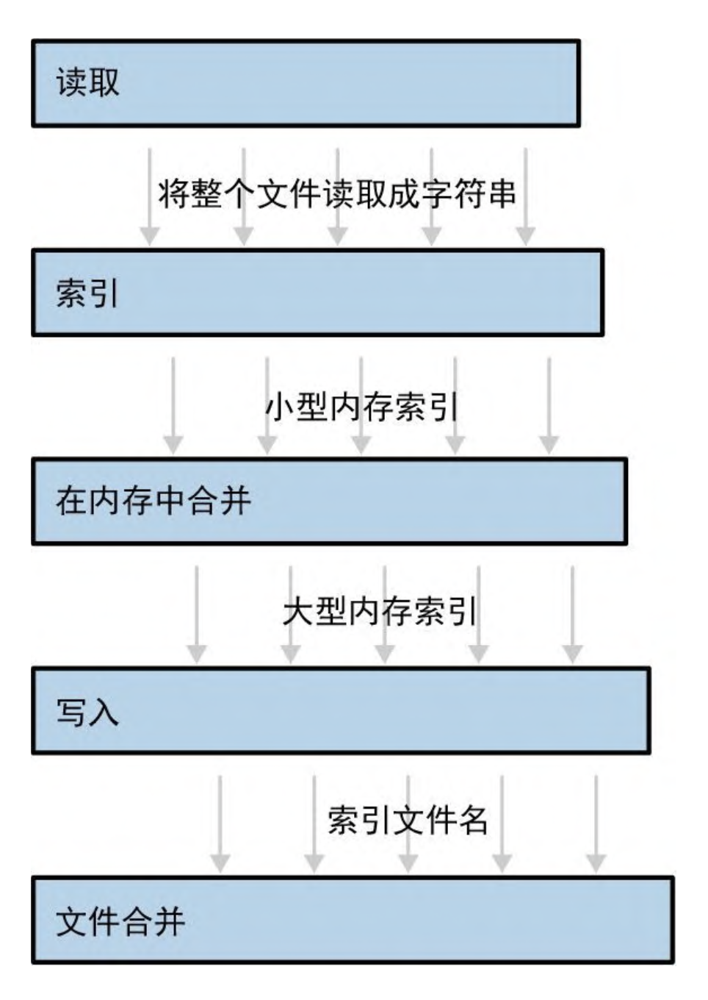
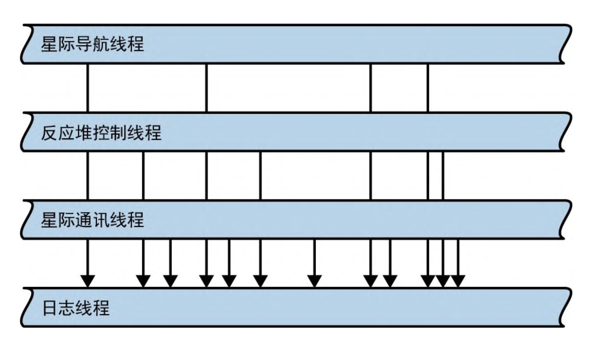

# 并发

这里介绍 3 种使用 Rust 线程的方法

- 分叉与合并并行
- 通道
- 共享可变状态

Rust 对引用、可变性和生命周期的处理方式在单线程程序中已经足够有价值了，但在并发编程中，这些规则的意义才开始真正显现。它们会扩展你的工具箱，让快速而正确地编写各种风格的多线程代码成为可能。

## 分叉与合并并行

当我们有几个完全独立的任务想要同时完成时，线程最简单的用例就出现了。

假设我们正在对大量文档进行自然语言处理。可以写这样一个循环：

```rust
fn process_files(filenames: Vec<String>) -> io::Result<()> {
    for document in filenames {
        let text = load(&document)?; // TODO：读取源文件
        let results = process(text); // TODO：计算统计信息
        save(&document, results)?; // TODO：写入输出文件
    }
    Ok(())
}

```

下图是上面代码单线程执行的流程示意图


由于每个文档都是单独处理的，因此要想加快任务处理速度，可以将语料库分成多个块并在单独的线程上处理每个块



这种模式称为分叉与合并并行。fork（分叉）是启动一个新线程，join（合并）是等待线程完成。

出于以下几个原因，分叉与合并并行很有吸引力

- 非常简单。分叉与合并很容易实现，在 Rust 中更不容易写错。
- 避免了瓶颈。分叉与合并中没有对共享资源的锁定。任何线程只会在最后一步才不得不等待另一个线程。同时，每个线程都可以自由允许。这有助于降低任务切换开销。
- 这种模式在性能方面的数学模型对程序员来说比较直观。在最好的情况下，通过启动 4 个线程，我们只花了 1/4 的时间就能完成原本的工作。上图展示了不应该期望这种理想加速的一个原因：我们可能无法在所有线程之间平均分配工作。另一个原因是，有时分叉与合并程序必须在线程联结后花费一些时间来组合各线程的计算结果，也就是说，完全隔离这些任务可能会产生一些额外的工作。不过，除了这两个原因，任何具有独立工作单元 CPU 密集型程序都可以获得显著的性能提升。
- 很容易推断出程序是否正确。只要线程真正隔离了，分叉与合并程序就是确定性的，这是一个没有竞态条件的并发模型
- 分叉与合并的主要缺点是要求工作单元彼此隔离

### 启动与联结

函数 std::thread::spawn() 会启动一个新线程

```rust
use std::thread;

thread::spawn(|| {
    // 线程代码
});
```

thread::spawn(closure) 会接收一个参数，即一个 FnOnce 闭包或函数型的参数。Rust 会启动一个新线程来运行该闭包或函数的代码。新线程是一个真正的操作系统线程，有自己的栈。

下面是一个更实际的例子，它使用 spawn 实现了之前的 process_files 函数的并行版本

```rust
fn process_files_in_parallel(filenames: Vec<String>) -> io::Result<()> {
    const NTHREADS: usize = 8; // 把工作拆分成几块
    let worklists = split_vec_into_chunks(filenames, NTHREADS); // 将文件切分为多个工作列表

    let mut thread_handles = vec![];

    for worklist in worklists {
        thread_handles.push(spawn(move || process_files(worklist)));
    }
    // 联结：等待所有线程结束
    for handle in thread_handles {
        handle.join().unwrap()?;
    }

    Ok(())
}
```

- 在父线程中，通过 for 循环来定义和填充 worklist。
- 一旦创建了 move 闭包，worklist 就会被移动到此闭包中。
- 然后 spawn 会将闭包（内含 worklist 向量）转移给新的子线程。

这些操作开销很低。String 没有被克隆。事实上，这个过程中并没有发生任何分配和释放。唯一移动的数据是 Vec 本身，只有 3 个机器字。

我们使用之前收集的 JoinHandle 的 .join() 方法来等待所有 8 个线程完成。联结这些线程对于保证程序的正确性是必要的，因为 Rust 程序会在 main 返回后立即退出，即使其他线程仍在运行。这些线程并不会调用析构器，而是直接被“杀死”了。如果这不是你想要的结果，请确保在从 main **_返回之前联结了任何你关心的线程_**。

### 跨线程共享不可变数据

假设我们正在进行的分析需要一个大型的英语单词和短语的数据库

```rust
// 之前
fn process_files(filenames: Vec<String>)
// 之后
fn process_files(filenames: Vec<String>, glossary: &GigabyteMap)
```

这个 glossary 会很大，所以要通过引用传递它。该如何修改, process_files_in_parallel 以便将词汇表传给工作线程呢？

```rust
fn process_files_in_parallel(filenames: Vec<String>, glossary: &GigabyteMap) -> io::Result<()> {
  //...
    for worklist in worklists {
          thread_handles.push(
              spawn(move || process_files(worklist, glossary)) // 错误：不能在闭包中使用引用
          );
    }
  //...
}
```

spawn 会启动独立线程。Rust 无法知道子线程要运行多长时间，因此它假设了最坏的情况：即使在父线程完成并且父线程中的所有值都消失后，子线程仍可能继续运行。显然，如果子线程要持续那么久，那么它运行的闭包也需要持续那么久。但是这个闭包有一个有限的生命周期，它依赖于 glossary 引用，而此引用不需要永久存在。

请注意，Rust 拒绝编译此代码是对的。按照我们编写这个函数的方式，一个线程确实有可能遇到 I/O 错误，导致 process_files_in_parallel 在其他线程完成之前退出。在主线程释放词汇表后，子线程可能仍然会试图使用词汇表。这将是一场竞赛，如果主线程获胜，就会赢得“未定义行为”这份大奖。而 Rust 不允许发生这种事。

spawn 似乎过于开放了，无法支持跨线程共享引用。一种安全的替代方案是为每个线程都克隆整个词汇表，但由于词汇表很大，我们不希望这么做。幸运的是，标准库提供了另一种方式：原子化引用计数。

```RUST
use std::sync::Arc;
fn process_files_in_parallel(filenames: Vec<String>, glossary: Arc<GigabyteMap>) -> io::Result<()> {
    for worklist in worklists {
        // 对.clone()的调用只会克隆Arc并增加引用计数，并不会克隆 GigabyteMap
        let glossary_for_child = glossary.clone();
        thread_handles.push(spawn(move || process_files(worklist, &glossary_for_child)));
    }
}
```

我们更改了 glossary 的类型：要执行并行分析，调用者就必须传入`Arc<GigabyteMap>`，这是指向已使用 `Arc::new(giga_map)` 移入堆中的 `GigabyteMap` 的智能指针。

调用 `glossary.clone()` 时，我们是在复制 `Arc` 智能指针而不是整个 `GigabyteMap`。这相当于增加一次引用计数。

通过此项更改，程序可以编译并运行了，因为它不再依赖于引用的生命周期。只要任何线程拥有 `Arc<GigabyteMap>`，它就会让 GigabyteMap 保持存活状态，即使父线程提前退出也没问题。不会有任何数据竞争，因为 Arc 中的数据是不可变的。

### rayon

由 Niko Matsakis 和 Josh Stone 设计的 [rayon](https://crates.io/crates/rayon) 库是另一个例子。它提供了两种运行并发任务的方式

```rust
use rayon::prelude::*;

// 并行做两件事
let (v1, v2) = rayon::join(fn1, fn2);

// 并行做 N 件事
giant_vector.par_iter().for_each(|value| {
    do_thing_with_value(value);
})
```

`rayon::join(fn1, fn2)` 只是调用这两个函数并返回两个结果。`.par_iter()` 方法会创建 `ParallelIterator`，这是一个带有 map、filter 和其他方法的值，很像 Rust 的 `Iterator`。在这两种情况下，rayon 都会用自己的工作线程池来尽可能拆分工作。只要告诉 rayon 哪些任务 并行完成就可以了，rayon 会管理这些线程并尽其所能地分派工作。

下图展示了对`giant_vector.par_iter().for_each(...)` 调用的两种思考方式。

- rayon 表现得就好像它为向量中的每个元素启动了一个线程。
- 在幕后，rayon 在每个 CPU 核心上都有一个工作线程，这样效率更高。

这个工作线程池由程序中的所有线程共享。当成千上万个任务同时进来时，rayon 会拆分这些工作。


下面是一个使用 rayon 的 `process_files_in_parallel` 版本和一个接受`Vec<String>` 型而非 `&str` 型参数的 process_file

```rust
use rayon::prelude::*;
fn process_files_in_parallel(filenames: Vec<String>, glossary: &GigabyteMap) -> io::Result<()>
{
    filenames.par_iter()
        .map(|filename| process_file(filename, glossary))
        .reduce_with(|r1, r2| {
            if r1.is_err() { r1 } else { r2 }
        })
        .unwrap_or(Ok(()))
}
```

比起使用 `std::thread::spawn` 的版本，这段代码更简短，也不需要很多技巧。我们一行一行地看。

- 首先，用 `filenames.par_iter()` 创建一个并行迭代器。
- 然后，用 .map() 在每个文件名上调用 process_file。这会在一系列 `io::Result<()>` 型的值上生成一个 ParallelIterator。
- 最后，用 `.reduce_with()` 来合并结果。在这里，我们会保留第一个错误(如果有的话)并丢弃其余错误。如果想累积所有的错误或者打印它们，也可以在这里修改。
- `reduce_with` 只有在 `filenames` 为空时才会返回一个为 None 的 Option。在这种情况下，我们会用 Option 的 `.unwrap_or()` 方法来生成结果 `Ok(())`。

## 通道

通道是一种单向管道，用于将值从一个线程发送到另一个线程。换句话说，通道是一个线程安全的队列。

下图说明了如何使用通道。通道有点儿像 Unix 管道:一端用于发送数据，另一端用于接收数据。两端通常由两个不同的线程拥有。 但是，Unix 管道用于发送字节，而通道用于发送 Rust 值。 `sender.send(item)` 会将单个值放入通道，`receiver.recv()` 则会移除一个值。值的所有权会从发送线程转移给接收线程。如果通道为空，则 `receiver.recv()` 会一直阻塞到有值发出为止。使用通道，线程可以通过彼此传值来进行通信。这是线程协同工作的一种非常简单的方法，无须使用锁或共享内存。



这并不是一项新技术。Erlang 中的独立进程和消息传递已经有 30 年 历史了。Unix 管道已经有将近 50 年历史了。我们一般会认为管道具有灵活性和可组合性，而没有意识到它还具有并发的特性，但事实上，管道具有上述所有特性。下图展示了一个 Unix 管道的例子。当然，这 3 个程序也可以同时工作。



Rust 通道比 Unix 管道更快。发送值只是移动而不是复制，即使要移动的数据结构包含数兆字节数据速度也很快。

### 发送值

在接下来的几节中，我们将使用通道来构建一个创建倒排索引的并发程序，倒排索引是搜索引擎的关键组成部分之一。每个搜索引擎都会处理特定的文档集合。倒排索引是记录“哪些词出现在哪里”的数据库。

我们的程序结构是管道式的，如图所示。管道只是使用通道的众多方法之一，但它们是将并发引入现 有单线程程序的最直观方式。



这个程序使用总共 5 个线程分别执行了不同的任务。每个线程在程序的生命周期内不断地生成输出。例如，第一个线程只是将源文档从磁盘逐个读取到内存中。该阶段会为每个文档输出一个表示其内容的长 String，因此这个线程与下一个线程可以通过 String 型通道连接。

我们的程序将从启动读取文件的线程开始。假设 documents 是一个 `Vec<PathBuf>`，即一个文件名向量。启动读取文件线程的代码如下所示

```rust
use std::sync::mpsc;
use std::{fs, thread};
let (sender, receiver) = mpsc::channel();

let handle = thread::spawn(move || {
    for filename in documents {
        let text = fs::read_to_string(filename);

        if sender.send(text).is_err() {
            break;
        }
    }
    Ok(())
});
```

通道是 `std::sync::mpsc` 模块的一部分，本章稍后会解释这个名字的含义。下面来看这段代码是如何工作的。先创建一个通道:

```rust
let (sender, receiver) = mpsc::channel();
```

channel 函数会返回一个值对: 发送者和接收者。底层队列的数据结构是标准库的内部实现细节

通道是有类型的。我们要使用这个通道来发送每个文件的文本，因此 `sender` 和 `receiver` 的类型分别为 `Sender<String>` 和 `Receiver<String>`。固然可以写成 `mpsc::channel:: <String>()` 来明确请求一个字符串型通道。但最好还是让 Rust 的类型推断来解决这个问题。

```rust
let handle = thread::spawn(move || {});
```

和以前一样，使用 `std::thread::spawn` 来启动一个线程。 sender(而不是 receiver)的所有权会通过这个 move 闭包转移给新线程。

接下来的几行代码只会从磁盘读取文件

```rust
for filename in documents {
    let text = fs::read_to_string(filename)?;
```

成功读取文件后，要将其文本发送到通道中

```rust
    if sender.send(text).is_err() {
        break;
    }
}
```

`sender.send(text)` 会将 text 值移动到通道中。最终，通道会再次把 text 值转交给接收到该值的任何对象。无论 text 包含 10 行文本还是 10 兆字节，此操作都只会复制 3 个机器字(String 结构体的大小)，相应的 `receiver.recv()` 调用也只会复制 3 个机器字。

`send` 方法和 `recv` 方法都会返回 `Result`，这两种方法只有当通道的另一端已被丢弃时才会失败。如果 `Receiver` 已被丢弃，那么 `send` 调用就会失败，因为如果不失败，则该值会永远存在于通道中:没有 `Receiver`，任何线程都无法再接收它。同样，如果通道中没有值在等待并且 `Sender` 已被丢弃，则 `recv` 调用会失败，因为如果不失败，`recv` 就只能永远等待

没有 Sender，任何线程都无法再发出下一个值。丢弃通道的某一端是正常的“挂断”方式，完成后就会关闭连接。

在我们的代码中，只有当接收者的线程提前退出时，`sender.send(text)` 才会失败。这是使用通道的典型代码。无论接收者是故意退出还是出错退出，读取者线程都可以悄悄地自行关闭。

无论是发生了这种情况还是线程读取完了所有文档，程序都会返回 `Ok(())`

```rust
    Ok(())
});
```

为便于使用，程序会把所有这些代码都包装在一个函数中，该函数会返回至今尚未用到的 `receiver` 和新线程的 `JoinHandle`

```rust
fn start_file_reader_thread(
    documents: Vec<PathBuf>,
) -> (
    mpsc::Receiver<io::Result<String>>,
    thread::JoinHandle<io::Result<()>>,
) {
    let (sender, receiver) = mpsc::channel();
    let handle = thread::spawn(move || {
        for filename in documents {
            let text = fs::read_to_string(filename);

            if sender.send(text).is_err() {
                break;
            }
        }
        Ok(())
    });
    (receiver, handle)
}

```

### 接收值

现在我们有了一个线程来运行发送值的循环。接下来可以启动第二个线程来运行调用 `receiver.recv()` 的循环

```rust
while let Ok(text) = receiver.recv() {
    do_something_with(text);
}
```

但 Receiver 是可迭代的，所以还有更好的写法：

```rust
for text in receiver {
    do_something_with(text);
}
```

这两个循环是等效的。无论怎么写，当控制流到达循环顶部时，只要通道恰好为空，接收线程在其他线程发送值之前都会阻塞。当通道为空且 Sender 已被丢弃时，循环将正常退出。在我们的程序中，当读取者线程退出时，循环会自然而然地退出。该线程正在运行一个拥有变量 sender 的闭包，当闭包退出时，sender 会被丢弃。

```rust
fn start_file_indexing_thread(
    texts: mpsc::Receiver<String>,
) -> (mpsc::Receiver<InMemoryIndex>, thread::JoinHandle<()>) {
    let (sender, receiver) = mpsc::channel();
    let handle = thread::spawn(move || {
        for (doc_id, text) in texts.into_iter().enumerate() {
            let index = InMemoryIndex::from_single_document(doc_id, text);
            if sender.send(index).is_err() {
                break;
            }
        }
    });
    (receiver, handle)
}
```

这个函数会启动一个线程，该线程会从一个通道(texts)接收 String 值并将 `InMemoryIndex` 值发送给另一个通道 `(sender/receiver)`。这个线程的工作是获取第一阶段加载的每个文件，并将每个文档变成一个小型单文件内存倒排索引。

这个线程的主循环很简单。索引文档的所有工作都是由函数 `InMemoryIndex::from_single_document` 完成的。它会在单词边界处拆分输入字符串，然后生成从单词到位置列表的映射。

这个阶段不会执行 I/O，所以不必处理各种 io::Error。它会返回 () 而非 `io::Result<()>`。

### 运行管道

其余 3 个阶段的设计也是类似的。每个阶段都会使用上一阶段创建的 Receiver。对管道的其余部分，我们设定的目标是将所有小索引合并到磁盘上的单个大索引文件中。最快的方法是将这个任务分为 3 个阶段。我们不会在这里展示代码，只会展示这 3 个函数的类型签名。

```rust
fn start_in_memory_merge_thread(file_indexes: mpsc::Receiver<InMemoryIndex>) -> (mpsc::Receiver<InMemoryIndex>, thread::JoinHandle<()>);
```

然后，将这些大型索引写入磁盘

```rust
fn start_index_writer_thread(
    big_indexes: mpsc::Receiver<InMemoryIndex>,
    output_dir: &Path)
    -> (mpsc::Receiver<PathBuf>, thread::JoinHandle<io::Result<()>>);
```

最后，如果有多个大文件，就用基于文件的合并算法合并它们

```rust
fn merge_index_files(files: mpsc::Receiver<PathBuf>, output_dir: &Path) -> io::Result<()>;
```

现在来看一下启动线程和检查错误的代码:

```rust
fn run_pipeline(documents: Vec<PathBuf>, output_dir: PathBuf) -> io::Result<()> {
    // 启动管道的所有5个阶段
    let (texts, h1) = start_file_reader_thread(documents);
    let (pints, h2) = start_file_indexing_thread(texts);
    let (gallons, h3) = start_in_memory_merge_thread(pints);
    let (files, h4) = start_index_writer_thread(gallons, &output_dir);
    let result = merge_index_files(files, &output_dir);
    // 等待这些线程结束，保留它们遇到的任何错误
    let r1 = h1.join().unwrap();
    h2.join().unwrap();
    h3.join().unwrap();
    let r4 = h4.join().unwrap();
    // 返回遇到的第一个错误(如果有的话)(如你所见，h2和h3
    // 不会失败，因为这些线程都是纯粹的内存数据处理)
    r1?;
    r4?;
    result
}
```

### 通道的特性与性能

`std::sync::mpsc` 中的 mpsc 代表多生产者、单消费者 (`multi- producer`, `single-consumer`)，这是对 Rust 通道提供的通信类型的简洁描述。

这个示例程序中的通道会将值从单个发送者传送到单个接收者。这是相当普遍的案例。但是 Rust 通道也支持多个发送者，如果需要的话，你可以用一个线程来处理来自多个客户端线程的请求



`Sender<T>` 实现了 Clone 特型。要获得具有多个发送者的通道，只需创建一个常规通道并根据需要多次克隆发送者即可。可以将每个 Sender 值转移给不同的线程。

Rust 的通道经过了精心优化。首次创建通道时，Rust 会使用特殊的“一次性”队列实现。如果只通过此通道发送一个对象，那么开销是最低的。如果要发送第二个值，Rust 就会切换到第二种队列实现。实际上，第二种实现就是为长期使用而设计的，它会准备好传输许多值的通道，同时最大限度地降低内存分配开销。如果你克隆了 Sender，那么 Rust 就必须回退到第三种实现，使得多个线程可以安全地同时尝试发送值，这种实现是安全的。当然，即便这 3 种实现中最慢的一种也是无锁队列，所以发送或接收一个值最多就是执行几个原子化操作和堆分配，再加上移动本身。只有当队列为空时才需要系统调用，这时候接收线程就会让自己进入休眠状态。当然，在这种情 况下，走这个通道的流量无论如何都不会满载。

尽管进行了所有这些优化工作，但应用程序很容易在通道性能方面犯一个错误:发送值的速度快于接收值和处理值的速度。这会导致通道中积压的值不断增长。例如，在这个程序中，我们发现文件读取线程(第一阶段)加载文件的速度比文件索引线程(第二阶段)更快。结果导致数百兆字节的原始数据从磁盘中读取出来后立即填充到了队列中。

这种不当行为会消耗内存并破坏局部性。更糟糕的是，发送线程还会继续运行，耗尽 CPU 和其他系统资源只是为了发出更多的值，而此时却恰恰是接收端最需要资源来处理它们的时候。这显然不对劲。

Rust 再次从 Unix 管道中汲取了灵感。Unix 使用了一个优雅的技巧来提供一些 ，以迫使超速的发送者放慢速度:Unix 系统上的每个管道都有固定的大小，如果进程试图写入暂时已满的管道，那么系统就会简单地阻塞该进程直到管道中有了空间。这在 Rust 中的等效设计称为同步通道:

```rust
use std::sync::mpsc;

let (sender, receiver) = mpsc::sync_channel(1000);
```

同步通道与常规通道非常像，但在创建时可以指定它能容纳多少个值。对于同步通道，sender.send(value) 可能是一个阻塞操作。 毕竟，有时候阻塞也不是坏事。在我们的示例程序中，将 start_file_reader_thread 中的 channel 更改为具有 32 个值空间的 sync_channel 后，可将基准数据集上的内存使用量节省 2/3，却不会降低吞吐量。

### 线程安全： send 与 Sync

迄今为止，我们一直假定所有值都可以在线程之间自由移动和共享。这基本正确，但 Rust 完整的线程安全故事取决于两个内置特型，即 `std::marker::Send` 和 `std::marker::Sync`。

- 实现了 Send 的类型可以安全地按值传给另一个线程。它们可以跨线程移动。
- 实现了 Sync 的类型可以安全地将一个值的不可变引用传给另一个线程。它们可以跨线程共享。

这里所说的 ，就是我们一直在强调的意思:没有数据竞争和其他未定义行为。

对于跨线程边界传输数据的函数，Send 和 Sync 会作为函数类型签名中的限界。当你生成(spawn)一个线程时，传入的闭包必须实现了 Send 特型，这意味着它包含的所有值都必须是 Send 的。同样，如果要通过通道将值发送到另一个线程，则该值必须是 Send 的。

### 绝大多数迭代器能通过管道传给通道

我们的倒排索引构建器是作为管道构建的。虽然代码很清晰，但需要手动建立通道和启动线程。相比之下，迭代器流水线似乎将更多的工作打包到了几行代码中。可以为线程管道构建类似的东西吗?

如果能统一迭代器流水线和线程管道就好了。这样索引构建器就可以写成迭代器流水线了。它可能是这样开始的:

```rust
documents.into_iter()
    .map(read_whole_file)
    .errors_to(error_sender)
    .off_thread()
    .map(make_single_file_index)
    .off_thread()
    // ..
```

特型允许我们向标准库类型添加一些方法，所以确实可以这样做

首先，编写一个特型来声明自己想要的方法

```rust
use std::sync::mpsc;

pub trait OffThreadExt: Iterator {
    /// 将这个迭代器转换为线程外迭代器:`next()`调用发生在
    /// 单独的工作线程上，因此该迭代器和循环体会同时运行
    fn off_thread(self) -> mpsc::IntoIter<Self::Item>;
}
```

然后，为迭代器类型实现这个特型。mpsc::Receiver 已经是可迭代类型了，对于我们的实现很有帮助

```rust
use std::thread;
impl<T> OffThreadExt for T
where
    T: Iterator + Send + 'static,
    T::Item: Send + 'static,
{
    fn off_thread(self) -> mpsc::IntoIter<Self::Item> {
        // 创建一个通道把条目从工作线程中传出去
        let (sender, receiver) = mpsc::sync_channel(1024);
        // 把这个迭代器转移给新的工作线程，并在那里运行它
        thread::spawn(move || {
            for item in self {
                if sender.send(item).is_err() {
                    break;
                }
            }
        });
        // 返回一个从通道中拉取值的迭代器
        receiver.into_iter()
    }
}
```

也就是说，我们希望此实现适用于所有迭代器。而 Rust 说不行。因为要用 spawn 将 T 类型的迭代器转移给新线程，所以必须指定 T: Iterator + Send + 'static。因为要用通道发回条目，所以必须指定 T::Item: Send + 'static。做完这些改动，Rust 很满意。

## 共享可变状态

### 什么是互斥锁

互斥锁用于强制多个线程在访问某些数据时轮流读写。互斥锁很有用，原因如下

- 它们可以防止数据竞争，即多个竞争线程同时读取和写入同一内存的情况；发生数据竞争时，产出的结果仍然是没有意义的。
- 即使不存在数据竞争，并且所有读取和写入在程序中都是按顺序一个接一个地发生，如果没有互斥锁，不同线程的操作也可能会以任意方式相互交错。想象一下，如果写出即使在运行期被其他线程修改了数据也能照常工作的代码。再想象一下你试图调试这个程序，那简直就像程序在“闹鬼”
- 互斥锁支持使用不变条件进行编程，在初始化设置时，那些关于受保护数据的规则在刚构造出来时就是成立的，并且会让每个临界区负责维护这些规则。

当然，所有这些实际上都基于同一个原因:不受控的竞态条件会让编程变得非常棘手。互斥锁给混乱带来了一些秩序，尽管不如通道或分叉与合并那么有序。

### `Mutex<T>`

现在我们将展示在 Rust 中如何实现等待列表。假如我们有一个游戏服务器中，每个玩家都有一个唯一的 ID:

```rust
type PlayerId = u32;
```

等待列表只是玩家的集合

```rust
const GAME_SIZE: usize = 8;
/// 等待列表永远不会超过GAME_SIZE个玩家
type WaitingList = Vec<PlayerId>;
```

等待列表会被存储为 `FernEmpireApp` 中的一个字段，这是在服务器启动期间在 Arc 中设置的一个单例。每个线程都有一个 `Arc` 指向它。它包含我们程序中所需的全部共享配置和其他“零件”，其中大 部分是只读的。由于等待列表既是共享的又是可变的，因此必须由 Mutex 提供保护

```rust
use std::sync::Mutex;

/// 所有线程都可以共享对这个大型上下文结构体对访问
struct FernEmpireApp {
    // ...
    waiting_list: Mutex<WaitingList>,
    // ...
}
```

在 Rust 中，受保护的数据存储于 Mutex 。建立此 Mutex 的代码如下所示

```rust
use std::sync::Mutex;

let app = Arc::new(FernEmpireApp {
    // ...
    waiting_list: Mutex::new(vec![]),
    // ...
})
```

创建新的 `Mutex` 看起来就像创建新的 `Box` 或 `Arc`，但是 `Box` 和 `Arc` 意味着堆分配，而 `Mutex` 仅与锁操作有关。如果希望在堆中分配 `Mutex`，则必须明确写出来，就像这里所做的这样: 对整个应用程序使用 `Arc::new`，而仅对受保护的数据使用 `Mutex::new`。这两个类型经常一起使用，`Arc` 用于跨线程共享数据，而 `Mutex` 用于跨线程共享的可变数据。

现在可以使用互斥锁的 join_waiting_list 方法了

```rust
impl FernEmpireApp {
    /// 往下一个游戏的等候列表中添加一个玩家。如果有足够
    /// 的待进入玩家，则立即启动一个新游戏
    fn join_waiting_list(&self, player: PlayerId){
        // 锁定互斥锁，并授予内部数据的访问权。`guard`的作用域是一个临界区
        let mut guard = self.waiting_list.lock().unwrap();
        // 现在开始执行游戏逻辑
        guard.push(player);
        if guard.len() == GAME_SIZE {
            let players = guard.split_off(0);
            self.start_game(players);
        }
    }
}
```

获取数据的唯一方法就是调用 `.lock()` 方法:

```rust
let mut guard = self.waiting_list.lock().unwrap();
```

`self.waiting_list.lock()` 会阻塞，直到获得互斥锁。这个方法调用所返回的 `MutexGuard<WaitingList>` 值是 `&mut WaitingList` 的浅层包装。多亏了“隐式解引用”机制，我们可以直接在此守卫上调用 `WaitingList` 的各种方法:

```rust
guard.push(player);
```

此守卫甚至允许我们借用对底层数据的直接引用。Rust 的生命周期体系会确保这些引用的生命周期不会超出守卫本身。如果不持有锁，就无法访问 Mutex 中的数据。

当 guard 被丢弃时，锁就被释放了。这通常会发生在块的末尾，但也可以手动丢弃。

```rust
if guard.len() == GAME_SIZE {
    let players = guard.split_off(0);
    drop(guard); // 启动游戏时就不必锁定列表了
    self.start_game(players);
}
```

### mut 与互斥锁

`join_waiting_list` 方法并没有通过可变引用获取 `self`，这可能看起来很奇怪，至少初看上去是这样。它的类型签名如下所示

```rust
fn join_waiting_list(&self, player: PlayerId);
```

当你调用底层集合 `Vec<PlayerId>` 的 `push` 方法时，它确实需要一个可变引用，其类型签名如下所示

```rust
pub fn push(&mut self, item: T);
```

然而这段代码不仅能编译而且运行良好。这是怎么回事?

在 Rust 中，`&mut` 表示独占访问。普通 `&` 表示共享访问。

我们习惯于把 `&mut` 访问从父级传到子级，从容器传到内容。只有一开始你就拥有对 `starships` 的 `&mut` 引用，才可以在 `starships[id].engine` 上调用 `&mut self` 方法。这是默认设置，因为如果没有对父项的独占访问权，那么 Rust 通常无法确保你对子项拥有独占访问权。

但是 Mutex 有办法确保这一点: 锁。事实上，互斥锁只不过是提供对内部数据的独占(mut)访问的一种方法，即使有许多线程也在 (非 mut)访问 Mutex 本身时，也能确保一切正常。

Rust 的类型系统会告诉我们 Mutex 在做什么。它在动态地强制执行独占访问，而这通常是由 Rust 编译器在编译期间静态完成的。

### 死锁

线程在尝试获取自己正持有的锁时会让自己陷入死锁

```rust
let mut guard1 = self.waiting_list.lock().unwrap();
let mut guard2 = self.waiting_list.lock().unwrap(); // 死锁
```

假设第一次调用 `self.waiting_list.lock()` 成功，获得了锁。 第二次调用时看到锁已被持有，所以线程就会阻塞自己，等待锁被释放。它会永远等下去，因为这个正等待的线程就是持有锁的线程。

换而言之，Mutex 中的锁并不是递归锁。

这里的 bug 是显而易见的。但在实际程序中，这两个 lock() 调用可能位于两个不同的方法中，其中一个会调用另一个。单独来看，每个方法的代码看起来都没什么问题。还有其他方式可以导致死锁，比如涉及多个线程或每个线程同时获取多个互斥锁。Rust 的借用系统不能保护你免于死锁。最好的保护是保持临界区尽可能小, 进入，开始工作，完成后马上离开。

通道也有可能陷入死锁。例如，两个线程可能会互相阻塞，每个线程都在等待从另一个线程接收消息。然而，再次强调，良好的程序设计可以让你确信这在实践中不会发生。在管道中，就像我们的倒排索引构建器一样，数据流是非循环的。与 Unix shell 管道一样，这样的程序不可能发生死锁。
