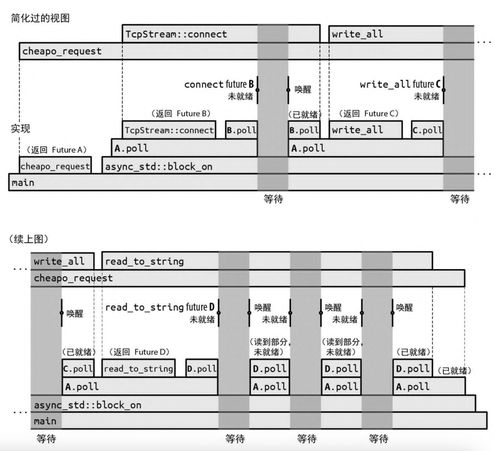
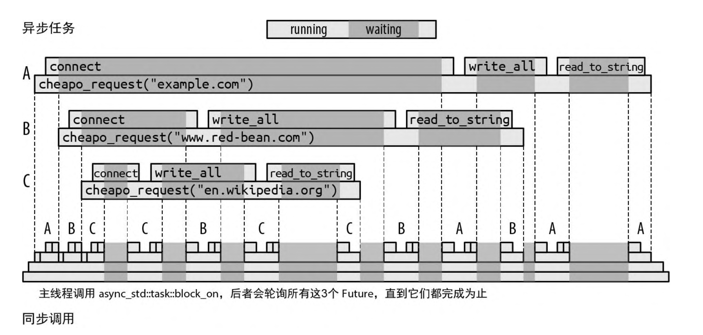

# 异步编程

假设你要编写一个聊天服务器。对于每个网络连接，都会有一些要解析的传入数据包、要组装的传出数据包、要管理的安全参数、要跟踪的聊天组订阅等。要想同时管理这么多连接，就得进行一定的组织工作。

理论上，可以为传入的每个连接启动一个单独的线程

```rust
use std::{net, thread};

let listener = net::TcpListener::bind(address)?

for socket_result in listener.incoming() {
  let socket = socket_result?;
  let groups = chat_group_table.clone();
  thread::spawn( || {
    log_error(serve(socket, groups));
  });
}
```

可以使用 Rust 在单个线程或工作线程池中交替执行许多彼此独立的活动。异步任务类似于线程，但其创建速度更快，在它们之间可以更有效地传递控制权，并且其内存开销比线程少一个数量级。在单个程序中同时运行数十万个异步任务是完全可行的。一般来说，异步 Rust 代码看上去很像普通的多线程代码，但实际上那些可能导致阻塞的操作(如 I/O 或获取互斥锁)会以略有不同的方式处理。通过对这些操作进行特殊处理，Rust 能够获得关于这段代码行为的更多信息以辅助优化，这就是它能提高性能的原因。前面代码的异步版本如下所示

```rust
use async_std::{net, task};

let listener = net::TcpListener::bind(address)?;

let mut new_connections = listener.incoming();

while let Some(socket_result) = new_connections.next().await {
  let socket = socket_result?;
  let groups = chat_group_table.clone();
  task::spawn(async  {
    log_error(serve(socket, groups).await);
  })
}
```

这里用的是 `async_std` 这个 crate 的网络模块和任务模块，并在可能发生阻塞的调用之后添加了 `.await`。但这段代码的整体结构与基于线程的版本无异。

## 从同步到异步

### Future

Rust 支持异步操作的方法是引入特型 `std::future::Future`

```rust
enum Poll<T> {
  Ready(T),
  Pending,
}
trait Future {
  type Output;
  // 现在，暂时把 Pin<&mut Self> 当作 $mut Self
  fn poll(self: Pin<&mut Self>, cx: &mut Context<'_>) -> Poll<Self::Output>;
}
```

`Future` 代表一个你可以测试其完成情况的操作。`Future` 的 `poll` (轮询)方法从来不会等待操作完成，它总是立即返回。如果操作已完成，则 `poll` 会返回 `Poll::Ready(output)`，其中 `output` 是它的最终结果。否则，它会返回 `Pending`。如果 `Future` 值得再次轮询，它承诺会通过调用 `Context` 中提供的回调函数 `waker` 来通知我们。我们将这种实现方式称为异步编程的“皮纳塔模型”: 对于 `Future`，你唯一能做的就是通过轮询来“敲打”它，直到某个值 “掉” 出来。

所有现代操作系统都包含其系统调用的一些变体，我们可以使用它们来实现这种轮询接口。例如，在 Unix 和 Windows 上，如果将网络套接字设置为非阻塞模式，那么一旦这些读写发生阻塞，就会返回某种错误。你必须稍后再试。

异步版本的 `read_to_string` 的签名大致如下所示

```rust
fn read_to_string(&mut self, buf: &mut String) -> impl Future<Output = Result<usize>>
```

除了返回类型，这与我们之前展示过的签名基本相同:异步版本会返回携带 `Result<usize>` 的 Future。你需要轮询这个 Future， 直到从中获得 Ready(result)。每次轮询时，都会尽可能读取更多的内容。最终 result 会为你提供成功值或错误值，就像普通的 I/O 操作一样。这是一种通用模式:任何函数的异步版本都会接受与其同步版本完全相同的参数，但返回类型包裹在 Future 中。

调用这个版本的 read_to_string 并没有实际读取任何内容，它唯一的职责是构建并返回一个 Future，该 Future 会在轮询时完成其真正的工作。这个 Future 必须包含执行调用请求所需的全部信息。 例如，此 read_to_string 返回的 Future 必须记住调用它的输入流，以及附加了传入数据的 String。事实上，由于 Future 包含 self 和 buf 的引用，因此 read_to_string 的正确签名必然是如下形式:

```rust
fn read_to_string<'a>(&'a mut self, buf: &'a mut String) -> impl Future<Output = Result<usize>> + 'a;
```

这增加了生命周期以表明返回的 Future 的生存期只能与 self 和 buf 借用的值一样长。

Future 特型的一个规则是，一旦 Future 返回了 Poll::Ready， 它就会假定自己永远不会再被轮询(poll)。当某些 Future 被过度轮询时，它们只会永远返回 Poll::Pending，而其他 Future 则可能会 panic 或被挂起。Future 特型上的 fuse 适配器方法能把任何 Future 变成被过度轮询时总会返回 Poll::Pending 的 Future。但所有常用的 Future 消耗方式都会遵守这一规则，因此通常不必动用 fuse。

### 异步函数与 await 表达式

下面是一个写成异步函数的 cheapo_request 版本, 使用了 [async-std](https://book.async.rs/) 这个库

```rust
use async_std::io::prelude::*;
use async_std::net;

async fn cheapo_request(host: &str, port: u16, path: &str) -> std::io::Result<String> {
  let mut socket = net::TcpStream::connect((host, port)).await?;
  let request = format!("GET {} HTTP/1.1\r\nHost: {}\r\n\r\n", path, host);
  socket.write_all(request.as_bytes()).await?;
  socket.shutdown(net::Shutdown::Write)?;

  let mut response = String::new();
  socket.read_to_string(&mut response).await?;
  Ok(response)
}
```

- 函数以 `async fn` 而不是 `fn` 开头
- 使用 `async_std crate` 的异步版本的 `TcpStream::connect`、`write_all` 和 `read_to_string`。这些都会返回其结果的 `Future`。
- 每次返回 `Future` 的调用之后，代码都会 `.await`。虽然这看起来像是在引用结构体中名为 await 的字段，但它实际上是语言中内置的特殊语法，用于等待 `Future` 就绪。`await` 表达式的计算结果为 `Future` 的最终值。这就是函数从 `connect`、`write_all` 和 `read_to_string` 获取结果的方式。

与普通函数不同，当你调用异步函数时，它会在函数体开始执行之前立即返回。显然，调用的最终返回值还没有计算出来，你得到的只是承载它最终值的 Future。所以如果执行下面这段代码

```rust
let response = cheapo_request(host, port, path);
```

那么 response 将是 `std::io::Result<String>` 型的 `Future`, 而 `cheapo_request` 的函数体尚未开始执行。你不需要调整异步函数的返回类型，Rust 会自动把 `async fn f(...) -> T` 函数的返回值视为承载 `T` 的 `Future`，而非直接的 `T` 值。

异步函数返回的 Future 中包含函数体运行时所需的一切信息：函数的参数、局部变量的内存空间等。（就像是把要调用的栈帧捕获成了一个普通的 Rust 值。）所以 `response` 必须保存传给 `host`、`port` 和 `path` 的值，因为 cheapo_request 的函数体将需要这些值来运行。

Future 的特化类型是由编译器根据函数的主体和参数自动生成的。这种类型没有名字，你只知道它实现了 `Future<Output=R>`，其中 R 是异步函数的返回类型。从这个意义上说，异步函数的 Future 就像闭包：闭包也有由编译器生成的匿名类型，该类型实现了 `FnOnce` 特型、`Fn` 特型和 `FnMut` 特型。

当你首次轮询 `cheapo_request` 返回的 `Future` 时，会从函数体的顶部开始执行，一直运行到 `TcpStream::connect` 返回的 `Future` 的第一个 `await`。`await` 表达式会轮询 `connect` 返回的`Future`，如果它尚未就绪，则向调用者返回 `Poll::Pending`：程序不能从这个 `await` 继续向前运行了，直到对这个 `Future`的某次轮询返回了 `Poll::Ready`。因此，表达式`TcpStream::connect(...).await` 大致等价于如下内容

```rust
// 注意：这是伪代码，不是有效的Rust
let connect_future = TcpStream::connect(...);
'retry_point:
match connect_future.poll(cx) {
    Poll::Ready(value) => value,
    Poll::Pending => {
      // 安排对`cheapo_request`返回的Future进行
      // 下一次`poll`，以便在'retry_point处恢复执行
      ...
      return Poll::Pending;
    }
}
```

`await` 表达式会获取 `Future` 的所有权，然后轮询它。如果已就绪，那么 `Future` 的最终值就是 `await` 表达式的值，然后继续执行。否则，此 `Future` 返回 `Poll::Pending`。

但至关重要的是，下一次对 `cheapo_request` 返回的 `Future` 进行轮询时不会再从函数的顶部开始，而是会在即将轮询 `connect_future` 的中途时间点恢复执行函数。直到 `Future` 就绪之前，我们都不会继续处理异步函数的其余部分。

随着对其返回的 `Future` 继续进行轮询，`cheapo_request` 将通过函数体从一个 `await` 走到下一个，仅当它等待的子 `Future` 就绪时才会继续。因此，要对 `cheapo_request` 返回的 `Future` 进行多少次轮询，既取决于子 `Future` 的行为，也取决于该函数自己的控制流。`cheapo_request` 返回的 `Future` 会跟踪下一次 `poll` 应该恢复的点，以及恢复该点所需的所有本地状态，比如变量、参数和临时变量。

### 从同步代码调用异步函数： block_on

从某种意义上说，异步函数就是在转移责任。的确，在异步函数中很 容易获得 Future 的值:要使用 await 就可以。但是异步函数也会返回 Future，所以现在调用者的工作是以某种方式进行轮询。但最终还是得有人实际等待一个值。

可以使用 async_std 的 task::block_on 函数从普通的同步函数调用 cheapo_request。这会接受一个 Future 并轮询，直到它生成一个值:

```rust
use async_std::io::prelude::*;
use async_std::net;
fn main() -> std::io::Result<()> {
    use async_std::task;
    let response = task::block_on(cheapo_request("baidu.com", 80, "/"))?;
    println!("Response: {}", response);
    Ok(())
}

async fn cheapo_request(host: &str, port: u16, path: &str) -> std::io::Result<String> {
    let mut socket = net::TcpStream::connect((host, port)).await?;
    let request = format!("GET {} HTTP/1.1\r\nHost: {}\r\n\r\n", path, host);
    socket.write_all(request.as_bytes()).await?;
    socket.shutdown(net::Shutdown::Write)?;

    let mut response = String::new();
    socket.read_to_string(&mut response).await?;
    Ok(response)
}
```



- 首先，main 会调用 cheapo_request，返回其最终结果的 Future A。然后 main 会将此 Future 传给 `async_std::block_on`，由后者对其进行轮询。
- 轮询 `Future A` 让 cheapo_request 的主体开始执行。它会调用 `TcpStream::connect` 来获取套接字的 `Future B`，然后对其进行等待。更准确地说，由于 `TcpStream::connect` 可能会遇到错误，因此 B 其实是 `Result<TcpStream, std::io::Error>` 型的 `Future`。
- `Future B` 会被 `await` 轮询。由于尚未建立网络连接，因此 `B.poll` 会返回 `Poll::Pending`，但会安排在套接字就绪后唤醒此调用任务。
- 由于 `Future B` 还没有就绪，因此 `A.poll` 会将 `Poll::Pending` 返回给自己的调用者 `block_on`。
- 由于 `block_on` 没有更好的事情可做，因此它进入了休眠状态。现在整个线程都被阻塞了。
- 如果 `Future B` 的连接就绪，就会唤醒轮询它的任务。这会激发 `block_on` 的行动，并再次尝试轮询 `Future A`。

- 轮询 `Future A` 会导致 `cheapo_request` 在其第一个 `await` 中恢复，并再次轮询 `Future B`。

- 这一次，`Future B` 就绪了, 套接字创建完成，因此它将 `Poll::Ready(Ok(socket))` 返回给了 `A.poll`。

- 对 `TcpStream::connect` 的异步调用现已完成。因此 `TcpStream::connect(...).await` 表达式的值成了` Ok(socket)`

- `cheapo_request` 函数体正常执行，使用 `format!` 宏构建请求字符串，并将其传给 `socket.write_all`。

- 由于 `socket.write_all` 是一个异步函数，因此它会返回其结果的 `Future C`，而 `cheapo_request` 会等待这个 `Future`。

- 剩下的部分也类似。

编写一遍又一遍调用 `poll` 的循环听起来并不难。但是 `async_std::task::block_on` 的价值在于，它知道如何进入休眠直到 `Future` 真正值得再次轮询时再启动轮询，而不是浪费处理器时间和电池寿命进行数十亿次无结果的 `poll` 调用。像 `connect` 和 `read_to_string` 这样的基本 `I/O` 函数返回的 `Future` 保留了由传给 `poll` 的 `Context` 提供的唤醒器。到了应该唤醒 `block_on` 并再次尝试轮询时，就会调用此唤醒器。

与前面介绍的原始同步版本一样，为了等待操作完成，这个异步版本的 `cheapo_request` 花费了几乎所有时间。如果时间轴是按真实比例绘制的，那么此图将几乎完全是深灰色的，当程序偶尔唤醒时才会出现微小的碎片级计算时间。

### 启动异步任务

在 `Future` 的值就绪之前，`async_std::task::block_on` 函数会一直阻塞。但是把线程完全阻塞在单个 `Future` 上并不比同步调用好，我们的目标是让线程在等待的同时做其他工作

为此，可以使用 `async_std::task::spawn_local`。该函数会接受一个 `Future` 并将其添加到任务池中，只要正阻塞着 `block_on` 的 `Future` 还未就绪，就会尝试轮询。因此，如果你将一堆 `Future` 传给 `spawn_local`，然后将 `block_on` 应用于最终结果的 `Future`，那么 `block_on` 就会在可以向前推进时轮询每个启动 (spawn)后的 Future，并行执行整个任务池，直到你想要的结果就绪。

`async_std::task::spawn_local(f)` 会接受 `Future f` 并将其添加到当前线程在调用 `block_on` 时要轮询的池中。 `spawn_local` 会返回自己的 `async_std::task::JoinHandle` 类型，它本身就是一个 `Future`，你可以等待(await)它以获取 `f` 的最终值。

假设我们想同时发出一整套 HTTP 请求

```rust
use async_std::io::prelude::*;
use async_std::net;
fn main() -> std::io::Result<()> {
    use async_std::task;
    let response = task::block_on(cheapo_request("baidu.com", 80, "/"))?;
    println!("Response: {}", response);
    Ok(())
}

async fn cheapo_request(host: &str, port: u16, path: &str) -> std::io::Result<String> {
    let mut socket = net::TcpStream::connect((host, port)).await?;
    let request = format!("GET {} HTTP/1.1\r\nHost: {}\r\n\r\n", path, host);
    socket.write_all(request.as_bytes()).await?;
    socket.shutdown(net::Shutdown::Write)?;

    let mut response = String::new();
    socket.read_to_string(&mut response).await?;
    Ok(response)
}
async fn many_requests(requests: Vec<(String, u16, String)>) -> Vec<std::io::Result<String>> {
    use async_std::task;

    let mut handles = vec![];

    for (host, port, path) in requests {
        handles.push(task::spawn_local(cheapo_request(&host, port, &path))); // 这里会报错，`host` does not live long enough
    }

    let mut results = vec![];
    for handle in handles {
        results.push(handle.await);
    }
    results
}
```

如果将引用传给一个异步函数，那么它返回的 Future 就必须持有这些引用，因此，安全起见，Future 的生命周期不能超出它们借来的值。这和任何包含引用的值所受的限制是一样的。

问题是 `spawn_local` 无法确定你会在 `host` 和 `path` 被丢弃之前等待任务完成。事实上，`spawn_local` 只会接受生命周期为 `'static` 的 `Future`，因为你也可以简单地忽略它返回的 `JoinHandle`，并在程序执行其他部分时让此任务继续运行。这不是异步任务独有的问题, 如果尝试使用 `std::thread::spawn` 启动一个线程，那么该线程的闭包也会捕获对局部变量的引用，并得到类似的错误。

解决此问题的方法是创建另一个接受这些参数的拥有型版本的异步函数

```rust
async fn cheapo_owning_request(host: String, port: u16, path: String) -> std::io::Result<String> {
    cheapo_request(&host, port, &path).await
}
```

此函数会接受 `String` 引用而不是 `&str` 引用，因此它的 `Future` 拥有 `host` 字符串和 `path` 字符串本身，并且其生命周期为 `'static`。通过借用检查器可以发现它立即开始等待 `cheapo_request` 返回的 `Future`，因此，如果该 `Future` 被轮询，那么它借用的 `host` 变量和 `path` 变量必然仍旧存在。

可以使用 `cheapo_owning_request` 像下面这样分发所有请求:

```rust
for (host, port, path) in requests {
    handles.push(task::spawn_local(cheapo_owning_request(host, port, path)));
}
```

可以借助 `block_on` 从同步 `main` 函数中调用 `many_requests`

```rust
use async_std::io::prelude::*;
use async_std::net;
fn main() {
    let requests = vec![
        ("example.com".to_string(), 80, "/".to_string()),
        ("www.red-bean.com".to_string(), 80, "/".to_string()),
        ("en.wikipedia.org".to_string(), 80, "/".to_string()),
    ];
    let results = async_std::task::block_on(many_requests(requests));
    for result in results {
        match result {
            Ok(response) => println!("{}", response),
            Err(err) => eprintln!("error: {}", err),
        }
    }
}

async fn cheapo_request(host: &str, port: u16, path: &str) -> std::io::Result<String> {
    let mut socket = net::TcpStream::connect((host, port)).await?;
    let request = format!("GET {} HTTP/1.1\r\nHost: {}\r\n\r\n", path, host);
    socket.write_all(request.as_bytes()).await?;
    socket.shutdown(net::Shutdown::Write)?;

    let mut response = String::new();
    socket.read_to_string(&mut response).await?;
    Ok(response)
}
async fn many_requests(requests: Vec<(String, u16, String)>) -> Vec<std::io::Result<String>> {
    use async_std::task;

    let mut handles = vec![];

    for (host, port, path) in requests {
        handles.push(task::spawn_local(cheapo_owning_request(host, port, path)));
    }

    let mut results = vec![];
    for handle in handles {
        results.push(handle.await);
    }
    results
}
async fn cheapo_owning_request(host: String, port: u16, path: String) -> std::io::Result<String> {
    cheapo_request(&host, port, &path).await
}

```

上述代码会在对 `block_on` 的调用中同时运行所有 3 个请求。每一个都会在某种时机取得进展，而其他的则会被阻塞，所有这些都发生在调用线程上


对 `many_requests` 的调用启动了 3 个异步任务，我们将其标记为 A、B 和 C。block_on 首先轮询 A，这样 A 会连接到 example.com。一旦返回了 Poll::Pending，block_on 就会将注意力转向下一个异步任务，轮询 B，并最终轮询 C，这样每个任务都会连接到各自的服务器。

当所有可轮询的 Future 都返回了 Poll::Pending 时， block_on 就会进入休眠状态，直到某个 TcpStream::connect 返回的 Future 表明它的任务值得再次轮询时才唤醒。

在本次执行中，服务器 en.wikipedia.org 比其他服务器响应更快，因此该任务首先完成。当启动的任务完成后，它会将值保存在 JoinHandle 中并标记为就绪，以便正在等候的 many_requests 可以继续处理。最终，对 cheapo_request 的其他调用要么成功了，要么返回了错误，而 many_requests 本身也可以返回了。最后，main 会从 block_on 接收到结果向量。

上述操作发生在同一个线程上，对 cheapo_request 的 3 个调用会通过对它们的 Future 的连续轮询交错进行。虽然异步调用看起来是单个函数调用一直运行到完成为止，但这种调用其实是通过对 Future 的 poll 方法的一系列同步调用实现的。每个单独的 poll 调用都会快速返回，让进程空闲，以便轮询另一个异步调用。

我们终于达成了开头设定的目标, 让线程在等待 I/O 完成时承担其他工作，这样线程的资源就不会在无所事事中浪费掉。更妙的是，此目标是通过与普通 Rust 代码非常相似的代码实现的, 一些函数被标记为 async，一些函数调用后面跟着 .await，并且改用来自 async_std 而不是 std 的函数，除此之外，就和普通的 Rust 代码一模一样。

异步任务与线程的一个重要区别是, 从一个异步任务到另一个异步任务的切换只会出现在 await 表达式处，且只有当等待的 Future 返回了 Poll::Pending 时才会发生。这意味着如果在 cheapo_request 中放置了一个长时间运行的计算，那么传给 spawn_local 的其他任务在它完成之前全都没有机会运行。使用线程则不会出现这个问题, 操作系统可以在任何时候挂起任何线程，并设置定时器以确保没有哪个线程会独占处理器。异步代码要求共享同一个线程的各个 Future 自愿合作。