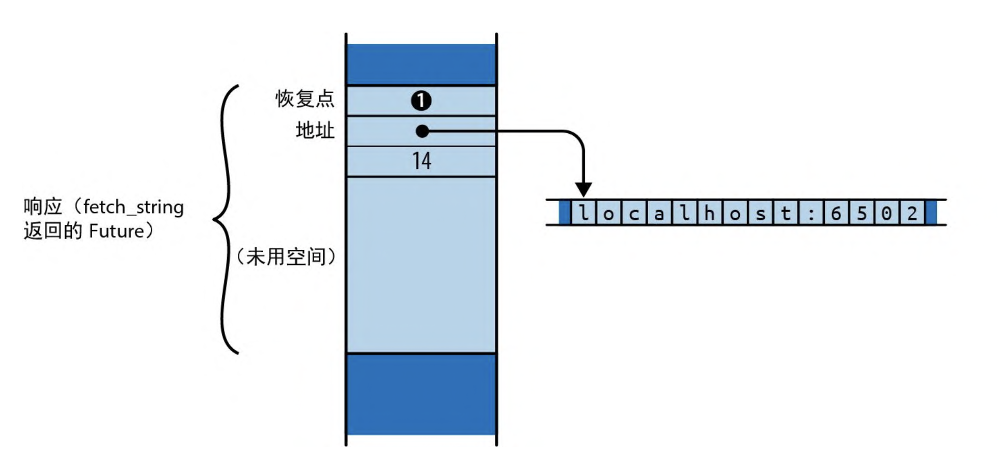
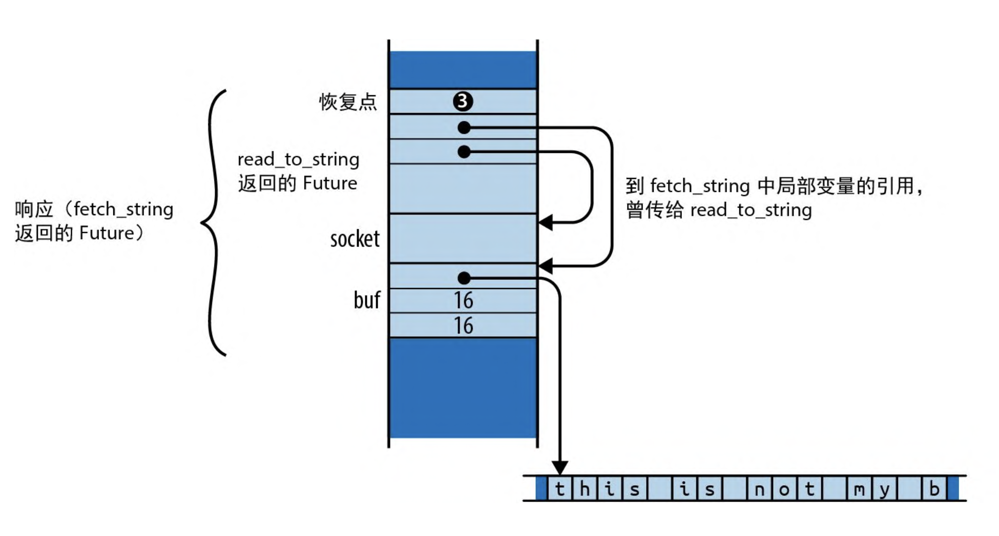
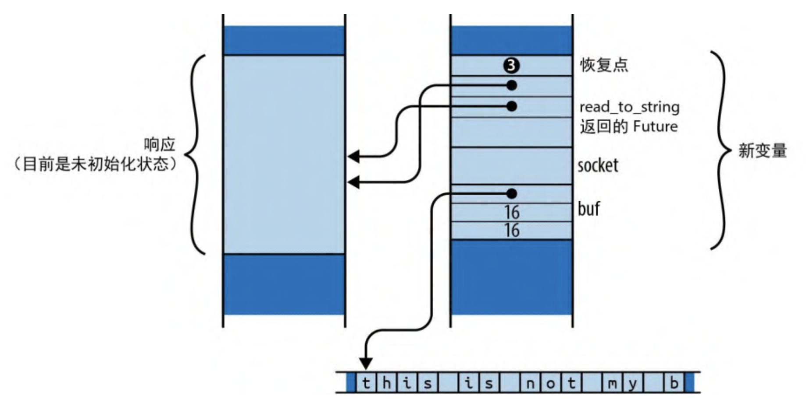

# 异步编程

假设你要编写一个聊天服务器。对于每个网络连接，都会有一些要解析的传入数据包、要组装的传出数据包、要管理的安全参数、要跟踪的聊天组订阅等。要想同时管理这么多连接，就得进行一定的组织工作。

理论上，可以为传入的每个连接启动一个单独的线程

```rust
use std::{net, thread};

let listener = net::TcpListener::bind(address)?

for socket_result in listener.incoming() {
  let socket = socket_result?;
  let groups = chat_group_table.clone();
  thread::spawn( || {
    log_error(serve(socket, groups));
  });
}
```

可以使用 Rust 在单个线程或工作线程池中交替执行许多彼此独立的活动。异步任务类似于线程，但其创建速度更快，在它们之间可以更有效地传递控制权，并且其内存开销比线程少一个数量级。在单个程序中同时运行数十万个异步任务是完全可行的。一般来说，异步 Rust 代码看上去很像普通的多线程代码，但实际上那些可能导致阻塞的操作(如 I/O 或获取互斥锁)会以略有不同的方式处理。通过对这些操作进行特殊处理，Rust 能够获得关于这段代码行为的更多信息以辅助优化，这就是它能提高性能的原因。前面代码的异步版本如下所示

```rust
use async_std::{net, task};

let listener = net::TcpListener::bind(address)?;

let mut new_connections = listener.incoming();

while let Some(socket_result) = new_connections.next().await {
  let socket = socket_result?;
  let groups = chat_group_table.clone();
  task::spawn(async  {
    log_error(serve(socket, groups).await);
  })
}
```

这里用的是 `async_std` 这个 crate 的网络模块和任务模块，并在可能发生阻塞的调用之后添加了 `.await`。但这段代码的整体结构与基于线程的版本无异。

## 从同步到异步

### Future

Rust 支持异步操作的方法是引入特型 `std::future::Future`

```rust
enum Poll<T> {
  Ready(T),
  Pending,
}
trait Future {
  type Output;
  // 现在，暂时把 Pin<&mut Self> 当作 $mut Self
  fn poll(self: Pin<&mut Self>, cx: &mut Context<'_>) -> Poll<Self::Output>;
}
```

`Future` 代表一个你可以测试其完成情况的操作。`Future` 的 `poll` (轮询)方法从来不会等待操作完成，它总是立即返回。如果操作已完成，则 `poll` 会返回 `Poll::Ready(output)`，其中 `output` 是它的最终结果。否则，它会返回 `Pending`。如果 `Future` 值得再次轮询，它承诺会通过调用 `Context` 中提供的回调函数 `waker` 来通知我们。我们将这种实现方式称为异步编程的“皮纳塔模型”: 对于 `Future`，你唯一能做的就是通过轮询来“敲打”它，直到某个值 “掉” 出来。

所有现代操作系统都包含其系统调用的一些变体，我们可以使用它们来实现这种轮询接口。例如，在 Unix 和 Windows 上，如果将网络套接字设置为非阻塞模式，那么一旦这些读写发生阻塞，就会返回某种错误。你必须稍后再试。

异步版本的 `read_to_string` 的签名大致如下所示

```rust
fn read_to_string(&mut self, buf: &mut String) -> impl Future<Output = Result<usize>>
```

除了返回类型，这与我们之前展示过的签名基本相同:异步版本会返回携带 `Result<usize>` 的 Future。你需要轮询这个 Future， 直到从中获得 Ready(result)。每次轮询时，都会尽可能读取更多的内容。最终 result 会为你提供成功值或错误值，就像普通的 I/O 操作一样。这是一种通用模式:任何函数的异步版本都会接受与其同步版本完全相同的参数，但返回类型包裹在 Future 中。

调用这个版本的 read_to_string 并没有实际读取任何内容，它唯一的职责是构建并返回一个 Future，该 Future 会在轮询时完成其真正的工作。这个 Future 必须包含执行调用请求所需的全部信息。 例如，此 read_to_string 返回的 Future 必须记住调用它的输入流，以及附加了传入数据的 String。事实上，由于 Future 包含 self 和 buf 的引用，因此 read_to_string 的正确签名必然是如下形式:

```rust
fn read_to_string<'a>(&'a mut self, buf: &'a mut String) -> impl Future<Output = Result<usize>> + 'a;
```

这增加了生命周期以表明返回的 Future 的生存期只能与 self 和 buf 借用的值一样长。

Future 特型的一个规则是，一旦 Future 返回了 Poll::Ready， 它就会假定自己永远不会再被轮询(poll)。当某些 Future 被过度轮询时，它们只会永远返回 Poll::Pending，而其他 Future 则可能会 panic 或被挂起。Future 特型上的 fuse 适配器方法能把任何 Future 变成被过度轮询时总会返回 Poll::Pending 的 Future。但所有常用的 Future 消耗方式都会遵守这一规则，因此通常不必动用 fuse。

### 异步函数与 await 表达式

下面是一个写成异步函数的 cheapo_request 版本, 使用了 [async-std](https://book.async.rs/) 这个库

```rust
use async_std::io::prelude::*;
use async_std::net;

async fn cheapo_request(host: &str, port: u16, path: &str) -> std::io::Result<String> {
  let mut socket = net::TcpStream::connect((host, port)).await?;
  let request = format!("GET {} HTTP/1.1\r\nHost: {}\r\n\r\n", path, host);
  socket.write_all(request.as_bytes()).await?;
  socket.shutdown(net::Shutdown::Write)?;

  let mut response = String::new();
  socket.read_to_string(&mut response).await?;
  Ok(response)
}
```

- 函数以 `async fn` 而不是 `fn` 开头
- 使用 `async_std crate` 的异步版本的 `TcpStream::connect`、`write_all` 和 `read_to_string`。这些都会返回其结果的 `Future`。
- 每次返回 `Future` 的调用之后，代码都会 `.await`。虽然这看起来像是在引用结构体中名为 await 的字段，但它实际上是语言中内置的特殊语法，用于等待 `Future` 就绪。`await` 表达式的计算结果为 `Future` 的最终值。这就是函数从 `connect`、`write_all` 和 `read_to_string` 获取结果的方式。

与普通函数不同，当你调用异步函数时，它会在函数体开始执行之前立即返回。显然，调用的最终返回值还没有计算出来，你得到的只是承载它最终值的 Future。所以如果执行下面这段代码

```rust
let response = cheapo_request(host, port, path);
```

那么 response 将是 `std::io::Result<String>` 型的 `Future`, 而 `cheapo_request` 的函数体尚未开始执行。你不需要调整异步函数的返回类型，Rust 会自动把 `async fn f(...) -> T` 函数的返回值视为承载 `T` 的 `Future`，而非直接的 `T` 值。

异步函数返回的 Future 中包含函数体运行时所需的一切信息：函数的参数、局部变量的内存空间等。（就像是把要调用的栈帧捕获成了一个普通的 Rust 值。）所以 `response` 必须保存传给 `host`、`port` 和 `path` 的值，因为 cheapo_request 的函数体将需要这些值来运行。

Future 的特化类型是由编译器根据函数的主体和参数自动生成的。这种类型没有名字，你只知道它实现了 `Future<Output=R>`，其中 R 是异步函数的返回类型。从这个意义上说，异步函数的 Future 就像闭包：闭包也有由编译器生成的匿名类型，该类型实现了 `FnOnce` 特型、`Fn` 特型和 `FnMut` 特型。

当你首次轮询 `cheapo_request` 返回的 `Future` 时，会从函数体的顶部开始执行，一直运行到 `TcpStream::connect` 返回的 `Future` 的第一个 `await`。`await` 表达式会轮询 `connect` 返回的`Future`，如果它尚未就绪，则向调用者返回 `Poll::Pending`：程序不能从这个 `await` 继续向前运行了，直到对这个 `Future`的某次轮询返回了 `Poll::Ready`。因此，表达式`TcpStream::connect(...).await` 大致等价于如下内容

```rust
// 注意：这是伪代码，不是有效的Rust
let connect_future = TcpStream::connect(...);
'retry_point:
match connect_future.poll(cx) {
    Poll::Ready(value) => value,
    Poll::Pending => {
      // 安排对`cheapo_request`返回的Future进行
      // 下一次`poll`，以便在'retry_point处恢复执行
      ...
      return Poll::Pending;
    }
}
```

`await` 表达式会获取 `Future` 的所有权，然后轮询它。如果已就绪，那么 `Future` 的最终值就是 `await` 表达式的值，然后继续执行。否则，此 `Future` 返回 `Poll::Pending`。

但至关重要的是，下一次对 `cheapo_request` 返回的 `Future` 进行轮询时不会再从函数的顶部开始，而是会在即将轮询 `connect_future` 的中途时间点恢复执行函数。直到 `Future` 就绪之前，我们都不会继续处理异步函数的其余部分。

随着对其返回的 `Future` 继续进行轮询，`cheapo_request` 将通过函数体从一个 `await` 走到下一个，仅当它等待的子 `Future` 就绪时才会继续。因此，要对 `cheapo_request` 返回的 `Future` 进行多少次轮询，既取决于子 `Future` 的行为，也取决于该函数自己的控制流。`cheapo_request` 返回的 `Future` 会跟踪下一次 `poll` 应该恢复的点，以及恢复该点所需的所有本地状态，比如变量、参数和临时变量。

### 从同步代码调用异步函数： block_on

从某种意义上说，异步函数就是在转移责任。的确，在异步函数中很 容易获得 Future 的值:要使用 await 就可以。但是异步函数也会返回 Future，所以现在调用者的工作是以某种方式进行轮询。但最终还是得有人实际等待一个值。

可以使用 async_std 的 task::block_on 函数从普通的同步函数调用 cheapo_request。这会接受一个 Future 并轮询，直到它生成一个值:

```rust
use async_std::io::prelude::*;
use async_std::net;
fn main() -> std::io::Result<()> {
    use async_std::task;
    let response = task::block_on(cheapo_request("baidu.com", 80, "/"))?;
    println!("Response: {}", response);
    Ok(())
}

async fn cheapo_request(host: &str, port: u16, path: &str) -> std::io::Result<String> {
    let mut socket = net::TcpStream::connect((host, port)).await?;
    let request = format!("GET {} HTTP/1.1\r\nHost: {}\r\n\r\n", path, host);
    socket.write_all(request.as_bytes()).await?;
    socket.shutdown(net::Shutdown::Write)?;

    let mut response = String::new();
    socket.read_to_string(&mut response).await?;
    Ok(response)
}
```


- 首先，main 会调用 cheapo_request，返回其最终结果的 Future A。然后 main 会将此 Future 传给 `async_std::block_on`，由后者对其进行轮询。
- 轮询 `Future A` 让 cheapo_request 的主体开始执行。它会调用 `TcpStream::connect` 来获取套接字的 `Future B`，然后对其进行等待。更准确地说，由于 `TcpStream::connect` 可能会遇到错误，因此 B 其实是 `Result<TcpStream, std::io::Error>` 型的 `Future`。
- `Future B` 会被 `await` 轮询。由于尚未建立网络连接，因此 `B.poll` 会返回 `Poll::Pending`，但会安排在套接字就绪后唤醒此调用任务。
- 由于 `Future B` 还没有就绪，因此 `A.poll` 会将 `Poll::Pending` 返回给自己的调用者 `block_on`。
- 由于 `block_on` 没有更好的事情可做，因此它进入了休眠状态。现在整个线程都被阻塞了。
- 如果 `Future B` 的连接就绪，就会唤醒轮询它的任务。这会激发 `block_on` 的行动，并再次尝试轮询 `Future A`。

- 轮询 `Future A` 会导致 `cheapo_request` 在其第一个 `await` 中恢复，并再次轮询 `Future B`。

- 这一次，`Future B` 就绪了, 套接字创建完成，因此它将 `Poll::Ready(Ok(socket))` 返回给了 `A.poll`。

- 对 `TcpStream::connect` 的异步调用现已完成。因此 `TcpStream::connect(...).await` 表达式的值成了` Ok(socket)`

- `cheapo_request` 函数体正常执行，使用 `format!` 宏构建请求字符串，并将其传给 `socket.write_all`。

- 由于 `socket.write_all` 是一个异步函数，因此它会返回其结果的 `Future C`，而 `cheapo_request` 会等待这个 `Future`。

- 剩下的部分也类似。

编写一遍又一遍调用 `poll` 的循环听起来并不难。但是 `async_std::task::block_on` 的价值在于，它知道如何进入休眠直到 `Future` 真正值得再次轮询时再启动轮询，而不是浪费处理器时间和电池寿命进行数十亿次无结果的 `poll` 调用。像 `connect` 和 `read_to_string` 这样的基本 `I/O` 函数返回的 `Future` 保留了由传给 `poll` 的 `Context` 提供的唤醒器。到了应该唤醒 `block_on` 并再次尝试轮询时，就会调用此唤醒器。

与前面介绍的原始同步版本一样，为了等待操作完成，这个异步版本的 `cheapo_request` 花费了几乎所有时间。如果时间轴是按真实比例绘制的，那么此图将几乎完全是深灰色的，当程序偶尔唤醒时才会出现微小的碎片级计算时间。

### 启动异步任务

在 `Future` 的值就绪之前，`async_std::task::block_on` 函数会一直阻塞。但是把线程完全阻塞在单个 `Future` 上并不比同步调用好，我们的目标是让线程在等待的同时做其他工作

为此，可以使用 `async_std::task::spawn_local`。该函数会接受一个 `Future` 并将其添加到任务池中，只要正阻塞着 `block_on` 的 `Future` 还未就绪，就会尝试轮询。因此，如果你将一堆 `Future` 传给 `spawn_local`，然后将 `block_on` 应用于最终结果的 `Future`，那么 `block_on` 就会在可以向前推进时轮询每个启动 (spawn)后的 Future，并行执行整个任务池，直到你想要的结果就绪。

`async_std::task::spawn_local(f)` 会接受 `Future f` 并将其添加到当前线程在调用 `block_on` 时要轮询的池中。 `spawn_local` 会返回自己的 `async_std::task::JoinHandle` 类型，它本身就是一个 `Future`，你可以等待(await)它以获取 `f` 的最终值。

假设我们想同时发出一整套 HTTP 请求

```rust
use async_std::io::prelude::*;
use async_std::net;
fn main() -> std::io::Result<()> {
    use async_std::task;
    let response = task::block_on(cheapo_request("baidu.com", 80, "/"))?;
    println!("Response: {}", response);
    Ok(())
}

async fn cheapo_request(host: &str, port: u16, path: &str) -> std::io::Result<String> {
    let mut socket = net::TcpStream::connect((host, port)).await?;
    let request = format!("GET {} HTTP/1.1\r\nHost: {}\r\n\r\n", path, host);
    socket.write_all(request.as_bytes()).await?;
    socket.shutdown(net::Shutdown::Write)?;

    let mut response = String::new();
    socket.read_to_string(&mut response).await?;
    Ok(response)
}
async fn many_requests(requests: Vec<(String, u16, String)>) -> Vec<std::io::Result<String>> {
    use async_std::task;

    let mut handles = vec![];

    for (host, port, path) in requests {
        handles.push(task::spawn_local(cheapo_request(&host, port, &path))); // 这里会报错，`host` does not live long enough
    }

    let mut results = vec![];
    for handle in handles {
        results.push(handle.await);
    }
    results
}
```

如果将引用传给一个异步函数，那么它返回的 Future 就必须持有这些引用，因此，安全起见，Future 的生命周期不能超出它们借来的值。这和任何包含引用的值所受的限制是一样的。

问题是 `spawn_local` 无法确定你会在 `host` 和 `path` 被丢弃之前等待任务完成。事实上，`spawn_local` 只会接受生命周期为 `'static` 的 `Future`，因为你也可以简单地忽略它返回的 `JoinHandle`，并在程序执行其他部分时让此任务继续运行。这不是异步任务独有的问题, 如果尝试使用 `std::thread::spawn` 启动一个线程，那么该线程的闭包也会捕获对局部变量的引用，并得到类似的错误。

解决此问题的方法是创建另一个接受这些参数的拥有型版本的异步函数

```rust
async fn cheapo_owning_request(host: String, port: u16, path: String) -> std::io::Result<String> {
    cheapo_request(&host, port, &path).await
}
```

此函数会接受 `String` 引用而不是 `&str` 引用，因此它的 `Future` 拥有 `host` 字符串和 `path` 字符串本身，并且其生命周期为 `'static`。通过借用检查器可以发现它立即开始等待 `cheapo_request` 返回的 `Future`，因此，如果该 `Future` 被轮询，那么它借用的 `host` 变量和 `path` 变量必然仍旧存在。

可以使用 `cheapo_owning_request` 像下面这样分发所有请求:

```rust
for (host, port, path) in requests {
    handles.push(task::spawn_local(cheapo_owning_request(host, port, path)));
}
```

可以借助 `block_on` 从同步 `main` 函数中调用 `many_requests`

```rust
use async_std::io::prelude::*;
use async_std::net;
fn main() {
    let requests = vec![
        ("example.com".to_string(), 80, "/".to_string()),
        ("www.red-bean.com".to_string(), 80, "/".to_string()),
        ("en.wikipedia.org".to_string(), 80, "/".to_string()),
    ];
    let results = async_std::task::block_on(many_requests(requests));
    for result in results {
        match result {
            Ok(response) => println!("{}", response),
            Err(err) => eprintln!("error: {}", err),
        }
    }
}

async fn cheapo_request(host: &str, port: u16, path: &str) -> std::io::Result<String> {
    let mut socket = net::TcpStream::connect((host, port)).await?;
    let request = format!("GET {} HTTP/1.1\r\nHost: {}\r\n\r\n", path, host);
    socket.write_all(request.as_bytes()).await?;
    socket.shutdown(net::Shutdown::Write)?;

    let mut response = String::new();
    socket.read_to_string(&mut response).await?;
    Ok(response)
}
async fn many_requests(requests: Vec<(String, u16, String)>) -> Vec<std::io::Result<String>> {
    use async_std::task;

    let mut handles = vec![];

    for (host, port, path) in requests {
        handles.push(task::spawn_local(cheapo_owning_request(host, port, path)));
    }

    let mut results = vec![];
    for handle in handles {
        results.push(handle.await);
    }
    results
}
async fn cheapo_owning_request(host: String, port: u16, path: String) -> std::io::Result<String> {
    cheapo_request(&host, port, &path).await
}

```

上述代码会在对 `block_on` 的调用中同时运行所有 3 个请求。每一个都会在某种时机取得进展，而其他的则会被阻塞，所有这些都发生在调用线程上


对 `many_requests` 的调用启动了 3 个异步任务，我们将其标记为 A、B 和 C。block_on 首先轮询 A，这样 A 会连接到 example.com。一旦返回了 Poll::Pending，block_on 就会将注意力转向下一个异步任务，轮询 B，并最终轮询 C，这样每个任务都会连接到各自的服务器。

当所有可轮询的 Future 都返回了 Poll::Pending 时， block_on 就会进入休眠状态，直到某个 TcpStream::connect 返回的 Future 表明它的任务值得再次轮询时才唤醒。

在本次执行中，服务器 en.wikipedia.org 比其他服务器响应更快，因此该任务首先完成。当启动的任务完成后，它会将值保存在 JoinHandle 中并标记为就绪，以便正在等候的 many_requests 可以继续处理。最终，对 cheapo_request 的其他调用要么成功了，要么返回了错误，而 many_requests 本身也可以返回了。最后，main 会从 block_on 接收到结果向量。

上述操作发生在同一个线程上，对 cheapo_request 的 3 个调用会通过对它们的 Future 的连续轮询交错进行。虽然异步调用看起来是单个函数调用一直运行到完成为止，但这种调用其实是通过对 Future 的 poll 方法的一系列同步调用实现的。每个单独的 poll 调用都会快速返回，让进程空闲，以便轮询另一个异步调用。

我们终于达成了开头设定的目标, 让线程在等待 I/O 完成时承担其他工作，这样线程的资源就不会在无所事事中浪费掉。更妙的是，此目标是通过与普通 Rust 代码非常相似的代码实现的, 一些函数被标记为 async，一些函数调用后面跟着 .await，并且改用来自 async_std 而不是 std 的函数，除此之外，就和普通的 Rust 代码一模一样。

异步任务与线程的一个重要区别是, 从一个异步任务到另一个异步任务的切换只会出现在 await 表达式处，且只有当等待的 Future 返回了 Poll::Pending 时才会发生。这意味着如果在 cheapo_request 中放置了一个长时间运行的计算，那么传给 spawn_local 的其他任务在它完成之前全都没有机会运行。使用线程则不会出现这个问题, 操作系统可以在任何时候挂起任何线程，并设置定时器以确保没有哪个线程会独占处理器。异步代码要求共享同一个线程的各个 Future 自愿合作。

### 异步块

除了异步函数， Rust 还支持异步块。普通的块语句会返回其最后一个表达式的值，而异步块会返回其最后一个表达式值的 Future。可以在异步块中使用 await 表达式

异步块看起来就像普通的块语句，但其前面有 async 关键字：

```rust
let server = async {
  use async_std::net;

  // 监听连接并接受其中一个
  let listener = net::TcpListener::bind("localhost:8087").await?;
  let (mut socket, _addr) = listener.accept().await?;

  // 在 `socket`上与客户端对话
  // ...

}
```

上述代码会将 serve_one 初始化为一个 Future ，以侦听并处理单个 TCP 连接。直到轮询 serve_one 时才会开始执行代码块的主体，就像直到轮询 Future 时才会开始执行异步函数的主体一样。

如果在异步块中使用 `？`运算符处理错误，那么它只会从块中而不是围绕它的函数中返回。如果前面的 bind 调用返回了错误，则 `？`运算符会将其作为 `serve_one` 的最终值返回。同样， `return` 表达式也会从异步块而不是其所在的函数中返回

如果异步块引用了围绕它的代码中定义的变量，那么它的 `Future` 就会捕获这些变量的值，就像闭包所做的那样。与 `move` 闭包的用法一样，也可以用 `async move` 启动该块以获取捕获的值的所有权，而不仅仅持有对它们的引用。

为了将你想要异步运行的那部分代码分离出去，异步块提供了一种简洁的方法。`spawn_local` 需要一个 `'static` 的 `Future`，因此我们定义了包装函数 `cheapo_owning_request` 来为我们提供一个拥有其参数所有权的 Future。只需从异步块中调用 `cheapo_request` 即可获得相同的效果，不用花心思去写包装函数

```rust
async fn many_requests(requests: Vec<(String, u16, String)>) -> Vec<std::io::Result<String>> {
    use async_std::task;

    let mut handles = vec![];

    for (host, port, path) in requests {
        handles.push(task::spawn_local(async move {
          cheapo_request(&host, port, &path)
        }));
    }

    let mut results = vec![];
    for handle in handles {
        results.push(handle.await);
    }
    results
}
```

由于这是一个 `async move` 块，因此它的 `Future` 获取了 `String` 值 `host` 和 `path` 的所有权，和 move 闭包一样。然后该 Future 会传递对 cheapo_request 的引用。借用检查器可以看到块的 await 表达式接手了 cheapo_request 返回的 Future 的所有权，因此对 host 和 path 的引用的生命周期不能比它们借来的已捕获变量的生命周期长。对于 cheapo_owning_request 所能做的事，async 块也能完成，且使用的样板代码更少。

### 从异步块构建异步函数

异步块为我们提供了另一种实现与异步函数相同效果的方式，并且这种方式更加灵活。例如，可以将我们的 `cheapo_request` 示例改写为一个普通的同步函数，该函数会返回一个异步块的 `Future`

```rust
use std::io;
use std::future::Future;

fn cheapo_request<'a>(host: &'a str, port: u16, path: &'a str) -> impl Future<Output = io::Result<String>> + 'a {
    async move {
        // ...
    }
}
```

当你调用这个版本的函数时，它会立即返回异步块返回值的 `Future`。这会捕获该函数的参数表，并且表现得就像异步函数返回的 `Future` 一样。由于没有使用 `async fn` 语法，因此需要在返回类型中写上 `impl Future`。但就调用者而言，这两个定义是具有相同函数签名的可互换实现。

如果想在调用函数时立即进行一些计算，然后再创建其结果的 `Future`，那么第二种方法会很有用。例如，另一种让 `cheapo_request` 和 `spawn_local` 协同工作的方法是将其变成一个返回 `'static Future` 的同步函数，这会捕获由其参数完全拥有的副本

```rust
fn cheapo_request(host: &str, port: u16, path: &str) -> impl Future<Output = io::Result<String>> + 'static {
    let host = host.to_string();
    let path = path.to_string();

    async move {
        // 使用 &*host、port 和 path
    }
}
```

这个版本允许异步块将 `host` 和 `path` 捕获为拥有型 `String` 值， 而不是 `&str` 引用。由于 `Future` 拥有其运行所需的全部数据，因此它会在整个 `'static` 生命周期内有效。(在前面的签名中我们明确写出了 `+ 'static`，但 `'static` 本来就是各种 `-> impl` 返回类型的默认值，因此将其省略也不会有任何影响。)

由于这个版本的 `cheapo_request` 返回的是 `'static Future`， 因此可以将它们直接传给 `spawn_local`。

```rust
let join_handle = async_std::task::spawn_local(
    cheapo_request("areweasyncyet.rs", 80, "/")
);
// ......其他工作......
let response = join_handle.await?;
```

### 在线程池中启动异步任务

迄今为止，我们展示的这些示例把几乎所有时间都花在了等待 `I/O` 上，但某些工作负载主要是 `CPU` 任务和阻塞的混合体。当计算量繁重到无法仅靠单个 `CPU` 满足时，可以使用 `async_std::task::spawn` 在工作线程池中启动 `Future`，线程池专门用于轮询那些已准备好向前推进的 `Future`。

`async_std::task::spawn` 用起来很像 `async_std::task::spawn_local`

```rust
use async_std::task;

let mut handles = vec![];

for (host, port, path) in requests {
    handles.push(task::spawn(async move {
        cheapo_request(&host, port, &path).await
    }));
}
```

与 `spawn_local` 一样，`spawn` 也会返回一个 `JoinHandle` 值， 你可以等待它，以获得 Future 的最终值。但与 `spawn_local` 不同，`Future` 不必等到调用 `block_on` 才进行轮询。一旦线程池中的某个线程空闲了，该线程就会试着轮询它。

使用 `spawn` 时要记住一点: 线程池倾向于保持忙碌。因此无论哪个线程率先得到轮询的机会，都会轮询到你的 Future。异步调用可能在一个线程上开始执行，阻塞在 `await` 表达式上，然后在另一个线程中恢复。因此，虽然将异步函数调用视为单一的、连续的代码执行是一种合理的简化(实际上，异步函数和 await 表达式的设计目标就是鼓励你以这种方式思考)，但实际上可能会通过许多不同的线程来承载此次调用。

### Future 实现 Send 特型

spawn 具有 spawn_local 所没有的一项限制。由于 Future 会被发送到另一个线程运行，因此它必须实现标记特型 Send。只有当 Future 包含的所有值都符合 Send 要求时， 它自己才符合 Send 要求:所有函数参数、局部变量，甚至匿名临时值都必须安全地转移给另一个线程。

和生命周期方面的限制一样，这项要求也不是异步任务独有的:如果尝试用 std::thread::spawn 启动其闭包以捕获非 Send 值的线程，那么也会遇到类似的错误。不同点在于，虽然传给 std::thread::spawn 的闭包会留在创建并运行它的线程上，但在线程池中启动的 Future 可以在等待期间的任意时刻从一个线程转移给另一个线程。

这项限制很容易意外触发。例如，下面的代码乍看起来没问题

```rust
use async_std::task;
use std::rc::Rc;
async fn reluctant() -> String {
    let string = Rc::new("ref-counted string".to_string());
    some_asynchronous_thing().await;
    format!("Your splendid string: {}", string)
}

// future returned by `reluctant` is not `Send`
task::spawn(reluctant());
```

异步函数的 Future 需要保存足够的信息，以便此函数能从 await 表达式继续。在这种情况下，reluctant 返回的 Future 必须在 await 之后使用 string 的值，因此 Future(至少在某些时刻) 会包含一个 `Rc<String>` 值。由于 Rc 指针不能在线程之间安全地共享，因此 Future 本身也不能是 Send 的。因为 spawn 只接受符合 Send 要求的 Future，所以 Rust 不会接受 Rc 指针

有两种方法可以解决此问题。一种方法是限制非 Send 值的作用域， 使其不跨越任何 await 表达式的作用域，因此也不需要保存在函数的 Future 中

```rust
async fn reluctant() -> String {
    let return_value = {
        let string = Rc::new("ref-counted string".to_string());
        format!("Your splendid string: {}", string)
        // `Rc<String>`在此离开了作用域......
    };
    // ......因此当我们在这里暂停时，它不在周边环境里
    some_asynchronous_thing().await;
    return_value
}
```

另一种方法是简单地使用 std::sync::Arc 而非 Rc。Arc 使用原子更新来管理引用计数，这会让它略慢，但 Arc 指针是符合 Send 要求的。

### 长时间运行的计算 yield_now 和 spawn_blocking

为了让 `Future` 更好地与其他任务共享线程，它的 `poll` 方法应该总是尽可能快地返回。但是，如果你正在进行长时间的计算，就可能需要很长时间才能到达下一个 `await`，从而让其他异步任务等待的时间比你预想的更久些。

避免这种情况的一种方法是偶尔等待某些事情。 `async_std::task::yield_now` 函数会返回一个为此而设计的简单的 Future

```rust
while computation_not_complete() {
    // 完成一个中等规模的计算步骤
    async_std::task::yield_now().await;
}
```

当 yield_now 返回的 Future 第一次被轮询时，它会返回 Poll::Pending 但表示自己很快就值得在此轮询。因此你的异步调用放弃了线程，以使其他任务有机会运行，但很快会再次轮到它。第二次轮询 yield_now 返回的 Future 时，它会返回 Poll::Ready, 让你的异步函数恢复执行。

然而，这种方法并不总是可行。如果你使用外部 crate 进行长时间运行的计算或者调用 C 或 C++，那么将上述代码更改为异步友好型代码可能并不方便。或者很难确保计算所经过的每条路径一定会时不时地等待一下。

对于这种情况，可以使用 async_std::task::spawn_blocking。该函数会接受一个闭包，开始在独立的线程上运行它，并返回携带其返回值的 Future。异步代码可以等待那个 Future，将其线程让给其他任务，直到本次计算就绪。通过将繁重的工作放在单独的线程上，可以委托给操作系统去负责，让它更友善地分享处理器。

假设我们要根据存储在身份验证数据库中的密码哈希值来检查用户提供的密码。为安全起见，验证密码需要进行大量计算，这样即使攻击者获得了数据库的副本，也无法简单地通过尝试数万亿个可能的密码来查看是否有匹配项。argonautica crate 提供了一个专为存储密码而设计的哈希函数:正确生成的 argonautica 哈希需要相当一部分时间才能验证。可以在异步应用程序中使用 argonautica(0.2 版)，如下所示

```rust
async fn verify_password(password: &str, hash: &str, key: &str) -> Result<bool, argonautica::Error> {
    // 制作参数的副本，以使闭包的生命周期是'static
    let password = password.to_string();
    let hash = hash.to_string();
    let key = key.to_string();

    async_std::task::spawn_blocking(move || {
        argonautica::Verifier::default()
           .with_hash(&hash)
           .with_password(&password)
           .with_secret_key(&key)
           .verify()
    }).await
}
```

如果 password 与 hash 匹配，则返回 Ok(true)，给定的 key 是整个数据库的键。通过在传给 spawn_blocking 的闭包中进行验证，可以将昂贵的计算推给其各自的线程，确保它不会影响我们对其他用户请求的响应。

### 异步 HTTP 客户端

下面展示一个正确使用异步 HTTP 客户端 crate 的例子，因为它非常简单，并且确有几个不错的 crate 可供选择，包括 request 和 surf。

下面是对 many_requests 的重写，它甚至比基于 cheapo_request 的重写更简单，而且会用 surf 同时运行一系列请求。你需要在 Cargo.toml 文件中添加如下依赖项

```toml
async-std = { version = "1.12.0", features = ["unstable"] }
surf = "2.3.2"
```

然后，可以像下面这样定义 many_requests

```rust
use surf;
fn main() {
    let requests = &[
        "http://baidu.com".to_string(),
        "https://www.qq.com".to_string(),
        "https://www.mi.com".to_string(),
    ];

    let results = async_std::task::block_on(many_requests(requests));

    for result in results {
        match result {
            Ok(body) => println!("Got body: {}", body),
            Err(e) => println!("Error: {}", e),
        }
    }
}

async fn many_requests(urls: &[String]) -> Vec<Result<String, surf::Error>> {
    let client = surf::Client::new();

    let mut handles = vec![];

    for url in urls {
        let request = client.get(&url).recv_string();
        handles.push(async_std::task::spawn(request));
    }

    let mut results = vec![];
    for handle in handles {
        results.push(handle.await);
    }

    results
}
```

使用单个 surf::Client 发出所有请求可以让我们重用 HTTP 连接 (如果其中有多个请求指向同一台服务器的话)，并且不需要异步块:因为 recv_string 是一个返回 Send + 'static 型 Future 的异步方法，所以可以将它返回的 Future 直接传给 spawn。

## 原始 Future 与执行器，Future 什么时候值得再次轮询

想想当我们从聊天客户端的 main 函数运行如下代码时会发生什么

```rust
task::block_on(async {
    let socket = net::TcpStream::connect(address).await?;
    // ...
})
```

在 `block_on` 第一次轮询异步块的 `Future` 时，几乎可以肯定网络连接没有立即就绪，所以 `block_on` 进入了睡眠状态。那它应该在什么时候醒来呢? 一旦网络连接就绪，`TcpStream` 就需要以某种方式告诉 `block_on` 应该再次尝试轮询异步块的 `Future`，因为它知道这一次 `await` 将完成，并且异步块的执行可以向前推进。

当像 block_on 这样的执行器轮询 Future 时，必须传入一个称为唤醒器(waker)的回调。如果 Future 还没有就绪，那么 Future 特型的规则就会要求它必须暂时返回 Poll::Pending，并且如果 Future 值得再次轮询，就会安排在那时调用唤醒器。

所以 Future 的手写实现通常看起来是这样的

```rust
use std::task::Waker;

struct MyPrimitiveFuture {
    // ...
    waker: Option<Waker>
}

impl Future for MyPrimitiveFuture {
    type Output = ...;

    fn poll(mut self::Pin<&mut Self>, cx: &mut Context<'_>) -> Poll<...> {
        if ... future is ready ... {
            return Poll::Ready(final_value);
        }

        // 保存此唤醒器以备后用
        self.waker = Some(cx.waker().clone());
        Poll::Pending
    }
}
```

换句话说，如果 Future 的值就绪了，就返回它。否则，将 Context 中唤醒器的克隆体存储在某处，并返回 Poll::Pending。

当 Future 值得再次轮询时，它一定会通过调用起唤醒器的 wake 方法通知最后一个轮询它的执行器。

```rust
// 如果有一个唤醒器，就调用它，并清除`self.waker`
if let Some(waker) = self.waker.take() {
    waker.wake();
}
```

理论上，执行器和 Future 会轮流轮询和唤醒, 执行器会轮询 Future 并进入休眠状态，然后 Future 会调用唤醒器，这样，执行器就会醒来并再次轮询 Future。

异步函数和异步块的 Future 不会处理唤醒器本身，它们只会将自己获得的上下文传给要等待的子 Future，并将保存和调用唤醒器的义务委托给这些子 Future。随后的轮询会同样将自己的上下文传给异步块接下来要等待的任何 Future。

Waker 实现了 Clone 和 Send，因此 Future 总是可以制作自己的唤醒器副本并根据需要将其发送到其他线程。Waker::wake 方法会消耗此唤醒器。还有一个 wake_by_ref 方法，该方法不会消耗唤醒器，但某些执行器可以更高效地实现消耗唤醒器的版本。

执行器过度轮询 Future 并无害处，只会影响效率。然而， Future 应该只在轮询会取得实际进展时才小心地调用唤醒器，虚假唤醒和轮询之间的循环调用可能会阻止执行器完全休眠，从而浪费电量并使处理器对其他任务的响应速度降低。

### 调用唤醒器 spawn_blocking

spawn_blocking 函数会启动在另一个线程上运行的给定闭包，并返回携带闭包返回值的 Future。现在， 我们拥有实现 spawn_blocking 所需的所有“零件”。为简单起见，我们的版本会为每个闭包创建一个新线程，而不是像 async_std 的版本那样使用线程池。

spawn_blocking 的签名如下所示

```rust
pub fn spawn_blocking<T, F>(closure: F) -> SpawnBlocking<T>
where F: FnOnce() -> T
      F: Send + 'static,
      T: Send + 'static
```

由于需要将闭包发送到另一个线程并带回返回值，因此闭包 F 及其返回值 T 必须实现 Send。由于不知道线程会运行多长时间，因此它们也必须是 `'static` 的。

`SpawnBlocking<T>` 是携带闭包返回值的 Future, 其定义如下

```rust
use std::sync::{Arc, Mutex};
use std::task::Waker;

pub struct SpawnBlocking<T> (Arc<Mutex<Shared<T>>>);

struct Shared<T> {
    value: Option<T>,
    waker: Option<Waker>,
}
```

Shared 结构体必须充当 Future 和运行闭包的线程之间的结合点，因此它由 Arc 拥有并受 Mutex 保护。轮询此 Future 会检查 value 是否存在，如果不存在则将唤醒器保存在 waker 中。运行闭包的线程会将其返回值保存在 value 中，然后调用 waker(如果存在的话)。

下面是 spawn_blocking 的完整定义

```rust
pub fn spawn_blocking<T, F>(closure: F) -> SpawnBlocking<T>
where F: FnOnce() -> T,
      F: Send + 'static,
      T: Send + 'static
{
    let inner = Arc::new(Mutex::new(Shared {
        value: None,
        waker: None,
    }));

    std::thread::spawn({
        let inner = inner.clone();

        move || {
            let value = closure();
            let maybe_waker = {
                let mut guard = inner.lock().unwrap();
                guard.value = Some(value);
                guard.waker.take()
            };

            if let Some(waker) = maybe_waker {
                waker.wake();
            }
        }
    });

    SpawnBlocking(inner)

}
```

创建 Shared 值后，就会启动一个线程来运行此闭包，将结果存储在 Shared 的 value 字段中，并调用唤醒器(如果有的话)。

可以为 SpawnBlocking 实现 Future，如下所示

```rust
use std::future::Future;
use std::pin::Pin;
use std::task::{Context, Poll};

impl<T: Send> Future for SpawnBlocking<T> {
    type Output = T;

    fn poll(self: Pin<&mut Self>, cx: &mut Context<'_>) -> Poll<Self::Output> {
        let mut guard = self.0.lock().unwrap();

        if let Some(value) = guard.value.take() {
            return Poll::Ready(value);
        }

        guard.waker = Some(cx.waker().clone());
        Poll::Pending
    }
}
```

轮询 SpawnBlocking 来检查闭包的值是否就绪，如果已经就绪，就接手这个值的所有权并返回它。否则，Future 仍然处于 Pending 状态，因此它在 Future 的 waker 字段中保存了此上下文中唤醒器的克隆体。
一旦 Future 返回了 Poll::Ready，就不应该再次对其进行轮询。诸如 await 和 block_on 之类消耗 Future 的常用方式都遵守这条规则。过度轮询 SpawnBlocking 型 Future 并不会发生什么可怕的事情，因此也不必花费精力来处理这种情况。这就是典型的手写型 Future。

## Pin 特型

### Future 生命周期的两个阶段

来看下面这个简单的异步函数

```rust
use async_std::io::prelude::*;
use async_std::{io, net};

async fn fetch_string(address: &str) -> io::Result<String> {
    // 恢复点 ➊
    let mut socket = net::TcpStream::connect(address).await?; // 恢复点 ➋

    let mut buf = String::new();
    socket.read_to_string(&mut buf).await?; // 恢复点 ➌
    Ok(buf)
}
```

假设调用 fetch_string 函数，但没有等待

```rust
let response = fetch_string("localhost:6502");
```

现在 response 是一个 Future，它准备在 fetch_string 的开头开始执行，并带有给定的参数。在内存中，Future 看起来如图



由于我们刚刚创建了这个 Future，因此它认为执行应该从函数体顶部的恢复点 ➊ 开始。在这种状态下，Future 唯一能给出的值就是函数参数。

现在假设你对 response 进行了几次轮询，并且它在函数体中到达了下面这个点

```rust
socket.read_to_string(&mut buf).await?; // 恢复点 ➌
```

进一步假设 read_to_string 的结果尚未就绪，因此轮询会返回 Poll::Pending。此时，Future 看起来如图



Future 必须始终保存下一次轮询时恢复执行需要的所有信息。在这种情况下是如下内容

- 恢复点 ➌，表示执行应该在 await 处恢复，那时正在轮询 read_to_string 返回的 Future。
- 在那个恢复点处于活动状态的变量:socket 和 buf。address 的值在 Future 中不会再出现，因为该函数已不再需要它。
- read_to_string 的子 Future，await 表达式正在对其进行轮询。

对 read_to_string 的调用借用了对 socket 和 buf 的引用。在同步函数中，所有局部变量都存在于栈中，但在异步函数中，在 await 中仍然存活的局部变量必须位于 Future 中，这样当再次轮询时它们才是可用的。借入对这样一个变量的引用，就是借入了 Future 中的一部分。

然而，Rust 要求值在已借出时就不能再移动了。假设要将下面这个 Future 移动到一个新位置

```rust
let new_variable = response;
```

Rust 无法找出所有活动引用并相应地调整它们。引用不会指向新位置的 socket 和 buf，而是继续指向它们在当前处于未初始化状态的 response 中的旧位置。它们变成了悬空指针，如图所示



防止已借出的值被移动通常是借用检查器的责任。借用检查器会将变量视为所有权树的根。但与存储在栈中的变量不同，如果 Future 本身已移动，则存储在 Future 中的变量也会移动。这意味着 socket 和 buf 的借用不仅会影响 fetch_string 可以用自己的变量做什么，还会影响其调用者可以安全地用 response(也就是持有这些变量的 Future)做什么。异步函数的 Future 是借用检查器的盲点， 如果 Rust 想要保持其内存安全承诺，就必须以某种方式解决这个问题。

Rust 对这个问题的解决方案基于这样一种洞见:Future 在首次创建时总是可以安全地移动，只有在轮询时才会变得不安全。在一开始，通过调用异步函数创建的 Future 仅包含一个恢复点和参数值。这些仅仅存在于尚未开始执行的异步函数主体的作用域内。只有当轮询 Future 时才会借用其内容。

由此可见，每一个 Future 的生命周期中都有两个阶段

- 第一阶段从刚创建 Future 时开始。因为函数体还没有开始执行，所以它的任何部分都不可能被借用。在这一点上，移动它和移动其他 Rust 值一样安全。
- 第二阶段在第一次轮询 Future 时开始。一旦函数的主体开始执行，它就可以借用对存储在 Future 中的变量的引用，然后等待，保留对 Future 持有的变量的借用。从第一次轮询开始，就必须假设 Future 不能被安全地移动了。

第一个生命阶段的灵活性让我们能够将 Future 传给 block_on 和 spawn 并调用适配器方法(如 race 和 fuse)，所有这些都会按值获取 Future。事实上，即使最初创建 Future 的那次异步函数调用也必须将其返回给调用者，那同样是一次移动。

要进入 Future 的第二个生命阶段，就必须对 Future 进行轮询。 poll 方法要求将 Future 作为 `Pin<&mut Self>` 值传递。Pin 是指针类型(如 &mut Self)的包装器，它限制了指针的使用方式，以确保它们的引用目标(如 Self)永远不会再次移动。因此， 必须首先生成一个指向 Future 的以 Pin 包装的指针，然后才能对其进行轮询。

这就是 Rust 确保 Future 安全的策略:Future 只有在轮询之前移动才不会有危险，在构建指向 Future 的以 Pin 包装的指针之前无法轮询 Future，一旦这么做了，Future 就不可再移动。

### 固定指针

Pin 类型是指向 Future 的指针的包装器，它限制了指针的用法，以确保 Future 一旦被轮询就不能移动。这些限制对于不介意被移动的 Future 是可以取消的，但对于需要安全地轮询异步函数和异步块地 Future 必不可少。
这里的指针指的是任何实现了 `Deref` 或 `DerefMut` 的类型。包裹在指针上的 `Pin` 称为固定指针。`Pin<&mut T>` 和 `Pin<Box<T>>` 是典型的固定指针。

```rust
pub struct Pin<P> {
    pointer: P
}
```

> 请注意，pointer 字段 pub 的。这意味着构造或使用 Pin 的唯一方法是借助该类型提供的经过精心设计的方法。

给定一个异步函数或异步块返回的 Future，只有以下几种方法可以获得指向它的固定指针:

- `pin!`宏来自 futures-lite crate，它会用新的 `Pin<&mut T>`类型的变量遮蔽 T 类型的变量。新变量会指向原始值，而原始值已移至栈中的匿名临时位置。当新变量超出作用域时，原始值会被丢弃。我们用 pin! 在 block_on 实现中固定了想要轮询的 Future。

- 标准库的 `Box::pin` 构造函数能获取任意类型 T 值的所有权， 将其移动到堆中，并返回 `Pin<Box<T>>`。
- `Pin<Box<T>>` 可以实现 `From<Box<T>>`，因此 `Pin::from(boxed)` 会取得 boxed 的所有权，并返回指向堆上同一个 T 的固定过的 Box。

获得指向这些 Future 的固定指针的每一种方法都需要放弃对 Future 的所有权，并且无法再取回。当然，固定指针本身可以按照你喜欢的任何方式移动，但移动指针不会移动其引用目标。因此，拥有指向 Future 的固定指针足以证明你已经不能移动 Future 了。 这样就可以安全地对其进行轮询了。这就是我们所要了解的一切。

一旦固定了 `Future`，如果想轮询它，那么所有 `Pin<pointer to T>` 类型都会有一个 as_mut 方法，该方法会解引用指针并返回 poll 所需的 `Pin<&mut T>`。

```rust
pin!(future);

loop {
    match future.as_mut().poll(&mut context) {
        Poll::Ready(value) => return value,
        Poll::Pending => parker.park()
    }
}
```

在这里，`pin!` 宏已将 future 重新声明为 `Pin<&mut F>`，因此可以将其传给 poll。但是可变引用不是 `Copy` 类型，因此 `Pin<&mut F>` 也不是 Copy 类型，这意味着直接调用 `future.poll()` 将取得 future 的所有权，进而导致循环的下一次迭代留下未初始化的变量。为了避免这种情况，我们会调用 future.`as_mut()` 为每次循环迭代重新借入新的 `Pin<&mut F>`。

无法获得对已固定 Future 的 &mut 引用，因为如果可以获得该引用，那么你就能用 std::mem::replace 或 std::mem::swap 将其移动出来并在原位置放入另一个 Future。
