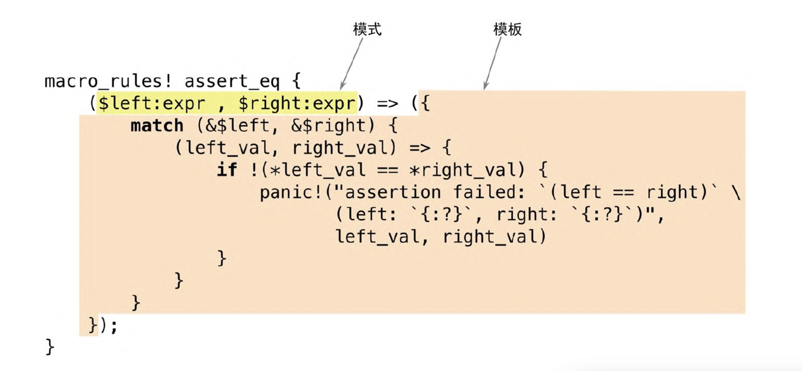
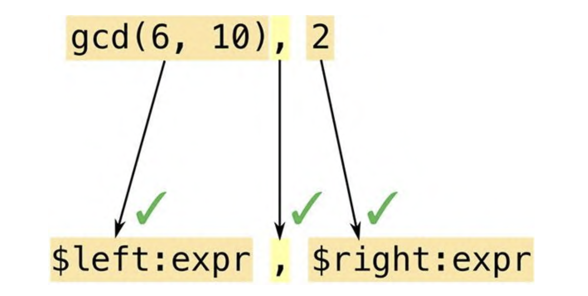
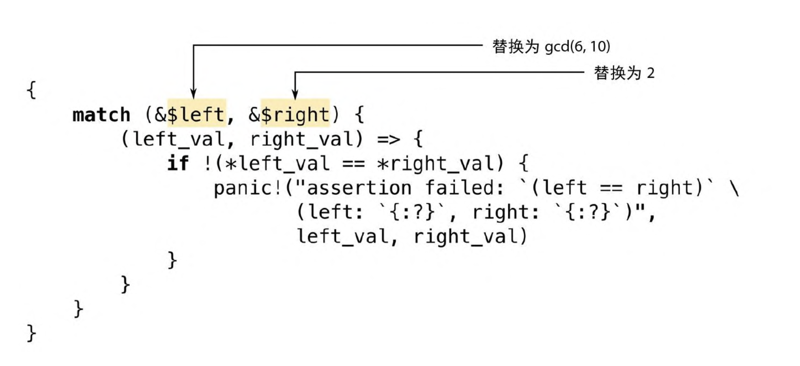

# 宏

Rust 支持 。宏是一种扩展语言的方式，它能做到单纯用函数无法做到的一些事。例如，我们已经见过 assert_eq! 宏，它是用于测试的好工具

```rust
assert_eq!(gcd(6, 10), 2);
```

这也可以写成泛型函数，但是 assert_eq! 宏能做到一些无法用函数做到的事。一是当断言失败时，assert_eq! 会生成一条错误消息，其中包含断言的文件名和行号。函数无法获取这些信息，而宏可以，因为它们的工作方式完全不同。

宏是一种简写形式。在编译期间，在检查类型并生成任何机器码之前，每个宏调用都会被 。也就是说，每个宏调用都会被替换成一些 Rust 代码。前面的宏调用展开后大致如下所示

```rust
match (&gcd(6, 10), &2) {
  (left_val, right_val) => {
    if !(*left_val == *right_val) {
      panic!("assertion failed: `left == right`,\
      (left: `{:?}`, right: `{:?}`)", left_val, right_val);
    }
  }
}
```

`panic!` 也是一个宏，它本身可以展开为更多的 Rust 代码(此处未展示)。这些代码使用了另外两个宏，即 `file!()` 和 `line!()`。

一旦 crate 中的每个宏调用都已完全展开，Rust 就会进入下一个编译阶段。

在运行期，断言失败时是这样的

```
thread 'main' panicked at 'assertion failed: `(left == right)`,
(left: `17`, right: `2`)', gcd.rs:7
```

宏调用总是标有感叹号，因此在你阅读代码时很容易发现它们，并且当你想要调用函数时也不会意外调用它们。Rust 宏永远不会插入不匹配的方括号或圆括号，它们天生支持模式匹配，因此编写既可维护又易于使用的宏非常容易。

## 宏基础

下图展示了 assert_eq! 宏的部分源代码



`macro_rules!` 是在 Rust 中定义宏的主要方式。请注意，这个宏定义中的 `assert_eq` 之后没有 `!`, 只有调用宏时才要用到 `!`，定义宏时不用。

但并非所有的宏都是这样定义的:有一些宏是内置于编译器中的，比 如 `file!`、`line!` 和 `macro_rules!`。本章会在结尾处讨论另一种方法，称为过程宏。

使用 `macro_rules!` 定义的宏完全借助“模式匹配”方式发挥作用。宏的主体只是一系列规则

```rust
( pattern1 ) => ( template1 );
( pattern2 ) => ( template2 );
```

另外，可以在模式或模板周围随意使用**方括号**或**花括号**来代替**圆括号**，这对 Rust 没有影响。同样，在调用宏时，下面这些都是等效的

```rust
assert_eq!(gcd(6, 10), 2);
assert_eq![gcd(6, 10), 2];
assert_eq!{gcd(6, 10), 2};
```

唯一的区别是花括号后面的分号通常是可选的

> 按照惯例，在调用 assert_eq! 时使用圆括号，在调用 vec! 时使用方括号，而在调用 macro_rules! 时使用花括号

### 宏展开的基础

Rust 在编译期间的很早阶段就展开了宏。编译器会从头到尾阅读你的源代码，定义并展开宏。你不能在定义宏之前就调用它，因为 Rust 在查看程序的其余部分之前就已经展开了每个宏调用。

Rust 展开 `assert_eq!` 宏调用的过程与对 `match` 表达式求值很像。`Rust` 会首先将参数与模式进行匹配



宏模式是 Rust 中的一种迷你语言。它们本质上是用来匹配代码的正则表达式。不过正则表达式操作的是字符，而模式操作的是语法标记 (Token，包括数值、名称、标点符号等)，这些语法标记是 Rust 程序的基础构造块。这意味着可以在宏模式中自由使用注释和空白字符，以尽量提高模式的可读性。因为注释和空白字符不是语法标记，所以不会影响匹配。

正则表达式和宏模式之间的另一个重要区别是圆括号、方括号和花括号在 Rust 中总是成对出现。Rust 会在展开宏之前进行检查，不仅仅在宏模式中检查，而且会贯穿整个语言。

在此示例中，我们的模式包含片段 $left:expr，它告诉 Rust 要匹配一个表达式(在本例中是 gcd(6, 10))并将其命名为 $left。 然后 Rust 会将模式中的逗号与 gcd 的参数后面的逗号进行匹配。就像正则表达式一样，模式中只有少数特殊字符会触发有意义的匹配行为; 其他字符，比如逗号，则必须逐字匹配，否则匹配就会失败。最后，Rust 会匹配表达式 2 并将其命名为 $right。

这个模式中的两个代码片段都是 expr 类型的，表示它们期待表达式，因为这个模式已经匹配到了所有的参数，所以 Rust 展开了相应的模版



Rust 会将 $left 和 $right 替换为它在匹配过程中找到的代码片段。

在输出模板中包含片段类型(比如写成 $left:expr 而不仅是 $left)是一个常见的错误。Rust 不会立即检测到这种错误。它会将 $left 视为替代品，然后将 :expr 视为模板中的其他内容——要包含在宏输出中的语法标记。所以宏在被调用之前不会发生错误，然而它将生成实际无法编译的伪输出。如果在使用新宏时收到像 cannot find type 'expr' in this scope 和 help: maybe you meant to use a path separator here 这样的错误消息，请检查是否存在这种错误。
